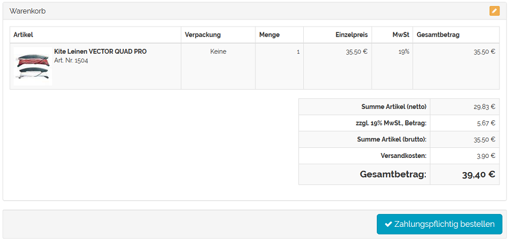

Versandkosten für In- und Ausland
*********************************
Für den Versand von Waren in das Ausland fallen höhere Versandkosten, als für den Versand im Inland an. Dies lässt sich durch Versandkostenregeln abbilden, die nur für bestimmte Länder gültig sind.

Der Kunde entscheidet sich beim Kauf im Online-Shop für eine Versandart. Alle Versandkostenregeln, die zu dieser Versandart gehören, werden abgearbeitet. Es wird geprüft, ob die festgelegte Bedingung (Land, in das versendet werden soll) erfüllt ist. Nur wenn die Bedingung zutrifft, wird die Versandkostenregel bei der Berechnung der Versandkosten angewandt.

In den Versandkostenregeln werden die gültigen Länder zugeordnet.

* Gehen Sie zu :menuselection:`Shopeinstellungen --> Versandkostenregeln`.
* Wählen Sie die Versandkostenregel aus der Liste der Versandkostenregeln.
* Betätigen Sie die Schaltfläche :guilabel:`Länder zuordnen` auf der Registerkarte :guilabel:`Stamm`.
* Verschieben Sie die Länder per Drag \& Drop in die rechte Liste des Zuordnungsfensters.
* Schließen Sie das Zuordnungsfenster.

.. hint:: Damit die Definition von Versand und Zahlung stringent ist, sollte die Länderzuordnung mit der in der zugehörigen Zahlungsart und der Versandart übereinstimmen. Wurde kein Land zugewiesen, gilt die Versandkostenregel immer für alle Länder.

Die Versandkostenregel wird einer Versandart zugeordnet.

* Gehen Sie zu :menuselection:`Shopeinstellungen --> Versandarten`.
* Wählen Sie die Versandart aus der Liste der Versandarten.
* Betätigen Sie die Schaltfläche :guilabel:`Versandkostenregeln zuordnen` auf der Registerkarte :guilabel:`Stamm`.
* Verschieben Sie die Versandkostenregel per Drag \& Drop in die rechte Liste des Zuordnungsfensters.
* Schließen Sie das Zuordnungsfenster.

.. hint:: Der Versandart müssen mindestens eine Versandkostenregel und eine Zahlungsart zugeordnet worden sein. Länder sollten zugewiesen sein, damit die Definition von Versand und Zahlung stringent ist. Ohne Länderzuordnung gilt die Versandart für alle Länder.

Beispiel
++++++++
Zwei Versandkostenregeln dienen als Beispiel für eine Lieferung mit höheren Versandkosten, wenn Artikel ins Ausland geliefert werden.

Dafür werden zwei Versandkostenregeln erstellt, denen unterschiedliche Länder zugeordnet werden. Die eine ist für den Versand von Artikeln innerhalb von Deutschlands zum Preis von 3,90 €, die andere für die Lieferung nach Österreich und in die Schweiz für 6,90 €. Die Versandkostenregeln werden so definiert, dass die Berechnung nur einmal pro Warenkorb erfolgt. Länder müssen zugewiesen sein. Für die eine Versandkostenregel ist das Deutschland, für die andere sind das Österreich und die Schweiz. Die Versandkostenregeln müssen aktiv sein.

.. image:: ../../media/screenshots-de/oxbafx01.png
   :alt: Versandkostenregel für Deutschland
   :height: 315
   :width: 650

Die Versandkostenregeln müssen einer Versandart zugeordnet sein. Wird diese Versandart beim Kauf eines Artikels ausgewählt, werden alle zugehörigen Versandkostenregeln geprüft. Sollen die Artikel nach Deutschland geliefert werden, greift die erste Versandkostenregel.

Wurden Artikel eingekauft, die nach Österreich geliefert werden, gilt die zweite Versandkostenregel.

.. image:: ../../media/screenshots-de/oxbafx03.png
   :alt: Warenkorb mit Lieferung nach Österreich
   :height: 262
   :width: 500

.. seealso:: `Versandkostenregeln - Registerkarte Stamm <../versandkostenregeln/registerkarte-stamm.html>`_ | `Versandarten - Registerkarte Stamm <../versandarten/registerkarte-stamm.html>`_