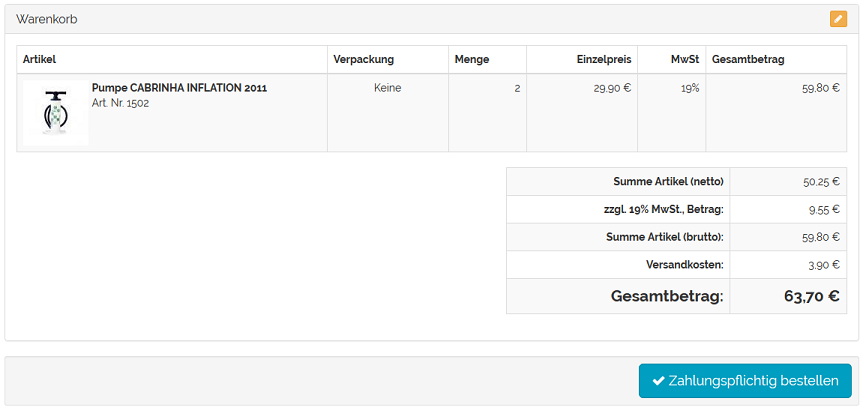
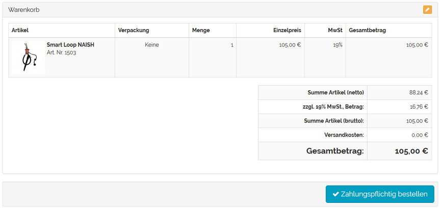

Versandkostenfrei ab Warenwert
******************************
Bei vielen Shops basieren die Versandkosten auf dem Gesamtpreis der gekauften Waren. Ab einem bestimmten Warenwert erfolgt meistens auch eine kostenlose Lieferung.

Die mit dem OXID eShop ausgelieferten Versandkostenregeln verwenden durchweg den Preis der Artikel als Bedingung. Mit einer Versandkostenregel kann auch festgelegt werden, dass die Versandkosten ab einem bestimmten Warenwert entfallen. Der Kunde entscheidet sich beim Kauf im Online-Shop für eine Versandart. Alle Versandkostenregeln, die zu dieser Versandart gehören, werden abgearbeitet. Es wird geprüft, ob die festgelegte Bedingung (Preis) bezogen auf den Gesamtpreis der Artikel im Warenkorb erfüllt ist. Nur wenn die Bedingung zutrifft, wird die Versandkostenregel bei der Berechnung der Versandkosten angewandt.

Der Preis eines Artikels wird in der Artikelverwaltung festgelegt.

* Gehen Sie zu :menuselection:`Artikel verwalten --> Artikel`.
* Wählen Sie den gewünschten Artikel aus der Artikelliste.
* Geben Sie auf der Registerkarte :guilabel:`Stamm` den Preis ein.
* Speichern Sie die Änderungen.

In den Versandkostenregeln wird Preis als Bedingung definiert.

* Gehen Sie zu :menuselection:`Shopeinstellungen --> Versandkostenregeln`.
* Wählen Sie die Versandkostenregel aus der Liste der Versandkostenregeln.
* Auf der Registerkarte :guilabel:`Stamm` finden Sie die Dropdown-Liste :guilabel:`Bedingung`.
* Wählen Sie die Bedingung Preis und tragen Sie Werte für :guilabel:`=\>` und :guilabel:`\<=` ein.
* Komplettieren Sie alle weiteren Einstellungen der Versandkostenregel.
* Speichern Sie die Änderungen.

Die Versandkostenregel wird einer Versandart zugeordnet.

* Gehen Sie zu :menuselection:`Shopeinstellungen --> Versandarten`.
* Wählen Sie die Versandart aus der Liste der Versandarten.
* Betätigen Sie die Schaltfläche :guilabel:`Versandkostenregeln zuordnen` auf der Registerkarte :guilabel:`Stamm`.
* Verschieben Sie die Versandkostenregel per Drag \& Drop in die rechte Liste des Zuordnungsfensters.
* Schließen Sie das Zuordnungsfenster.

.. hint:: Der Versandart müssen mindestens eine Versandkostenregel und eine Zahlungsart zugeordnet worden sein. Länder sollten zugewiesen sein, damit die Definition von Versand und Zahlung stringent ist. Ohne Länderzuordnung gilt die Versandart für alle Länder.

Beispiel
++++++++
Zwei Versandkostenregeln dienen als Beispiel für eine versandkostenfreie Lieferung, wenn Artikel für 80 € und mehr gekauft werden.

Dafür werden zwei Versandkostenregeln erstellt, deren Bedingung der Preis ist. Die eine ist für Artikel im Warenkorb mit einem Warenwert bis 79,99 €, die andere für Artikel ab 80 € Warenwert. Die Versandkostenregeln werden so definiert, dass die Berechnung nur einmal pro Warenkorb erfolgt. Länder können, aber müssen nicht zugewiesen sein. Die Versandkostenregeln müssen aktiv sein.

.. image:: ../../media/screenshots-de/oxbafw01.png
   :alt: Versandkostenregel ab 80 € Warenwert
   :height: 315
   :width: 650

Die Versandkostenregeln müssen einer Versandart zugeordnet sein. Wird diese Versandart beim Kauf eines Artikels ausgewählt, werden alle zugehörigen Versandkostenregeln geprüft. Liegen Artikel mit einem Einkaufswert unter 80 € im Warenkorb, greift die erste Versandkostenregel.

Wurden Artikel eingekauft, deren Einkaufswert 80 € ist oder darüberliegt, gilt die zweite Versandkostenregel. Die Ware wird ohne Versandkosten geliefert.

.. seealso:: `Artikel - Registerkarte Stamm <../artikel/registerkarte-stamm.html>`_ | `Versandkostenregeln - Registerkarte Stamm <../versandkostenregeln/registerkarte-stamm.html>`_ | `Versandarten - Registerkarte Stamm <../versandarten/registerkarte-stamm.html>`_