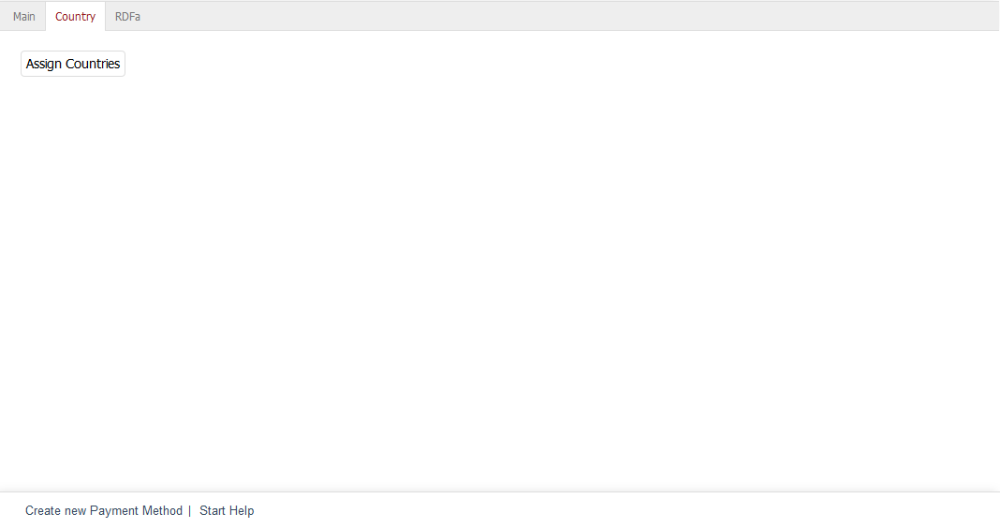

Registerkarte Länder
====================

Zahlungsarten gelten für Länder. Ordnen Sie auf der Registerkarte :guilabel:`Länder` die Länder zu, aus denen Kunden ihre Bestellung mit dieser Zahlungsart begleichen können. Ohne eine solche Zuordnung ist die Zahlungsart für kein Land gültig.

:guilabel:`Länder zuordnen` |br|
Um Länder einer Zahlungsart zuzuordnen, betätigen Sie die Schaltfläche :guilabel:`Länder zuordnen`. Es öffnet sich ein Zuordnungsfenster, in dem Sie Länder aus der Liste :guilabel:`Alle Länder` auswählen können. Länder lassen sich nach Namen und/oder der Länderabkürzung sortieren und filtern. Ziehen Sie die gewünschten Länder mit der Maus in die rechte Liste. Eine Mehrfachauswahl ist bei gedrückter Strg-Taste möglich. Die Zuordnung zur Zahlungsart ist damit abgeschlossen.

.. Intern: oxbadb, Status:, F1: payment_country.html
