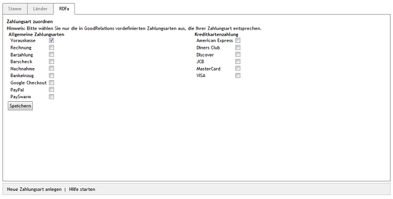

Registerkarte RDFa
******************
Der OXID eShop stellt Informationen gut aufbereitet für Suchmaschinen, Portale und andere Systeme bereit. Diese können beispielsweise als so genannte Rich Snippets - ausführliche Informationen zu einem Suchergebnis - dargestellt werden. Die Aufbereitung der Daten erfolgt auf Basis des Resource Description Framework (RDFa) und der für den E-Commerce optimierten Beschreibungssprache GoodReleations.

Auf der Registerkarte :guilabel:`RDFa` wird eine logische Verknüpfung der Zahlungsart mit den in GoodReleations vordefinierten Werten für Zahlung hergestellt.

.. hint:: Damit der Shop die RDFa-Integration verwenden kann, muss die Funktion unter :menuselection:`Stammdaten --> Grundeinstellungen --> RDFa` aktiviert werden.

:guilabel:`Zahlungsart zuordnen
| Hinweis: Bitte wählen Sie nur die in GoodRelations vordefinierten Zahlungsarten aus, die Ihrer Zahlungsart entsprechen.`

Setzen Sie ein Häkchen bei allen Angaben, welche die Zahlungsart exakt beschreiben.

:guilabel:`Allgemeine Zahlungsarten
| Vorauskasse
| Rechnung
| Barzahlung
| Barscheck
| Nachnahme
| Bankeinzug
| Google Checkout
| PayPal
| PaySwarm
| Kreditkartenzahlung
| American Express
| Diners Club
| Discover
| JCB
| MasterCard
| VISA`