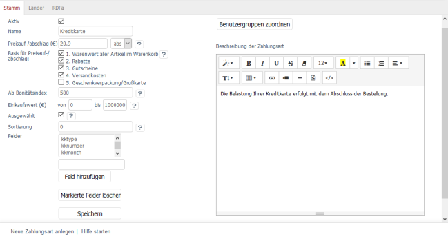

Registerkarte Stamm
*******************
Die Registerkarte :guilabel:`Stamm` stellt verschiedene Einstellungen zur Verfügung, um die Zahlungsart individuell konfigurieren zu können. Die Zahlungsart kann hier beschrieben werden. Über einen Dialog erfolgt die Zuordnung der Benutzergruppen zur Zahlungsart.

:guilabel:`Aktiv`

Aktivieren Sie dieses Kontrollkästchen, damit die Zahlungsart im Shop verwendet werden kann.

:guilabel:`Name`

Vergeben Sie einen Namen für die Zahlungsart. Dieser wird dem Kunden im Bestellschritt 3 als Option angezeigt. Sind mehrere Zahlungsarten möglich, kann eine Option und damit eine Zahlungsart per Mausklick ausgewählt werden.

:guilabel:`Preisauf-/abschlag (€)`

Für Zahlungsarten kann ein absoluter oder prozentualer Auf- oder Abschlag auf den Preis festgelegt werden. Kosten, die durch eine Zahlungsart entstehen, können so auf die Kunden umgelegt werden. Wählen Sie aus der Liste aus, ob der Preisauf- oder -abschlag absolut oder in Prozent angegeben wird. Einen Preisabschlag gewähren Sie, indem Sie ein Minuszeichen vor den Preis setzen.

:guilabel:`Basis für Preisauf-/abschlag:`

Wurde der Preisauf- oder -abschlag prozentual angegeben, muss dieser bei der Bestellung berechnet werden. Basis dafür ist der Warenkorb. Setzen Sie ein Häkchen bei den Warenkorbpositionen, die bei der Berechnung berücksichtigt werden sollen.

:guilabel:`1. Warenwert aller Artikel im Warenkorb`

:guilabel:`2. Rabatte`

:guilabel:`3. Gutscheine`

:guilabel:`4. Versandkosten`

:guilabel:`5. Geschenkverpackung/Grußkarte`

:guilabel:`Ab Bonitätsindex`

Legen Sie fest, dass Kunden über einen bestimmten Bonitätsindex verfügen müssen, um diese Zahlungsart nutzen zu können. Wenn Sie den Wert 0 eintragen, ist die Zahlungsart uneingeschränkt nutzbar. Die Bonität eines Kunden wird unter :menuselection:`Benutzer verwalten --> Benutzer` definiert.

:guilabel:`Einkaufswert (€) von` ... :guilabel:`bis` ...

Sie können Ihren Kunden eine Zahlungsart erst ab einem bestimmten Einkaufswert zur Verfügung stellen. Geben Sie hier einen Einkaufswert vor. Soll die Zahlungsart für jeden Einkaufswert gelten, tragen Sie beispielsweise von 0 bis 99999 als Werte ein. Im Feld bis darf nicht 0 stehen.

:guilabel:`Ausgewählt`

Kann ein Kunde im dritten Schritt des Bestellprozesses aus mehreren Zahlungsarten wählen, werden diese als untereinanderstehende Optionsfelder angezeigt. Aktivieren Sie dieses Kontrollkästchen, wenn diese Zahlungsart als Option standardmäßig vorausgewählt sein soll.

:guilabel:`Sortierung`

Wenn mehrere Zahlungsarten im Schritt 3 des Bestellprozesses untereinander angezeigt werden, steht die Zahlungsart mit der kleinsten Zahl als Option ganz oben. Legen Sie eine sinnvolle Reihenfolge der Zahlungsarten fest.

:guilabel:`Felder`

Bei bestimmten Zahlungsarten sind zusätzliche Informationen vom Kunden erforderlich. Hat der Kunde bei der Bestellung Bankeinzug gewählt, benötigen Sie dessen Bankverbindung. Die Felder \"lsbankname\", lsblz\" und \"lsktonr\" fragen Bank, Bankleitzahl und Kontonummer während der Bestellung vom Kunden ab.

.. hint:: Da viele Zahlungsschnittstellen, mit denen der OXID eShop erweitert werden kann, bestehende Felder verwenden, ändern Sie die bestehenden Einträge bitte nicht.

:guilabel:`Feld hinzufügen` | :guilabel:`Markierte Felder löschen`

Für Zahlungsarten können Sie neue Felder ohne Programmierung hinzufügen. Damit diese aber vom Kunden abgefragt und deren Werte in der Datenbank gespeichert werden, muss allerdings das für die Anzeige zuständige Template erweitert werden. Eine Vorlage, wie die Felder verwendet werden, finden Sie im Template :file:`payment_oxiddebitnote.tpl`, welches die Zahlungsart \"Bankeinzug/Lastschrift\" im Bestellprozess anzeigt. Hier sorgen die DynValue-Felder dafür, dass die vom Kunden eingegebenen Bankdaten in der Datenbank (Tabelle\"oxuserpayments\", Feld\"OXVALUE\") gespeichert werden.

:guilabel:`In Sprache`

Die Zahlungsart lässt sich auch in weiteren aktiven Sprachen des Shops bearbeiten. Wählen Sie eine Sprache aus der Liste aus.

:guilabel:`Benutzergruppen zuordnen`

Zahlungsarten gelten für Benutzergruppen. Eine Zuordnung stellt sicher, dass Kunden nur die für sie vorgesehenen Zahlungsarten nutzen können. Wurden keine Benutzergruppen zugeordnet, gilt die Zahlungsart für alle Benutzergruppen.

Die Schaltfläche :guilabel:`Benutzergruppen zuordnen` öffnet ein neues Fenster. In diesem Zuordnungsfenster werden in der linken Liste alle Benutzergruppen angezeigt. Die Benutzergruppen können per Drag \& Drop in die rechte Liste verschoben werden. Damit ist die Zuordnung abgeschlossen.

Die Benutzergruppen \"Inland\" und \"Ausland\" sind so etwas wie die Basis für die Zahlungsarten. Jeder Kunde, der Waren in den Warenkorb legte, hat sich im Bestellschritt 2 bereits identifiziert. Er kauft als registrierter Kunde oder als Kunde ohne Registrierung ein. Seine Rechnungsanschrift und gegebenenfalls eine davon abweichende Lieferadresse sind dem Shop bekannt. Ein Inlandskunde oder ein Auslandskunde ist er damit in jedem Fall.

:guilabel:`Beschreibung der Zahlungsart`

Geben Sie ein paar Informationen zur Zahlungsart ein. Diese werden angezeigt, sobald der Kunde diese Zahlungsart im Bestellprozess auswählt.

.. seealso:: `Benutzer - Registerkarte Erweitert <../../betrieb/benutzer/registerkarte-erweitert.html>`_ | `Preise für Zahlungsarten <../zahlung-und-versand/preise-fuer-zahlungsarten.html>`_ | `Zahlungsarten für bestimmte Benutzer <../zahlung-und-versand/zahlungsarten-fuer-bestimmte-benutzer.html>`_