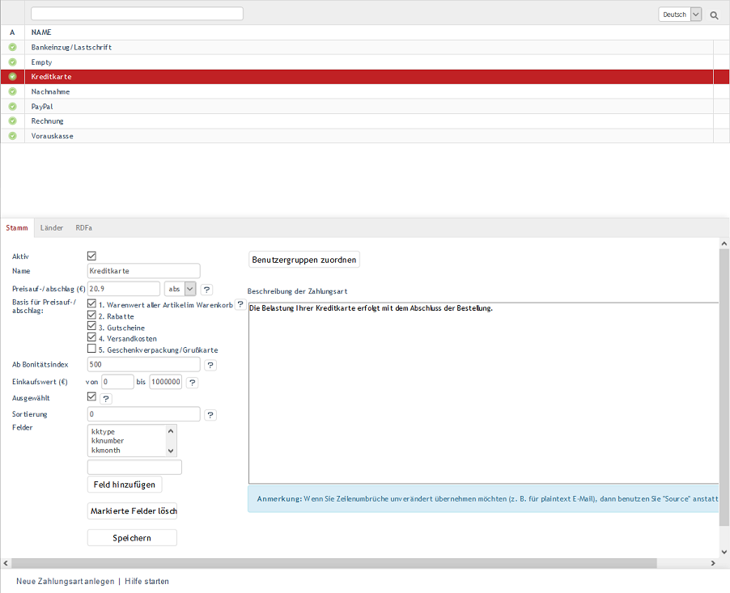

Zahlungsarten
*************
Zahlung und Versand sind wichtige Funktionen in einem Online-Shop. Sie werden durch die Definition von Zahlungsarten, Versandarten und Versandkostenregeln bestimmt, die in einem wechselseitigen Zusammenhang zueinander stehen.

Kunden, die in Ihrem Shop einkaufen, können im dritten Bestellschritt auswählen, wie sie zahlen wollen. Die Auswahl der Zahlungsarten hängt davon ab, ob es eine Zahlungsart für das Land gibt, aus dem ein Kunde bestellt. Er sollte auch zu einer Benutzergruppe gehören, für welche diese Zahlungsart gilt.

Alle erforderlichen Einstellungen können im Administrationsbereich unter :menuselection:`Shopeinstellungen --> Zahlungsarten` vorgenommen werden. In einer Liste werden alle Zahlungsarten mit ihrem Namen ausgegeben. Darunter befindet sich der Eingabebereich für die Zahlungsart. Nach Zahlungsarten kann gesucht werden, indem das Suchfeld für den Namen verwendet wird. Zahlungsarten, die neu erstellt wurden, können auch gelöscht werden. Durch einen Klick auf das Löschsymbol am Ende der Zeile werden sie endgültig aus der Datenbank entfernt. Die im Shop vorhandenen Zahlungsarten können nur deaktiviert werden, wenn sie nicht verwendet werden sollen.

Wird eine Zahlungsart aus der Liste gewählt, werden deren Informationen in den Eingabebereich geladen. Zum Erstellen einer neuen Zahlungsart klicken Sie am unteren Bildschirmrand auf :guilabel:`Neue Zahlungsart anlegen`.

Der OXID eShop wird mit den vorbereiteten Zahlungsarten \"Bankeinzug/Lastschrift\", \"Empty\", \"Kreditkarte\", \"Nachnahme\", \"Rechnung\" und \"Vorauskasse\" ausgeliefert. Sie können verwendet werden, nachdem sie individuell angepasst wurden. Nicht verwendete Zahlungsarten sollten mit Ausnahme von \"Empty\" deaktiviert werden. Diese ist eine Art Fallback-Zahlungsart, welche Kunden den Bestellprozess abschließen lässt, auch wenn die definierten Bedingungen für Zahlung und Versand für ein im Shop aktives Land nicht zutreffen. Der Kunde kann dennoch bestellen. Der Verkäufer muss im Nachhinein mit ihm die Bezahlung und den Versand klären.

Es können neue Zahlungsarten erstellt werden. Auch bei der Installation von Zahlungsmodulen werden ggf. neue Zahlungsarten, beispielsweise PayPal, hinzugefügt.

.. hint:: Zahlungsarten gelten für bestimmte Benutzergruppen und für Länder, aus denen Benutzer bestellen.

Wenn Sie einer Zahlungsart Benutzergruppen zuordnen, ist die Zahlungsart ausschließlich für Benutzer dieser Benutzergruppen gültig. Die Zuordnung der Benutzergruppen \"Inlandskunden\" und \"Auslandskunden\" stellt dabei das Funktionieren der Zahlungsart zunächst einmal sicher. Wurden keine Benutzergruppen zugeordnet, gilt die Zahlungsart für alle Benutzergruppen.

Einer Zahlungsart sollten Länder zugewiesen sein. Ohne eine solche Zuordnung ist die Zahlungsart für alle Länder gültig. Darüber hinaus beeinflussen die Einstellungen zur Bonität und zum Einkaufswert, ob eine Zahlungsart im Bestellprozess gültig ist und angezeigt wird. Stellen Sie sicher, dass die Zahlungsart aktiv ist.

Bitte beachten Sie, dass in früheren Shopversionen einer Zahlungsart mindestens ein Land (vor OXID eShop 4.6.0) und eine Benutzergruppe (vor OXID eShop 4.8.0/5.1.0) zugewiesen sein musste.

-----------------------------------------------------------------------------------------

.. |link| image:: ../../media/icons-de/link.png
.. |br| raw:: html 

    

Registerkarte Stamm
+++++++++++++++++++
**Inhalte**: aktive Zahlungsart, Preisaufschlag, Preisabschlag, Skonto, Bonität, Bonitätsindex, Einkaufswert, Zusatzfelder, DynValue-Felder, Zahlungsart und Benutzergruppen |br| 
:doc:`Artikel lesen <registerkarte-stamm>` |link|

Registerkarte Länder
++++++++++++++++++++
**Inhalte**: Zahlungsarten für Länder, Länder zuordnen |br|
:doc:`Artikel lesen <registerkarte-laender>` |link|

Registerkarte RDFa
++++++++++++++++++
**Inhalte**: RDFa, Resource Description Framework, GoodReleations, Vokabular für E-Commerce, Zahlungsarten und Kreditkartenzahlung, Rich Snippets |br| 
:doc:`Artikel lesen <registerkarte-rdfa>` |link|

.. seealso:: :doc:`Versandarten <../versandarten/versandarten>` | :doc:`Versandkostenregeln <../versandkostenregeln/versandkostenregeln>` | `Zahlung und Versand <../zahlung-und-versand/zahlung-und-versand>`