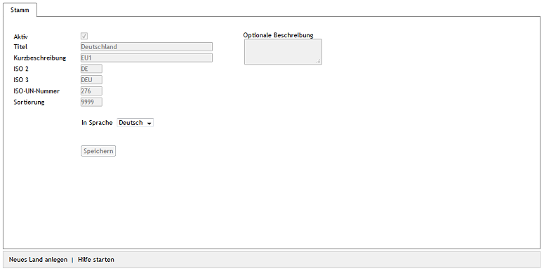

Geteilte Elemente
*****************
Geteilte Elemente sind Zahlungsarten, Länder, Benutzer, Benutzergruppen und Bewertungen. Diese werden in allen Shops verwendet und nur ein Administrator mit dem Recht \"Admin\" kann diese ändern. Administratoren der Subshops, Supershops oder Multishops haben dafür keine Berechtigung.

Benutzer werden nur mit allen Shops geteilt, wenn im Hauptshop die Option :guilabel:`Benutzer können sich in allen Shops einloggen` aktiviert ist. Ist diese Einstellung auf der Registerkarte :guilabel:`Mall` unter :menuselection:`Stammdaten --> Grundeinstellungen` nicht aktiv, verwaltet jeder Shop seine eigenen Benutzer.

.. seealso:: `Konfiguration <../../../konfiguration/konfiguration.html>`_ | `Zahlungsarten <../../../einrichtung/zahlungsarten/zahlungsarten.html>`_ | `Benutzer <../../../betrieb/benutzer/benutzer.html>`_ | `Benutzergruppen <../../../betrieb/benutzergruppen/benutzergruppen.html>`_