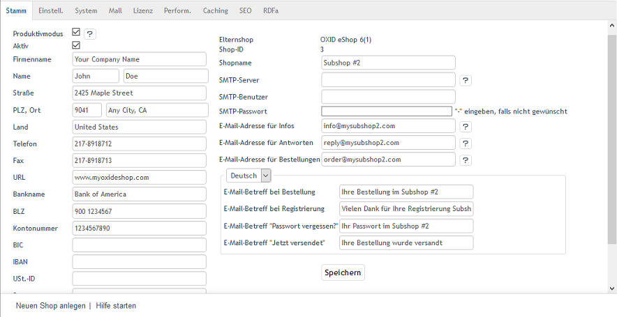

Nicht vererbbare Elemente
*************************
Nicht vererbbare Elemente gehören zu jedem Subshop, Supershop und Multishop. Sie werden je Shop erstellt und können dort bearbeitet und an den jeweiligen Shop und seine Anforderungen angepasst werden. Beim Anlegen eines neuen Shops werden dessen Grundeinstellungen, Sprachen, Aktionen und die Seiten des Content Management Systems (CMS) kopiert und als Vorlagen für den neuen Shop bereitgestellt. Bestellungen gehören ebenfalls zu den nicht vererbbaren Elementen und werden je Shop verwaltet.

Die Konfiguration eines Shops kann unter :menuselection:`Stammdaten --> Grundeinstellungen` definiert werden. Die Einstellungen lassen sich separat für jeden Shop anpassen - von den Firmendaten und E-Mail-Adressen, über die verschiedenen Systemeinstellungen bis hin zu Vorgaben für die Performance oder SEO. Lediglich die Registerkarte :guilabel:`Lizenz` nimmt shopübergreifend den Lizenzschlüssel der Enterprise Edition auf.

Die CMS-Seiten sind ebenso wie die Aktionen nicht vererbbare Elemente. Sie werden beim Erstellen des neuen Shops vom Elternshop kopiert und können beliebig angepasst werden. Bei den Aktionen werden nur das Angebot der Woche, Frisch eingetroffen, das Kategorie-Topangebot, Startseite unten (nicht aktiv), das Topangebot Startseite und die Topseller als Vorlage kopiert. Zugeordnete Artikel werden dabei nicht übernommen und müssen separat zugwiesen werden. Aktionen können inhaltlich nur im Hauptshop geändert werden.

Wenn ein Kunde in einem Subhop, Supershop oder Multishop bestellt, wird die Bestellung nur im jeweiligen Shop erstellt und kann nur dort bearbeitet werden. Die vergebene Bestellnummer ist davon abhängig, ob für den Shop separate Bestellnummern erlaubt sind. Die Einstellungen ist auf der Registerkarte :guilabel:`Mall` unter :menuselection:`Stammdaten --> Grundeinstellungen` zu finden.

.. seealso:: `Konfiguration <../../../konfiguration/konfiguration.html>`_ | `Bestellungen <../../../betrieb/bestellungen/bestellungen.html>`_