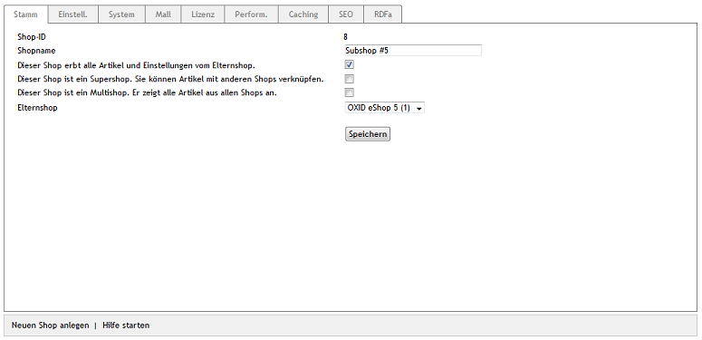

Vererbung
*********
Die Vererbung ist ein wichtiger Bestandteil der Mall-Funktion. Sie erfolgt beim Anlegen eines neuen Shops, wenn das Kontrollkästchen :guilabel:`Dieser Shop erbt alle Artikel und Einstellungen vom Elternshop` aktiviert wurde. Außer den Artikeln werden auch Attribute, Auswahllisten, Versandarten, Versandkostenregeln, Hersteller, Lieferanten und weitere Elemente an den neuen Shop weitergegeben. Eine Vererbung von Kategorien erfolgt nicht.

Die Vererbung kann nach dem Anlegen eines Shops noch geändert werden. Die Änderungen können shopweit in den Vererbungseinstellungen vorgenommen werden oder sich auf einzelne Artikel, Attribute, Auswahllisten, Versandarten, Versandkostenregeln, Hersteller, Lieferanten usw. beziehen. Details dazu finden Sie im Dokument :doc:`Individualisierung <individualisierung>`.

Ein Subshop kann seine Artikel und Einstellungen an einen weiteren Subshop vererben. Es ist nur möglich, einzelne Artikel und andere Elemente zu dem Subshop zu verknüpfen oder die Verknüpfung dorthin zu lösen, für den er Elternshop ist. Ein Supershop hingegen, kann an Supershops und Subshops vererben. Verknüpfungen einzelner Artikel und anderer Elemente können zu allen anderen Shops hergestellt und wieder gelöst werden. Das gilt auch für den Hauptshop und für Subshops, für den der Supershop nicht Elternshop ist. Multishops müssen keine Artikel und Einstellungen erben, denn sie zeigen beispielsweise alle Artikel, Hersteller und Lieferanten aus allen Shops an. Optional können sie aber alle Kategorien aus allen Shops erben.

Die in den weiteren Dokumenten beschriebenen Details zur Vererbung sind auch davon abhängig, ob man als Administrator aller Shops oder als Administrator eines Subhops, Supershops oder Multishops angemeldet ist. Die Definition erfolgt über die Vergabe von Rechten unter :menuselection:`Benutzer verwalten --> Benutzer`.

-----------------------------------------------------------------------------------------

Vererbbare Elemente
+++++++++++++++++++
**Inhalte**: Mall, Enterprise Edition, Vererbung, Vererbungseinstellungen, Verknüpfungen, vererbbare Elemente, Artikel, Attribute, Auswahllisten, Versandkosten, Versandkostenregeln, Hersteller, Lieferanten, Rabatte, Gutscheine, Geschenkverpackungen, Nachrichten, Links |br|
:doc:`Artikel lesen <vererbbare-elemente>` |link|

Nicht vererbbare Elemente
+++++++++++++++++++++++++
**Inhalte**: Mall, Enterprise Edition, Vererbung, nicht vererbbare Elemente, Shopkonfiguration, Zuordnung zu Aktionen, CMS-Seiten, Bestellungen |br|
:doc:`Artikel lesen <nicht-vererbbare-elemente>` |link|

Geteilte Elemente
+++++++++++++++++
**Inhalte**: Mall, Enterprise Edition, Vererbung, geteilte Elemente, Zahlungsarten, Länder, Sprachen, Benutzer, Benutzergruppen, Bewertungen |br|
:doc:`Artikel lesen <geteilte-elemente>` |link|

Individualisierung
++++++++++++++++++
**Inhalte**: Mall, Enterprise Edition, Vererbung, Individualisierung, Vererbungseinstellungen, Artikelpreis, alternative Preise, Staffelpreise, Rechte und Rollen, SEO, config.inc.php, aMultishopArticleFields, oxfield2shops |br|
:doc:`Artikel lesen <individualisierung>` |link|

.. seealso:: :doc:`Benutzer <../../../betrieb/benutzer/benutzer>`

.. Intern: oxbago, Status: