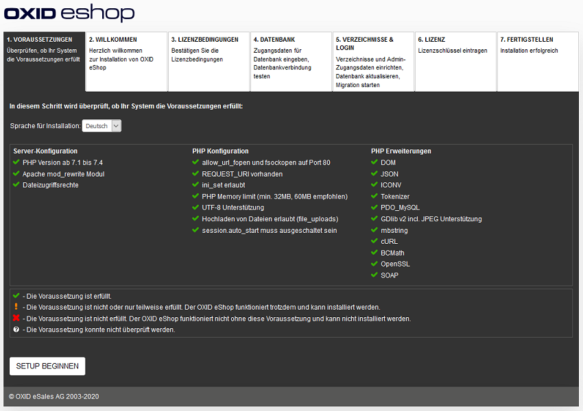

Neu-Installation
================

Erfahren Sie, wie Sie den OXID eShop 7.0 neu installieren.

Die für den Shop benötigten Dateien rufen Sie  mit Hilfe von Composer ab, dem Dependency Manager für PHP.

Danach führen Sie das webbasierte Setup aus und installieren den Shop.

Eine englischsprachige Anleitung zur Installation finden Sie in der Entwicklerdokumentation: `<https://docs.oxid-esales.com/developer/en/latest/getting_started/installation/index.html>`_.

-----------------------------------------------------------------------------------------

Server- und Systemvoraussetzungen sicherstellen
-----------------------------------------------
**Inhalte**: Server, Shared Hosting, Managed Server, Serverfarm mit Loadbalancing und Datenbankcluster, Linux, Webserver, Apache 2.2 + 2.4, MySQL 5.5 + 5.7, MariaDB 10.4, PHP 8.1 und 7.4, Composer 2.7, OpenSSL |br|
:doc:`Artikel lesen <server-und-systemvoraussetzungen>` |link|

Installation vorbereiten
------------------------
**Inhalte**: Composer installieren, Shopdateien bereitstellen, Apache konfigurieren, Datei- und Verzeichnisrechte anpassen, Datenbank anlegen |br|
:doc:`Artikel lesen <installation-vorbereiten>` |link|

Setup ausführen
---------------
**Inhalte**: Webbasiertes Setup, Prüfung der Systemvoraussetzungen, Hauptlieferland und Sprache des Shops wählen, Lizenzbedingungen, Datenbank, Datenbankname, Datenbankbenutzer und -passwort angeben, Demodaten, Shopverzeichnisse, Zugangsdaten für Administrationsbereich festlegen, Shop-Administrator, Lizenzschlüssel eingeben (PE und EE) |br|
:doc:`Artikel lesen <setup-ausfuehren>` |link|

Installation abschließen
------------------------
**Inhalte**: Löschen des Setup-Verzeichnisses kontrollieren, Datei- und Verzeichnisrechte setzen, Schreibrechte für /source/out/pictures, /source/out/media, /source/log, /source/export, /source/tmp, /var, Schreibschutz für .htaccess, config.inc.php  |br|
:doc:`Artikel lesen <installation-abschliessen>` |link|

.. Intern: oxbaae, Status: