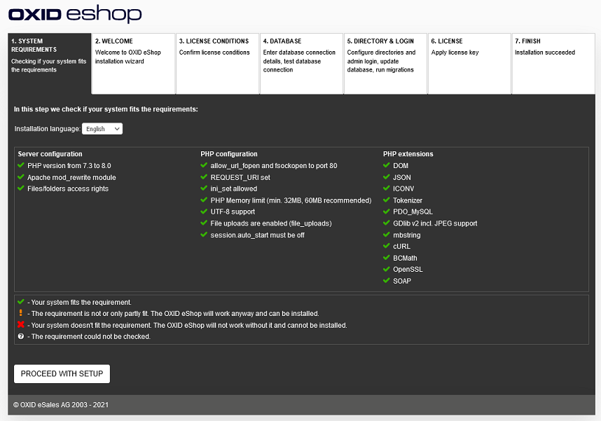

New installation
================

This section tells you how to install OXID eShop 7.0. The installation is no longer based on installation packages. The files required for the shop are provided by Composer, a dependency manager for PHP. After that, you can run the web-based setup and install the shop as usual.

The installation guide in English can be found in the developer documentation: `<https://docs.oxid-esales.com/developer/en/latest/getting_started/installation/index.html>`_.

-----------------------------------------------------------------------------------------

Server und system requirements
------------------------------
**Contents**: server, shared hosting, managed server, server farm with load balancing and database cluster, Linux, web server, Apache 2.2 + 2.4, MySQL 5.5 + 5.7, MariaDB 10.4, PHP from 7.1 to 7.4, Composer, OpenSSL |br|
:doc:`Read article <server-and-system-requirements>` |link|

Preparing for installation
--------------------------
**Contents**: installing Composer, providing shop files, configuring Apache, customising file and directory permissions, creating database |br|
:doc:`Read article <preparing-for-installation>` |link|

Web-based setup
---------------
**Contents**: web-based setup, checking system requirements, selecting main shipping country and shop’s language, license terms, database, database name, specifying database user and password, demo data, shop directories, defining login data for the Admin panel, shop administrator, entering license key (PE and EE) |br|
:doc:`Read article <setup-web-based>` |link|

Setup via command line
----------------------
**Contents**: setup via command line, oe:setup:shop, Datenbank, db-host, db-port, db-name, db-user, db-password, shop configuration, shop-url, shop-directory, compile-directory, language, oe:setup:demodata, demo datea, oe:admin:create-user, access data for administration panel, shop administrator, admin-email, admin-password, oe:license:add, oe:license:clear, license key for PE/EE |br|
:doc:`Read article <setup-command-line>` |link|

Completing installation
-----------------------
**Contents**: checking deletion of the setup directory, setting file and directory permissions, write permissions for /out/pictures, /out/media, /log, /export, /tmp, write protection for .htaccess, config.inc.php  |br|
:doc:`Read article <completing-installation>` |link|

.. Intern: oxbaae, Status:
