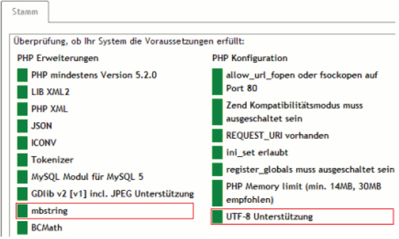

Auf UTF-8 umstellen
*******************
Diese Anleitung ist für ein Update ab der Version 4.1.1 auf UTF-8.

Hinweis: Ältere eShop-Versionen können nicht auf den Zeichensatz UTF-8 umgestellt werden.

Update-Dateien
--------------
Enterprise Edition
++++++++++++++++++
5.2.0 - 5.2.x: `OXID_UTF8UPDATE_EE_5.2.0.zip herunterladen <http://support.oxid-esales.com/downloads/utf-8/OXID_UTF8UPDATE_EE_5.2.0.zip>`_ \

5.1.0 - 5.1.x: `OXID_UTF8UPDATE_EE_5.1.0.zip herunterladen <http://support.oxid-esales.com/downloads/utf-8/OXID_UTF8UPDATE_EE_5.1.0.zip>`_ \\

5.0.0 - 5.0.x: `OXID_UTF8UPDATE_EE_5.0.0.zip herunterladen <http://support.oxid-esales.com/downloads/utf-8/OXID_UTF8UPDATE_EE_5.0.0.zip>`_ \

4.6.0 - 4.6.x: `OXID_UTF8UPDATE_FOR_4.6.0.zip herunterladen <http://support.oxid-esales.com/downloads/utf-8/OXID_UTF8UPDATE_FOR_4.6.0.zip>`_ \

4.5.1 - 4.5.x: `OXID_UTF8UPDATE_EE_4.5.1-4.5.x.zip herunterladen <http://support.oxid-esales.com/downloads/utf-8/OXID_UTF8UPDATE_EE_4.5.1-4.5.x.zip>`_ \

4.5.0: `OXID_UTF8UPDATE_EE_4.5.0.zip herunterladen <http://support.oxid-esales.com/downloads/utf-8/OXID_UTF8UPDATE_EE_4.5.0.zip>`_ \

4.4.0 - 4.4.x: `OXID_UTF8UPDATE_EE_4.4.0.zip herunterladen <http://support.oxid-esales.com/downloads/utf-8/OXID_UTF8UPDATE_EE_4.4.0.zip>`_ \

4.3.0 - 4.3.2: `OXID_UTF8UPDATE_EE_4.3.0.zip herunterladen <http://support.oxid-esales.com/downloads/utf-8/OXID_UTF8UPDATE_EE_4.3.0.zip>`_ \

4.1.6 - 4.2.0: `OXID_UTF8UPDATE_EE_4.1.6-4.2.0.zip herunterladen <http://support.oxid-esales.com/downloads/utf-8/OXID_UTF8UPDATE_EE_4.1.6-4.2.0.zip>`_ \

4.1.1 - 4.1.5: `OXID_UTF8UPDATE_EE_4.1.1-4.1.5.zip herunterladen <http://support.oxid-esales.com/downloads/utf-8/OXID_UTF8UPDATE_EE_4.1.1-4.1.5.zip>`_ \\

Professional Edition
++++++++++++++++++++
4.9.0 - 4.9.x: `OXID_UTF8UPDATE_PE_4.9.0.zip herunterladen <http://support.oxid-esales.com/downloads/utf-8/OXID_UTF8UPDATE_PE_4.9.0.zip>`_ \

4.8.0 - 4.8.x: `OXID_UTF8UPDATE_PE_4.8.0.zip herunterladen <http://support.oxid-esales.com/downloads/utf-8/OXID_UTF8UPDATE_PE_4.8.0.zip>`_ \\

4.7.0 - 4.7.x: `OXID_UTF8UPDATE_PE_4.7.0.zip herunterladen <http://support.oxid-esales.com/downloads/utf-8/OXID_UTF8UPDATE_PE_4.7.0.zip>`_ \

4.6.0 - 4.6.x: `OXID_UTF8UPDATE_FOR_4.6.0.zip herunterladen <http://support.oxid-esales.com/downloads/utf-8/OXID_UTF8UPDATE_FOR_4.6.0.zip>`_ \

4.5.1 - 4.5.x: `OXID_UTF8UPDATE_PE_4.5.1-4.5.x.zip herunterladen <http://support.oxid-esales.com/downloads/utf-8/OXID_UTF8UPDATE_PE_4.5.1-4.5.x.zip>`_ \

4.5.0: `OXID_UTF8UPDATE_PE_4.5.0.zip herunterladen <http://support.oxid-esales.com/downloads/utf-8/OXID_UTF8UPDATE_PE_4.5.0.zip>`_ \\

4.4.0 - 4.4.x: `OXID_UTF8UPDATE_PE_4.4.0.zip herunterladen <http://support.oxid-esales.com/downloads/utf-8/OXID_UTF8UPDATE_PE_4.4.0.zip>`_ \

4.3.0 - 4.3.2: `OXID_UTF8UPDATE_PE_4.3.0.zip herunterladen <http://support.oxid-esales.com/downloads/utf-8/OXID_UTF8UPDATE_PE_4.3.0.zip>`_ \\

4.1.6 - 4.2.0: `OXID_UTF8UPDATE_PE_4.1.6-4.2.0.zip herunterladen <http://support.oxid-esales.com/downloads/utf-8/OXID_UTF8UPDATE_PE_4.1.6-4.2.0.zip>`_ \

4.1.1 - 4.1.5: `OXID_UTF8UPDATE_PE_4.1.1-4.1.5.zip herunterladen <http://support.oxid-esales.com/downloads/utf-8/OXID_UTF8UPDATE_PE_4.1.1-4.1.5.zip>`_ \

Community Edition
+++++++++++++++++
4.9.0 - 4.9.x: `OXID_UTF8UPDATE_CE_4.9.0.zip herunterladen <http://support.oxid-esales.com/downloads/utf-8/OXID_UTF8UPDATE_CE_4.9.0.zip>`_ \

4.8.0 - 4.8.x: `OXID_UTF8UPDATE_CE_4.8.0.zip herunterladen <http://support.oxid-esales.com/downloads/utf-8/OXID_UTF8UPDATE_CE_4.8.0.zip>`_ \

4.7.0 - 4.7.x: `OXID_UTF8UPDATE_CE_4.7.0.zip herunterladen <http://support.oxid-esales.com/downloads/utf-8/OXID_UTF8UPDATE_CE_4.7.0.zip>`_ \

4.6.0 - 4.6.x: `OXID_UTF8UPDATE_FOR_4.6.0.zip herunterladen <http://support.oxid-esales.com/downloads/utf-8/OXID_UTF8UPDATE_FOR_4.6.0.zip>`_ \

4.5.1 - 4.5.x: `OXID_UTF8UPDATE_CE_4.5.1-4.5.x.zip herunterladen <http://support.oxid-esales.com/downloads/utf-8/OXID_UTF8UPDATE_CE_4.5.1-4.5.x.zip>`_ \

4.5.0: `OXID_UTF8UPDATE_CE_4.5.0.zip herunterladen <http://support.oxid-esales.com/downloads/utf-8/OXID_UTF8UPDATE_CE_4.5.0.zip>`_ \\

4.4.0 - 4.4.x: `OXID_UTF8UPDATE_CE_4.4.0.zip herunterladen <http://support.oxid-esales.com/downloads/utf-8/OXID_UTF8UPDATE_CE_4.4.0.zip>`_ \

4.3.0 - 4.3.2: `OXID_UTF8UPDATE_CE_4.3.0.zip herunterladen <http://support.oxid-esales.com/downloads/utf-8/OXID_UTF8UPDATE_CE_4.3.0.zip>`_ \

4.1.6 - 4.2.0: `OXID_UTF8UPDATE_CE_4.1.6-4.2.0.zip herunterladen <http://support.oxid-esales.com/downloads/utf-8/OXID_UTF8UPDATE_CE_4.1.6-4.2.0.zip>`_ \

4.1.1 - 4.1.5: `OXID_UTF8UPDATE_CE_4.1.1-4.1.5.zip herunterladen <http://support.oxid-esales.com/downloads/utf-8/OXID_UTF8UPDATE_CE_4.1.1-4.1.5.zip>`_ \\

1. Systemvoraussetzungen für UTF-8 prüfen
+++++++++++++++++++++++++++++++++++++++++

* Loggen Sie sich in den eShop Administrationsbereich ein
* Gehen Sie zu
* Service
* -
* \>
* Systemvoraussetzungen
* Überprüfen Sie, ob
* mbstring
* und
* UTF-8 Unterstützung
* grün sind:

------------------------------------------------------------------------------------------------------------------------

Achtung: Die Umstellung auf UTF-8 funktioniert nur, wenn die oben genannten Systemvoraussetzungen erfüllt sind. Trifft dies nicht zu, kann das Update Ihren eShop beschädigen!

2) eShop temporär offline setzen
++++++++++++++++++++++++++++++++
Der eShop muss für die Dauer des Updates offline sein. Dazu wird dieindex.phpin dem Hauptverzeichis Ihres eShops ersetzt.

* Machen Sie eine Sicherungskopie der
* index.php
* , die sich im Hauptverzeichnis Ihres eShops befindet.
* Erstellen Sie eine neue
* index.php
* mit dem folgenden Inhalt:
*

* \<?php echo\"Der eShop ist zur Zeit offline wegen Wartungsarbeiten. Bitte versuchen Sie es später noch einmal.\";?\>
* Überschreiben Sie die
* index.php
* mit der neuen
* index.php
* .

Rufen Sie Ihren eShop im Browser auf. Die Wartungsarbeiten-Nachricht sollte erscheinen.

3. Sicherungskopie der Datenbank anlegen
++++++++++++++++++++++++++++++++++++++++
Machen Sie eine Sicherungskopie Ihrer Datenbank.

4. Datenbank auf UTF-8 umstellen
++++++++++++++++++++++++++++++++
Als nächstes wird die Datenbank auf UTF-8 umgestellt. Die entsprechenden Datenbank-Kommandos finden Sie in der.sqlDatei im Updatepaket.

Bevor Sie die Befehle in die Datenbank einspielen, müssen Sie die Datei bearbeiten. Ersetzen Sie_NAME_OF_DB_mit dem Namen Ihrer Datenbank.

Sie können die Datenbank-Befehle auf mehrere Arten ausführen:

* Viele Web Hoster bieten
* phpmyadmin
* zur Datenbankadministration an. In phpmyadmin können Sie die Import-Funktion verwenden.
* Wenn Sie Kommandozeilenzugriff auf die Datenbank haben, können Sie die
* update.sql
* per Kommandozeile einspielen.

Die Befehle sind für die Standard-Datenbank des OXID eShops. Wenn Sie Änderungen an der Datenbank gemacht haben, müssen Sie diese manuell auf UTF-8 umstellen.

5. Sprachdateien überprüfen
+++++++++++++++++++++++++++
In den Sprachdateien muss angegeben werden, welcher Zeichensatz verwendet wird. Alle Sprachdateien in den folgenden Verzeichnissen müssen überprüft werden (SPRACHKÜRZEL steht für de, en, fr usw.):

Sprachdateien für den Administrationsbereich:/out/admin/SPRACHKÜRZEL/

Sprachdateien für das Frontend:/out/azure/SPRACHKÜRZEL/

* Überprüfen Sie, ob in jeder Sprachdatei der Zeichensatz angegeben wird, z. B.:
* 'charset' =\>'ISO-8859-15',
* Falls der Zeichensatz nicht angegeben ist, werden die Sprachdateien ignoriert. Damit die Sprachdateien korrekt funktionieren, müssen Sie die mit einem Texteditor den Zeichensatz der Datei herausfinden. Fügen Sie die Zeichensatz-Information in die Sprachdatei nach der Zeile $aLang = array( ein:
*

* $aLang = array(

'charset' =\>'ZEICHENSATZNAME',

Folgende Zeichensätze werden von PHP unterstützt: ISO-8859-1, ISO-8859-15, UTF-8, cp866, cp1251, cp1252, KOI8-R, BIG5, GB2312, BIG5-HKSCS, Shift_JIS, EUC-JP

6. Eigene Erweiterungen überprüfen
++++++++++++++++++++++++++++++++++
Wenn Sie den OXID eShop mit eigenen Dateien erweitert haben, müssen Sie den Zeichensatz dieser Dateien überprüfen: Alle Dateien außer den Sprachdateien

müssen in ISO-8859-15 kodiert sein. Ansonsten kann es zu Problemen mit Sonderzeichen kommen.

* Überprüfen Sie, ob alle Erweiterungen (außer den Sprachdateien) in ISO-8859-15 kodiert sind.
*

*

7. update.php ausführen
+++++++++++++++++++++++

* Kopieren Sie die
* update.php
* aus dem Updatepaket ins Hauptverzeichnis Ihres eShops.
* Rufen Sie das Update-Skript mit ihrem Browser auf (
* www.ihreshop.de/update.php
* ).
* Im ersten Schritt wird der derzeit verwendete Zeichensatz auotomatisch erkannt.
*

* Klicken Sie auf
* Proceed
* , um das Update auszuführen.
* Auf der nächsten Seite werden die Ergebnisse des Updates angezeigt. Überprüfen Sie, ob alle Sonderzeichen korrekt gespeichert sind (besonders die Währungseinstellungen, vgl.
*  `Bugtracker-Eintrag <https://bugs.oxid-esales.com/view.php?id=579>`_
* ). Ändern Sie eventuell falsche Sonderzeichen im Administrationsbereich, nachdem Sie das Update beendet haben.
*

*

8. config.inc.php aktualisieren
+++++++++++++++++++++++++++++++

* Überprüfen Sie, ob in der
* config.inc.php
* im Hauptverzeichnis Ihres eShops die Einstellung
* $this-\>iUtfMode
* vorhanden ist:
* Falls nicht vorhanden: Fügen Sie folgende Zeile zur
* config.inc.php
* hinzu:
* $this-\>iUtfMode = '1'; // 1 - enables UTF-8, 0 - disables UTF-8
* Falls vorhanden: Ändern Sie den Wert von
* $this-\>iUtfMode
* auf
* 1
* .
*

*

9. Temporäre Dateien löschen
++++++++++++++++++++++++++++

* Löschen Sie alle Dateien, die sich im
* /tmp
* Verzeichnis befinden.
*

*

10. index.php wiederherstellen
++++++++++++++++++++++++++++++

* Kopieren Sie die Sicherungskopie der
* index.php
* , die Sie in Schritt 2) gemacht haben, zurück ins Hauptverzeichnis Ihres eShops.
*

*

Das Update ist fertig
---------------------
Das Update auf den UTF-8 Zeichensatz ist fertig.