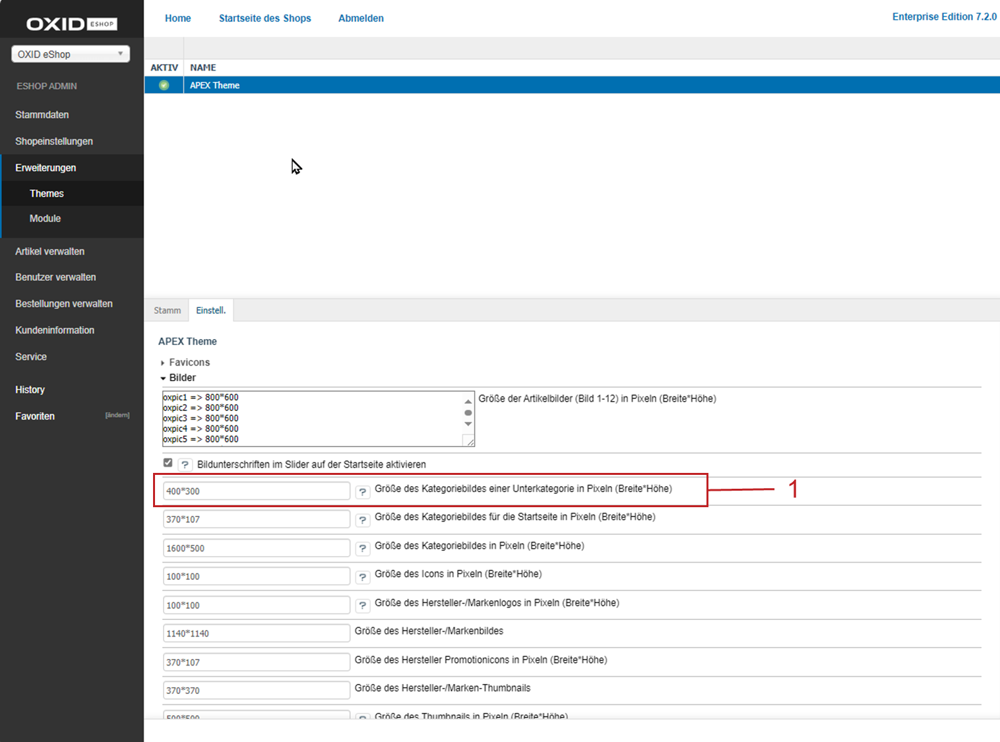
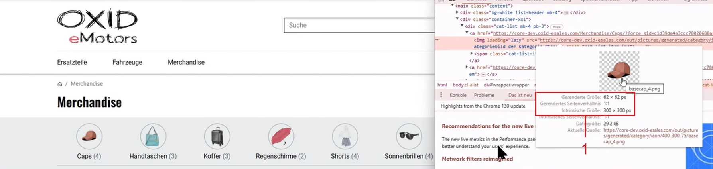

Bilder
======

Ordnen Sie jedem Artikel bis zu zwölf Bilder zu, die in der Detailansicht des Artikels angezeigt werden.

Artikel haben Zoombilder, die ebenfalls auf der Detailseite aufrufbar sind. Legen Sie global, auf Kategorienebene oder für individuelle Produkte fest, welche Art von Zoom Sie nutzen wollen.

Kleinere Artikelbilder zeigen den Artikel in den Artikellisten, in Produktboxen und im Warenkorb. Alle benötigten Bildarten werden automatisch generiert. Legen Sie maximale Bildgrößen und die Bildqualität fest, um das Laden der Bilder im Browser zu optimieren.

Legen Sie fest, ob Bestellbestätigungen mit Bildern gesendet werden sollen.

Bildgenerierung und -qualität festlegen
---------------------------------------
Die erforderlichen Einstellungen für die Bildgenerierung und für die Bildgrößen werden für alle Artikel im Administrationsbereich vorgenommen.

Grundeinstellungen anzeigen
^^^^^^^^^^^^^^^^^^^^^^^^^^^

Prüfen Sie bei Bedarf die Version der Software, die für das dynamische Erzeugen von Bildern zuständig ist.

|procedure|

1. Wählen Sie unter :menuselection:`Stammdaten --> Grundeinstellungen` die Registerkarte :guilabel:`Einstell.`
#. Klicken Sie auf :guilabel:`Bilder`, um die Einstellungen anzuzeigen.

   * Prüfen Sie die Version der GDLib, der Software auf dem Server, die Grafiken dynamisch erzeugt.
   * Prüfen Sie, ob das automatische Generieren von Icons aktiviert ist.

   Lassen Sie beide Einstellungen unverändert.

Bildqualität festlegen
^^^^^^^^^^^^^^^^^^^^^^

Erhöhen Sie bei Bedarf die Geschwindigkeit, mit der Seiten im Browser geladen werden, indem Sie die Bildqualität anpassen.

|procedure|

1. Wählen Sie unter :menuselection:`Stammdaten --> Grundeinstellungen` die Registerkarte :guilabel:`System.`.
#. Wählen Sie den Abschnitt :guilabel:`Bilder`.

   Sie haben folgende Möglichkeiten:

   * :guilabel:`Bildqualität`: Legen Sie die Bildqualität beim Generieren der Bilder fest.

     Die Standardeinstellung ist 75 und ist ein guter Kompromiss zwischen Bildqualität und Dateigröße.

     Bei einem deutlich kleineren Wert sind die Artikelbilder stark komprimiert, haben daher eine kleine Dateigröße, aber eine schlechte Bildqualität (Unschärfen und Kompressionsartefakte).

     Ist der Wert größer als 75, steigt die Bildqualität, aber auch die Größe der Datei (längere Ladezeiten).

* :guilabel:`Bilder automatisch ins WebP-Format konvertieren`: Erhöhen Sie die Browser-Geschwindigkeit.

  Konvertieren Sie dazu die Bilder automatisch ins Bildformat WebP.

Bestellbestätigungen mit Bildern senden
---------------------------------------

Entscheiden Sie, ob Bestellbestätigungen Bilder enthalten sollen.

|background|

E-Mails mit Artikelbildern können schnell groß werden, was zu Problemen beim Versand und beim Empfang der Mail führen kann.

Standardmäßig werden E-Mails ohne Artikelbilder versendet.

Die Artikelbilder werden beim Lesen der E-Mail durch das Mail-Programm des Kunden nachgeladen.

|procedure|

1. Wählen Sie unter :menuselection:`Stammdaten --> Grundeinstellungen` die Registerkarte :guilabel:`System.`.
#. Wählen Sie den Abschnitt :guilabel:`Bilder`.
#. Um Artikelbilder in Bestellbestätigung zu senden, aktivieren Sie das Kontrollkästchen :guilabel:`E-Mails mitsamt Bildern versenden`.

Bildgrößen optimieren
---------------------

Um die Geschwindigkeit zu optimieren, mit der Seiten geladen werden, legen Sie möglichst kleine Bildgrößen fest. Ihre Bilder werden dann vor dem Laden durch den Browser auf diese maximale Bildgröße heruntergerechnet.

Die tatsächlich :emphasis:`angezeigte` Größe der Bilder für Artikel und Kategorien sowie der Hersteller- und Markenlogos ist abhängig vom Design Ihres OXID eShops. Diese Werte legen Sie mit Ihrem CSS fest.

|example|

In unserem Demo-Shop werden die Bilder für die Anzeige von Unterkategorien (:ref:`oxbaaz03a`) auf eine Größe von 400x300 Pixel heruntergerechnet (:ref:`oxbaaz04`, Pos. 1). Dies ist die Größe, die der Browser auf dem Endgerät herunterladen würde.

.. _oxbaaz04:

   Abb.: Beispiel: Maximale Bildgröße 400x300 Pixel festlegen

Das Stylesheet wiederum verkleinert das Bild auf 62x62 Pixel. Dies ist die tatsächlich angezeigte (gerenderte) Größe gegenüber der intrinsischen Größe des vom Browser heruntergeladenen Bilds (:ref:`oxbaaz05`, Pos. 1).

Die angezeigte intrinsische Größe 300 x 300 Pixel weicht von der maximalen Größe ab, weil es sich um ein quadratisches Bild handelt. In diesem Fall legt das System die kleinste Seitenlänge zugrunde, in diesem Beispiel also 300 Pixel.

.. _oxbaaz05:

   Abb.: Gerenderte Bildgröße 62x62 Pixel im Stylesheet

|procedure|

1. Wählen Sie unter :menuselection:`Erweiterungen --> Themes` das Theme.
#. Wählen Sie die Registerkarte :guilabel:`Einstell.`, und wählen Sie :guilabel:`Bilder`.

   Sie haben folgende Möglichkeiten, die Bildgrößen anzupassen:

   * :guilabel:`Größe der Artikelbilder (Bild 1-12) in Pixeln (Breite*Höhe)`

   Artikelbild, das auf der Detailseite angezeigt wird.

   Definieren Sie die maximale Größe von bis zu 12 Artikelbildern.

   Dadurch sind Artikelbilder mit unterschiedlichen Größen möglich.

   Für jedes Artikelbild gibt es eine Zeile, an deren Anfang ``oxpic`` und eine Zahl steht. ``oxpic1`` steht für das erste Artikelbild, ``oxpic2`` für das zweite Artikelbild usw.

   .. hint:: Verwenden Sie die Möglichkeit unterschiedlicher Bildgrößen mit Umsicht.

      Verschieden große Artikelbilder könnten eventuell zu einer eher unprofessionell wirkenden Präsentation der Artikel führen.

   .. todo: #1: sCatIconsize , Icon: auch bei Listenansihten

   * :guilabel:`Größe des Kategoriebildes einer Unterkategorie in Pixeln (Breite*Höhe)`

     Bild für die Anzeige von Unterkategorien in der Kategorie-Übersicht.

     Name der Funktion: ``category.getIconUrl``
     |br|
     Name des Parameters: ``sCatIconsize``
     |br|
     Standardgröße: 400 Pixel breit und 300 Pixel hoch.

     .. _oxbaaz03a:

     .. figure:: ../media/screenshots/oxbaaz03a.png
        :alt: Kategoriebild einer Unterkategorie
        :width: 650
        :class: with-shadow

        Abb.: Kategoriebild einer Unterkategorie

   .. todo #2 zur Zeit auf der Startseite nicht verwendet

   * :guilabel:`Größe des Kategoriebildes für die Startseite in Pixeln (Breite*Höhe)`

     Bild für die Anzeige der Kategorie-Übersicht. Dieser Bildtyp wird derzeit nicht verwendet, bleibt jedoch erhalten, um die Abwärtskompatibilität sicherzustellen, eine zukünftige Nutzung zu ermöglichen und Ihnen bei Bedarf die Einbindung in eigene Templates zu erlauben.

     Name der Funktion: ``category.getPromotionIconUrl``
     |br|
     Name des Parameters: ``sCatPromotionsize``
     |br|
     Standardgröße: 370 Pixel breit und 107 Pixel hoch.

   .. todo #3: nicht im Demoshop, aber lässt sich einfügen: - category.getThumbUrl -> tpl/page/list/list.html.twig  , sCatThumbnailsize

   * :guilabel:`Größe des Kategoriebildes (Breite*Höhe)`

     Bild der Kategorie, die auf der Startseite beworben wird.

     Dieser Bild-Typ ist im Demo-Shop zur Zeit nicht umgesetzt, ließe sich aber umsetzen (Beispiel: :ref:`oxbaaz03c`).

     Name der Funktion: ``category.getThumbUrl``
     |br|
     Name des Parameters: ``sCatThumbnailsize``
     |br|
     Standardgröße: 1600 Pixel breit und 500 Pixel hoch.

     .. _oxbaaz03c:

     .. figure:: ../media/screenshots/oxbaaz03c.png
        :alt: Kategoriebild
        :width: 650
        :class: with-shadow

        Abb.: Kategoriebild

   .. todo #4: article.getIconUrl; sIconsize

   * :guilabel:`Größe des Icons in Pixeln (Breite*Höhe)`

     Icons sind die kleinsten Artikelbilder. Sie werden verwendet

     * in der Warenkorb-Vorschau (Minibasket) (:ref:`oxbaaz03d`, Pos. 1)
     * im Warenkorb (:ref:`oxbaaz03d`, Pos. 2)
     * als Bildumschalter (:ref:`oxbaaz03d`, Pos. 3)
     * als Bildumschalter für den Modal-Zoom (siehe :ref:`konfiguration/bilder:Zoom wählen`)
     * für die Größe der Geschenkverpackung

     Name der Funktion: ``article.getIconUrl``
     |br|
     Name des Parameters: ``sIconsize``
     |br|
     Standardgröße: 100 Pixel breit und 100 Pixel hoch.

     .. _oxbaaz03d:

     .. figure:: ../media/screenshots/oxbaaz03d.png
        :alt: Icon in verschiedenen Funktionen
        :width: 650
        :class: with-shadow

        Abb.: Icon in verschiedenen Funktionen

   .. todo #5: vendor.getIconUrl

   * :guilabel:`Größe des Hersteller-/Markenlogos in Pixeln (Breite*Höhe)`

     Logo, das angezeigt wird

     * in der Marken-Übersicht auf der Startseite (:ref:`oxbaaz03e`, Pos. 1)
     * in der Produktübersicht pro Hersteller (:ref:`oxbaaz03e`, Pos. 1)
     * auf der Produkdetalseite (:ref:`oxbaaz03e`, Pos. 1)

     Name der Funktion: ``vendor.getIconUrl``
     |br|
     Name des Parameters: ``sManufacturerIconsize``
     |br|
     Standardgröße: 100 Pixel breit und 100 Pixel hoch.

     .. _oxbaaz03e:

     .. figure:: ../media/screenshots/oxbaaz03e.png
        :alt: Hersteller-/Markenlogo in verschiedenen Funktionen
        :width: 650
        :class: with-shadow

        Abb.: Hersteller-/Markenlogo in verschiedenen Funktionen

   .. todo: #6

   * :guilabel:`Größe des Hersteller-/Markenbildes`

     Dieser Bildtyp wird derzeit nicht verwendet, bleibt jedoch erhalten, um die Abwärtskompatibilität sicherzustellen, eine zukünftige Nutzung zu ermöglichen und Ihnen bei Bedarf die Einbindung in eigene Templates zu erlauben.

     Name der Funktion: ``manufacturer.getPictureUrl``
     |br|
     Name des Parameters: ``sManufacturerPicturesize``
     |br|
     Standardgröße: 1140 Pixel breit und 1140 Pixel hoch.

   .. todo #7

   * :guilabel:`Größe des Hersteller Promotionicons in Pixeln (Breite*Höhe)`

     Dieser Bildtyp wird derzeit nicht verwendet, bleibt jedoch erhalten, um die Abwärtskompatibilität sicherzustellen, eine zukünftige Nutzung zu ermöglichen und Ihnen bei Bedarf die Einbindung in eigene Templates zu erlauben.

     Name der Funktion: ``manufacturer.getPromotionIconUrl``
     |br|
     Name des Parameters: ``sManufacturerPromotionsize``
     |br|
     Standardgröße: 370 Pixel breit und 107 Pixel hoch

   .. todo #8

   * :guilabel:`Größe des Hersteller-/Marken-Thumbnails`

     Dieser Bildtyp wird derzeit nicht verwendet, bleibt jedoch erhalten, um die Abwärtskompatibilität sicherzustellen, eine zukünftige Nutzung zu ermöglichen und Ihnen bei Bedarf die Einbindung in eigene Templates zu erlauben.

     Name der Funktion: ``manufacturer.getPromotionIconUrl``
     |br|
     Name des Parameters: ``sManufacturerThumbnailsize``
     |br|
     Standardgröße: 370 Pixel breit und 370 Pixel hoch

   .. todo #9: sThumbnailsize; article.getThumbnailUrl: kommt in 3 templates vor: bei Vergleichen, überall wo Produkte aufgelistet werden: -> tpl/page/compare/inc/compareitem.html.twig, tpl/widget/product/listitem_grid.html.twig, tpl/widget/product/listitem_line.html.twig

   * :guilabel:`Größe des Thumbnails in Pixeln (Breite*Höhe)`

     Thumbnails sind Vorschaubilder und werden überall dort angezeigt, wo Produkte aufgelistet werden, beispielsweise in

     * Produktvergleichsseiten
     * Artikellisten, wie Kategorie-Übersichten und Suchergebnisse
     * Aktionen (Beispiel: Frisch eingetroffen!)

     Sie können vorkommen in Gitter- (:ref:`oxbaaz03i`, Pos. 1) oder Listenansicht (:ref:`oxbaaz03i`, Pos. 2).

     Name der Funktion: ``article.getThumbnailUrl``
     |br|
     Name des Parameters: ``sThumbnailsize``
     |br|
     Standardgröße: 500 Pixel breit und 500 Pixel hoch.

     .. _oxbaaz03i:

     .. figure:: ../media/screenshots/oxbaaz03i.png
        :alt: Thumbnails in Gitter- und Listenansicht
        :width: 650
        :class: with-shadow

        Abb.: Thumbnails in Gitter- und Listenansicht

   .. todo #10

   * :guilabel:`Größe der modalen Zoom-Bilder (Zoom 1-4) in Pixeln (Breite*Höhe)`

     Vergrößerte Anzeige modaler Artikelbilder, die sich auf der Detailseite aufrufen lässt.

     Weitere Informationen finden Sie unter :ref:`konfiguration/bilder:Zoom wählen`.

     Name der Funktion: ``article.getZoomPictureUrl``
     |br|
     Name des Parameters: ``sZoomImageSize``
     |br|
     Standardgröße: 1200 Pixel breit und 1200 Pixel hoch.

Zoom wählen
-----------

Beeinflussen Sie je nach Anwendung und Produkt die Kaufbereitschaft positiv, indem Sie beim APEX-Theme mit einer von drei Arten, Bilder zu vergrößern, unterschiedliche psychologische Bedürfnisse der Kunden ansprechen.

* Hover-Zoom: Diese Funktion bietet eine interaktive Möglichkeit, Produktbilder im Detail zu betrachten.

  Wenn der Mauszeiger über das Bild fährt, wird es vergrößert, und die Vergrößerung folgt der Mausbewegung.

  Der Hover-Zoom bietet sich an für Shops mit einer breiten Produktpalette, in denen Kunden häufig zwischen verschiedenen Produkten wechseln. Die interaktive Natur des Hover-Zooms kann das Nutzererlebnis verbessern und die Verweildauer erhöhen.

  Der Hover-Zoom fördert Neugier und Engagement, was zu schnelleren, emotional getriebenen Kaufentscheidungen führen kann.

* Modal-Zoom: Beim Klick auf das Produktbild wird dieses in einem größeren Modal-Fenster geöffnet, in dem weitere Details sichtbar werden.

  Zusätzlich kann der Nutzer innerhalb des Modals nochmals in das Bild hineinzoomen, um besonders feine Details zu erkennen.

  Dies bietet eine umfassende Möglichkeit, Produkte genau unter die Lupe zu nehmen.

  Der Modal-Zoom vermittelt Vertrauen und Sicherheit, unterstützt rationale Entscheidungen und stärkt das Vertrauen in die Produktqualität.

* Lupen-Zoom: Hier wird eine Lupenfunktion aktiviert, wenn der Mauszeiger über das Bild fährt (:ref:`oxbaaz01`).

  Ein separater Bereich zeigt eine stark vergrößerte Ansicht des Bildausschnitts direkt unter dem Mauszeiger.

  Dies ermöglicht eine präzise Betrachtung spezifischer Produktdetails, ohne das gesamte Bild zu vergrößern.

  Der Lupen-Zoom betont Präzision und Qualität, was besonders bei Kunden gut ankommt, die auf Details und Spezifikationen achten, und kann so das Vertrauen in spezifische Produkteigenschaften stärken.

  .. _oxbaaz01:

  .. figure:: ../media/screenshots/oxbaaz01.png
     :alt: Beispiel Lupen-Zoom
     :width: 650
     :class: with-shadow

     Abb.: Beispiel Lupen-Zoom

Sie können die gewünschte Art des Zooms global für Ihren eShop festlegen. Zusätzlich zu diesem Standard-Zoom können Sie die drei Zoom-Optionen auch für jedes Produkt individuell einstellen.

Zoom global festlegen
^^^^^^^^^^^^^^^^^^^^^

Wählen Sie die Art des Zooms global für Ihren eShop.

|procedure|

1. Wählen Sie unter :menuselection:`Erweiterungen --> Themes` das APEX-Theme.
#. Expandieren Sie auf der Registerkarte :guilabel:`Einstell.` den Bereich :guilabel:`Produktdetailseite`.
#. Wählen Sie unter :guilabel:`Zoom type for product detail page` die gewünschte Art des Zooms.
#. Speichern Sie Ihre Einstellungen.

Zoom für individuelle Produkte festlegen
^^^^^^^^^^^^^^^^^^^^^^^^^^^^^^^^^^^^^^^^

Weisen Sie Sie bei Bedarf einzelnen Produkten eine individuelle Zoom-Option zu.

Zusätzlich zur Einstellung einer Standard-Bild-Zoom-Option in den Theme-Einstellungen können Sie damit die drei Zoom-Optionen individuell für jedes Produkt anwenden.

Damit haben Sie eine größere Flexibilität für verschiedene Produkte.

|procedure|

1. Wählen Sie unter :menuselection:`Artikel verwalten --> Artikel` das Produkt und wählen Sie die Registerkarte :guilabel:`Einstell.`.
#. Legen Sie den gewünschten Zoom fest, indem Sie im Eingabefeld :guilabel:`Alternatives Template` (in unserem Beispiel: Lupen-Zoom festlegen, :ref:`oxbaaz02`, Pos. 1) den Pfad des entsprechenden Templates eingeben.

   * Hover-Zoom: ``custom/hover_zoom.html.twig``
   * Modal-Zoom: ``custom/modal_zoom.html.twig``
   * Lupen-Zoom: ``custom/magnifier_lens.html.twig``

   .. _oxbaaz02:

   .. figure:: ../media/screenshots/oxbaaz02.png
      :alt: Alternatives Template für ein Produkt festlegen
      :width: 650
      :class: with-shadow

      Abb.: Alternatives Template für ein Produkt festlegen

#. Speichern Sie Ihre Einstellungen.
#. Optional: Um die Einheitlichkeit der Darstellung zu gewährleisten, wiederholen Sie die Schritte für alle Produkte einer Kategorie.

   Hintergrund: Es ist nicht möglich, die Zoom-Templates auf Kategorieebene anzuwenden.

.. Intern: oxbaaz, Status: