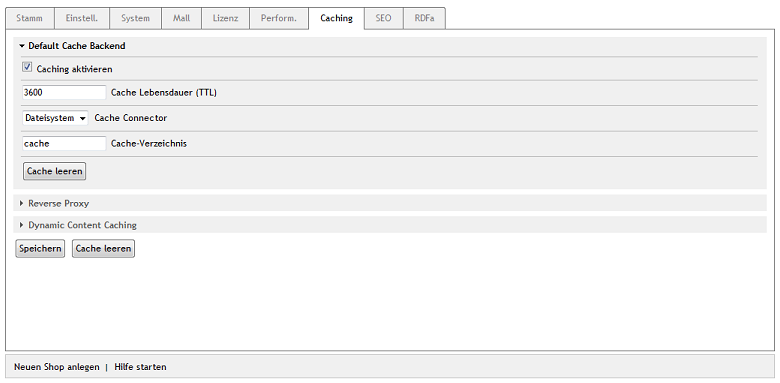

Caching-Einstellungen
=====================

Im Administrationsbereich des OXID eShop lassen sich alle Einstellungen für das Caching vornehmen. Gehen Sie zu :menuselection:`Stammdaten --> Grundeinstellungen --> Caching`. Die Registerkarte :guilabel:`Caching` ist in drei Bereiche unterteilt: :guilabel:`Default Cache Backend`, :guilabel:`Reverse Proxy` und :guilabel:`Dynamic Content Caching`. Klicken Sie jeweils auf die Überschriften, um die dazugehörigen Einstellungen anzuzeigen.

Default Cache Backend
---------------------
In diesem Abschnitt wird das Standard-Caching aktiviert. Dadurch werden statische Inhalte, wie Artikel, Kategorien, der Kategoriebaum, Mengenpreise, Inhalte von CMS-Seiten u.a. zwischengespeichert. Mit Cache Connector legen Sie den Speicherort für den Cache fest. Sie können dabei das Dateisystem nutzen oder Memcached wählen, wenn Memcached installiert wurde und verwendet werden kann.

Der Default Cache kann auch komplett gelöscht werden.

:guilabel:`Caching aktivieren` |br|
Setzen Sie ein Häkchen, um das Standard-Caching zu aktivieren.

:guilabel:`Cache Lebensdauer (TTL)` |br|
Der Standardwert für die Cache Lebensdauer ist 3.600 Sekunden. TTL steht für Time To Live. Nach dieser Zeit wird der Cache gelöscht, auch wenn er noch nie verwendet wurde.

:guilabel:`Cache Connector` |br|
Wählen Sie aus der Liste den Speicherort des Caches: Dateisystem oder Memcached.

:guilabel:`Cache-Verzeichnis` |br|
Geben Sie ein Verzeichnis an, welches der Cache verwenden soll. Standardmäßig ist dafür das Verzeichnis :file:`/cache` vorgesehen. Das Eingabefeld wird nur angezeigt, wenn Dateisystem als Cache Connector ausgewählt wurde.

:guilabel:`Liste der Memcached Server ([host]@[port]@[weight])` |br|
Tragen Sie den oder die Memcached Server ein. Die Syntax ist ``[host]@[port]@[weight]``, wobei ``@[weight]`` optional ist. Werden mehrere Memcached Server angegeben, kann über den Wert ``@[weight]`` eine Lastverteilung definiert werden. Das Eingabefeld wird nur angezeigt, wenn Memcached als Cache Connector ausgewählt wurde.

Reverse Proxy
-------------
Der Abschnitt enthält die Einstellungen für die Unterstützung eines Reverse Proxys. Derzeit arbeitet der OXID eShop ausschließlich mit Varnish als Reverse Proxy zusammen. Bitte beachten Sie, dass Sie entweder Reverse Proxy oder Dynamic Content Caching verwenden sollten. Es wird davon abgeraten, beide Arten des Cachings im OXID eShop einzusetzen.

Es wird überprüft, ob der Administrationsbereich über den Reverse Proxy aufgerufen wurde. Ist das nicht der Fall, wird ein Hinweis angezeigt. Mit dem Button :guilabel:`Verfügbarkeit des Reverse Proxys testen`, kann überprüft werden, ob der Reverse Proxy für das Frontend verfügbar ist und die Voraussetzungen für das Caching gegeben sind.

Der Cache des Reverse Proxys kann für alle oder bestimmte Seiten gelöscht werden.

:guilabel:`Caching aktivieren` |br|
Setzen Sie ein Häkchen, um das Caching mit dem Reverse Proxy zu aktivieren.

:guilabel:`Cache Lebensdauer (TTL)` |br|
Dauer in Sekunden, nach denen der Cache gelöscht wird, auch wenn er noch nie verwendet wurde. Der Standardwert ist 3.600 Sekunden.

:guilabel:`Cache leeren` |br|
Der Cache des Reverse Proxys kann für alle Seiten oder separat für die Startseite, die Detailseiten der Artikel oder für Listen- und Detailseiten gelöscht werden. Wird der Eintrag Listen- und Detailseiten ausgewählt, wird der Cache für die Listen der Kategorien, Hersteller, Lieferanten und auch für jede Detailseite aus den Kategorien gelöscht.

:guilabel:`Verfügbarkeit des Reverse Proxys testen` |br|
Überprüft, ob der Reverse Proxy für das Frontend verfügbar ist. Dabei wird intern die Startseite des Shops aufgerufen und nach dem Header 'X-Varnish' gesucht, der vom Reverse Proxy Varnish geliefert wird. Das Ergebnis der Prüfung wird als Meldung ausgegeben.

Dynamic Content Caching
-----------------------
In diesem Abschnitt finden Sie die Einstellungen zum Dynamic Content Caching, welches bisher die einzige Art des Cachings in der Enterprise Edition war. Eine Tabelle gibt eine Übersicht über die vom Cache angeforderten Daten, beispielsweise über Cache Hits für Daten, die sich im Cache befinden oder Cache Miss für Daten, die im Cache nicht mehr vorhanden sind.

Bitte verwenden Sie Dynamic Content Caching nicht zusammen mit Reverse Proxy, da beide Methoden im Wesentlichen Seiten und dynamische Inhalte zwischenspeichern. Das könnte die Performance negativ beeinflussen.

:guilabel:`Caching aktivieren` |br|
Wenn Sie Dynamic Content Caching verwenden wollen, aktivieren Sie bitte das Kontrollkästchen.

:guilabel:`Cache Lebensdauer (TTL)` |br|
Dauer in Sekunden, nach denen der Cache gelöscht wird. Der Standardwert ist 3.600 Sekunden. Nach dieser Zeit wird das Seiten-Layout ungültig. Diese Information wird über den HTTP-Header unter Verwendung des Header-Wertes \"Age\" gesendet.

:guilabel:`Cachebare Klassen` |br|
Liste der Klassen, die gecached werden, standardmäßig info, start, details, alist und vendorlist.

.. Intern: oxbacd, Status: