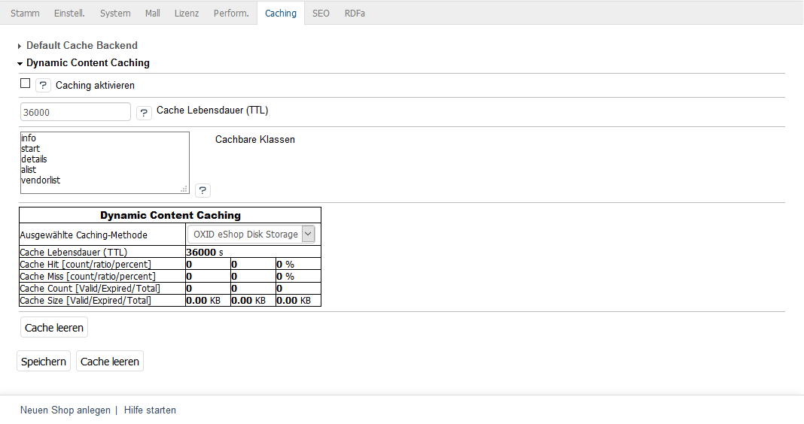

Caching-Einstellungen
=====================

Im Administrationsbereich des OXID eShop lassen sich alle Einstellungen für das Caching vornehmen. Gehen Sie zu :menuselection:`Stammdaten --> Grundeinstellungen --> Caching`. Die Registerkarte :guilabel:`Caching` ist in zwei Bereiche unterteilt: :guilabel:`Default Cache Backend` und :guilabel:`Dynamic Content Caching`. Klicken Sie jeweils auf die Überschriften, um die dazugehörigen Einstellungen anzuzeigen.

.. image:: ../../media/screenshots/oxbacd01.png
   :alt: Registerkarte Caching
   :height: 343
   :width: 650

Default Cache Backend
---------------------
In diesem Abschnitt wird das Standard-Caching aktiviert. Dadurch werden statische Inhalte, wie Artikel, Kategorien, der Kategoriebaum, Mengenpreise, Inhalte von CMS-Seiten u.a. zwischengespeichert. Mit Cache Connector legen Sie den Speicherort für den Cache fest. Sie können dabei das Dateisystem nutzen oder Memcached wählen, wenn Memcached installiert wurde und verwendet werden kann.

Der Default Cache kann auch komplett gelöscht werden.

:guilabel:`Caching aktivieren`
   Setzen Sie ein Häkchen, um das Standard-Caching zu aktivieren.

:guilabel:`Cache Lebensdauer (TTL)`
   Der Standardwert für die Cache Lebensdauer ist 3.600 Sekunden. TTL steht für Time To Live. Nach dieser Zeit wird der Cache gelöscht, auch wenn er noch nie verwendet wurde.

:guilabel:`Cache Connector`
   Wählen Sie aus der Liste den Speicherort des Caches: Dateisystem oder Memcached.

:guilabel:`Cache-Verzeichnis`
   Geben Sie ein Verzeichnis an, welches der Cache verwenden soll. Standardmäßig ist dafür das Verzeichnis :file:`/cache` vorgesehen. Das Eingabefeld wird nur angezeigt, wenn Dateisystem als Cache Connector ausgewählt wurde.

:guilabel:`Liste der Memcached Server ([host]@[port]@[weight])`
   Tragen Sie den oder die Memcached Server ein. Die Syntax ist ``[host]@[port]@[weight]``, wobei ``@[weight]`` optional ist. Werden mehrere Memcached Server angegeben, kann über den Wert ``@[weight]`` eine Lastverteilung definiert werden. Das Eingabefeld wird nur angezeigt, wenn Memcached als Cache Connector ausgewählt wurde.

Dynamic Content Caching
-----------------------
In diesem Abschnitt finden Sie die Einstellungen zum Dynamic Content Caching, welches bisher die einzige Art des Cachings in der Enterprise Edition war. Eine Tabelle gibt eine Übersicht über die vom Cache angeforderten Daten, beispielsweise über Cache Hits für Daten, die sich im Cache befinden oder Cache Miss für Daten, die im Cache nicht mehr vorhanden sind.

Bitte verwenden Sie Dynamic Content Caching nicht zusammen mit einem Reverse Proxy, da beide Methoden im Wesentlichen Seiten und dynamische Inhalte zwischenspeichern. Das könnte die Performance negativ beeinflussen.

:guilabel:`Caching aktivieren`
   Wenn Sie Dynamic Content Caching verwenden wollen, aktivieren Sie bitte das Kontrollkästchen.

:guilabel:`Cache Lebensdauer (TTL)`
   Dauer in Sekunden, nach denen der Cache gelöscht wird. Der Standardwert ist 3.600 Sekunden. Nach dieser Zeit wird das Seiten-Layout ungültig. Diese Information wird über den HTTP-Header unter Verwendung des Header-Wertes \"Age\" gesendet.

:guilabel:`Cachebare Klassen`
   Liste der Klassen, die gecached werden, standardmäßig info, start, details, alist und vendorlist.

.. Intern: oxbacd, Status: