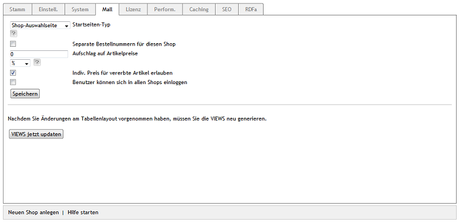

Hauptshop & Elternshops
=======================

Der Shop, der bei der Installation des OXID eShop Enterprise Edition erstellt wird, ist ein spezieller Shop. Der Hauptshop vereinigt nicht nur verschiedene Shoptypen in sich, sondern stellt auch zwei Einstellmöglichkeiten bereit, die alle Shops betreffen. Die übrigen Einstellungen hingegen finden sich auf der Registerkarte :guilabel:`Mall` jedes Shops.

Hauptshop
---------
:guilabel:`Startseiten-Typ` |br|
Diese Einstellung ist nur beim Hauptshop vorhanden.

Wenn es bei einer Enterpreis Edition mehrere Shops gibt, kann aus der Dropdown-Liste ausgewählt werden, was beim Aufruf der Shop-URL angezeigt wird. Der erste Eintrag :guilabel:`Hauptshop anzeigen` ruft direkt die Startseite des Hauptshops auf. Mit :guilabel:`Shop-Auswahlseite` wird eine Seite aufgerufen, auf welcher der anzuzeigende Shop ausgewählt werden kann. Darüber hinaus können einzelne Shops über eigene Shop-URLs aufgerufen werden, worauf später eingegangen wird.

:guilabel:`Separate Bestellnummern für diesen Shop` |br|
Aktivieren Sie dieses Kontrollkästchen, damit Bestellungen in diesem Shop Bestellnummern aus einem separaten Nummernkreis erhalten. Für Shops, in denen diese Einstellung nicht aktiv ist, werden die Bestellnummern shopübergreifend vergeben und hochgezählt.

:guilabel:`Aufschlag auf Artikelpreise` |br|
Für den Shop kann generell ein absoluter oder ein prozentualer Aufschlag auf den Artikelpreis festgelegt werden. Geben Sie eine Prozentzahl für einen prozentualen Aufschlag ein und stellen Sie sicher, dass :guilabel:`%` in der zugehörigen Dropdown-Liste ausgewählt wurde. Soll es einen absoluten Preisaufschlag geben, wählen Sie bitte :guilabel:`EUR` aus der Liste und tragen Sie einen Betrag ein.

:guilabel:`Indiv. Preis für vererbte Artikel erlauben` |br|
Soll dieser Shop einmal seine Artikel und Einstellungen an andere Shops vererben, welche die Artikel mit individuellen Preisen anbieten sollen, aktivieren Sie bitte dieses Kontrollkästchen. Artikel- und Staffelpreise können dann in den jeweiligen Shops angepasst werden. Alle übrigen Eigenschaften der Artikel sind nicht änderbar.

:guilabel:`Benutzer können sich in allen Shops einloggen` |br|
Diese Einstellung ist nur beim Hauptshop vorhanden.

Sie legt fest, ob sich die Benutzer in allen Shops anmelden können. Wurde das Kontrollkästchen aktiviert, müssen die Benutzer in nur einem Shop registriert sein, können aber in allen anderen Shops die Anmeldedaten nutzen und auf Ihr Konto zugreifen. Beim Erstellen eines neuen Shops auf Basis des Elternshops, werden auch die Benutzer des Elternshops mit kopiert. Sie lassen sich mit entsprechenden Administratorrechten sowohl im Elternshop, als auch im neu erstellten Shop ändern. Neue Kunden werden hingegen nur in dem Shop erstellt, für den sie sich registriert haben.

Ist diese Einstellung nicht aktiv oder wurde sie später deaktiviert, können sich die Benutzer nur an den Shop anmelden, für den sie sich registriert haben.

Elternshops
-----------
Zum Elternshop wird ein Shop beim Erstellen eines neuen Shops, wenn letzterer alle Artikel und Einstellungen erbt. Der Shop, der Artikel, Attribute, Auswahllisten, Versandarten, Versandkostenregeln, Hersteller, Lieferanten und weitere Elemente an den neuen Shop weitergibt, ist dessen Elternshop. Vom Hauptshop aus können darüber hinaus einzelne Artikel mit jedem beliebigen anderen Shop verknüpft werden. Diese Eigenschaft macht den Hauptshop auch zu einem Supershop. Lesen Sie mehr über weitere Shoptypen im Artikel `Subshops, Supershops \& Multishops <subshops-supershops-multishops>`_ .

.. seealso:: :doc:`Vererbung <vererbung/vererbung>`

.. Intern: oxaagm, Status: