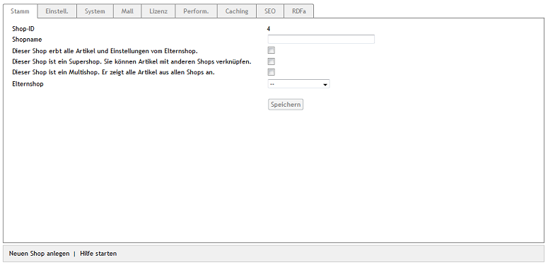
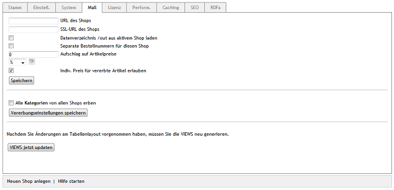

Subshops, Supershops \& Multishops
==================================

Beim Anlegen eines Shops wird definiert, zu welchem Shoptyp der neue Shop gehört und ob er Artikel, Attribute, Auswahllisten, Versandarten, Versandkostenregeln, Hersteller, Lieferanten und weitere Elemente von einem Elternshop erben soll. Shoptypen sind Subshop, Supershop und Multishop.

Der *Subshop* ist ein Shop ohne spezielle Eigenschaften. Er kann die Artikel und Einstellungen von einem Elternshop erben und diese an neue Shops vererben. Artikel, Attribute, Auswahllisten und andere Elemente können nur mit Subshops verknüpft werden, für die der Shop Elternshop ist.

Der *Supershop* kann ebenfalls Artikel und Einstellungen von einem Elternshop erben und sie an neue Shops weitergeben. In einem Supershop besteht darüber hinaus die Möglichkeit, Artikel, Attribute, Auswahllisten u.a. mit jedem Shop zu verknüpfen. Das gilt auch für den Hauptshop und für Subshops, für den der Supershop nicht Elternshop ist.

Der *Multishop* kommt ohne Vererbung aus, denn er zeigt alle Artikel, Hersteller und Lieferanten aus allen Shops an. Als einziger Shoptyp kann er alle Kategorien aus anderen Shops übernehmen.

Ein neuer Shop kann unter :menuselection:`Stammdaten --> Grundeinstellungen` angelegt werden. Nutzen Sie dafür die Funktion am unteren Bildschirmrand.

:guilabel:`Shop-ID` |br|
Die Shops erhalten automatisch eine Nummer, beginnend mit der Shop-ID 1 für den Hauptshop.

:guilabel:`Shopname` |br|
Tragen Sie hier den Namen für den neuen Shop ein.

:guilabel:`Dieser Shop erbt alle Artikel und Einstellungen vom Elternshop.` |br|
Wird dieses Kontrollkästchen aktiviert, erbt der neue Shop Artikel, Attribute, Auswahllisten sowie andere Elemente und Einstellungen von einem Elternshop. Dieser muss aus der Auswahlliste :guilabel:`Elternshop` ausgewählt werden.

:guilabel:`Dieser Shop ist ein Supershop. Sie können Artikel mit anderen Shops verknüpfen.` |br|
Bei aktiviertem Kontrollkästchen wird ein Shop vom Shoptyp Supershop erstellt.

:guilabel:`Dieser Shop ist ein Multishop. Er zeigt alle Artikel aus allen Shops an.` |br|
Bei aktiviertem Kontrollkästchen wird ein Shop vom Shoptyp Multishop erstellt.

Wird beim Anlegen eines neuen Shops nicht Supershop oder Multishop als Shoptyp gewählt, entsteht ein Subshop.

Unter :menuselection:`Stammdaten --> Grundeinstellungen` können auf der Registerkarte :guilabel:`Mall` für den Shop Einstellungen zur Mall-Funktion vorgenommen werden. Die Einstellmöglichkeiten sind für alle Shoptypen nahezu identisch. Nur für den Multishop gibt es die Möglichkeit, alle Kategorien aus allen Shops zu übernehmen. Wurden Artikel, Attribute, Auswahllisten sowie andere Elemente und Einstellungen von einem Elternshop geerbt, zeigt die Registerkarte auch die Vererbungseinstellungen an.

:guilabel:`URL des Shops` |br|
Es kann eine Webadresse angegeben werden, über die der Shop erreichbar ist. Diese URL muss sich durch die Top-Level-Domain (TLD), die Second-Level-Domain, eine Subdomain oder durch eine beliebige Kombination daraus von den anderen Shops der Enterprise Edition unterscheiden. Das Protokoll ist mit anzugeben.

Beispiele: ``http://de.exampleshop.com``, ``http://en.exampleshop.com``, ``http://www.exampleshop.de``

Es ist nicht möglich, die verschiedenen Shops über Pfade in der URL zu strukturieren. Wird keine URL angegeben, wird der Shop über den URL-Parameter ``shp`` adressiert.

:guilabel:`SSL-URL des Shops` |br|
Webadresse für den verschlüsselten Aufruf des Shops. Es gelten die oben genannten Anmerkungen zur URL.

:guilabel:`Datenverzeichnis /out aus aktivem Shop laden` |br|
Aktivieren Sie dieses Kontrollkästchen, wenn beispielsweise die Artikelfotos mit der URL des aktiven Shops geladen werden sollen. Ohne diese Funktion werden die Artikelfotos und andere Ressourcen aus dem Verzeichnis :file:`/out` mit der URL des Hauptshops aufgerufen.

:guilabel:`Separate Bestellnummern für diesen Shop` |br|
Aktivieren Sie dieses Kontrollkästchen, damit Bestellungen in diesem Shop Bestellnummern aus einem separaten Nummernkreis erhalten. Für Shops, in denen diese Einstellung nicht aktiv ist, werden die Bestellnummern shopübergreifend vergeben und hochgezählt.

:guilabel:`Aufschlag auf Artikelpreise` |br|
Für den Shop kann generell ein absoluter oder ein prozentualer Aufschlag auf den Artikelpreis festgelegt werden. Geben Sie eine Prozentzahl für einen prozentualen Aufschlag ein und stellen Sie sicher, dass :guilabel:`%` in der zugehörigen Dropdown-Liste ausgewählt wurde. Soll es einen absoluten Preisaufschlag geben, wählen Sie bitte :guilabel:`EUR` aus der Liste und tragen Sie einen Betrag ein.

:guilabel:`Indiv. Preis für vererbte Artikel erlauben` |br|
Soll dieser Shop einmal seine Artikel und Einstellungen an andere Shops vererben, welche die Artikel mit individuellen Preisen anbieten sollen, aktivieren Sie bitte dieses Kontrollkästchen. Artikel- und Staffelpreise können dann in den jeweiligen Shops angepasst werden. Alle übrigen Eigenschaften der Artikel sind nicht änderbar.

.. Intern: oxbagn, Status: