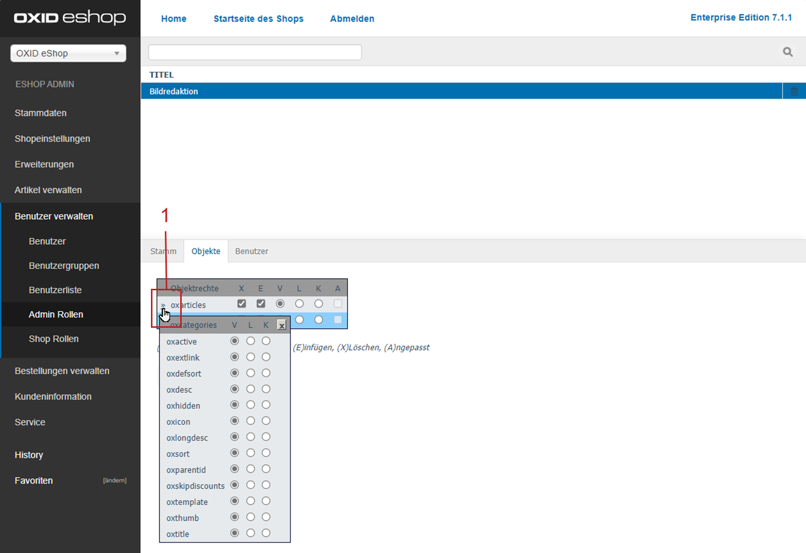

Rechte und Rollen
=================

Ein Feature der Enterprise Edition ist die Rechte- und Rollenverwaltung. Mit Rechte und Rollen kann der Zugriff auf anzuzeigende Elemente und verfügbare Funktionen des OXID eShop für einzelne Benutzer und Benutzergruppen gesteuert werden.

Dabei wird zwischen den Rechten und den Rollen für den eigentlichen Shop, hier auch als Frontend bezeichnet, und dem Administrationsbereich, dem so genannten Backend, unterschieden. Front- und Backend werden in diesem Dokument als Begriffe zur Verdeutlichung der verschiedenen Bereiche der Rechte- und Rollenverwaltung verwendet.

Das Recht regelt den Zugriff auf bestimmte Funktionen, wie den Zugriff auf Artikel und Kategorien oder die Anzeige bestimmter Bereiche der Detailseite von Artikeln. In Rollen werden mehrere Rechte zusammengefasst und Benutzern und Benutzergruppen zugeordnet.

Rechte und Rollen für den Shop (Frontend)
-----------------------------------------
Für den Shop können verschiedene Berechtigungen erteilt werden. Die Definition erfolgt im Administrationsbereich in der Artikel- und Kategorienverwaltung sowie unter :menuselection:`Benutzer verwalten --> Shop Rollen`.

Anzeigen von Artikeln und Kategorien
^^^^^^^^^^^^^^^^^^^^^^^^^^^^^^^^^^^^
Sie können festlegen, dass nur bestimmte Benutzergruppen ausgewählte Artikel und Kategorien sehen dürfen. Die Definition erfolgt auf der Registerkarte :guilabel:`Rechte` von Artikeln und Kategorien, indem eine oder mehrere Benutzergruppen zugewiesen werden. Es handelt sich dabei um ein ausschließliches Recht. Nur für Benutzer, die den zugewiesenen Benutzergruppen angehören, sind die jeweiligen Artikel und Kategorien nach Anmeldung am Shop sichtbar. Allen übrigen Benutzern und Benutzergruppen werden diese Bestandteile des Warenkatalogs niemals angezeigt.

Kaufen von Artikeln und Kategorien
^^^^^^^^^^^^^^^^^^^^^^^^^^^^^^^^^^
Für Artikel und Kategorien kann auch definiert werden, dass sie ausschließlich für bestimmte Benutzergruppen kaufbar sein sollen. Auch hier erfolgt die Definition durch Zuweisung der jeweiligen Benutzergruppen auf der Registerkarte :guilabel:`Rechte` von Artikeln oder Kategorien. Der Screenshot zeigt, dass es für nicht berechtigte Benutzer in der Artikelübersicht keine Möglichkeit gibt, zum Beispiel Kites in den Warenkorb zu legen. Mit der Schaltfläche :guilabel:`Mehr Informationen` kann lediglich die Detailseite des Artikels aufgerufen werden.

Auch in der Detailansicht fehlt die Schaltfläche :guilabel:`In den Warenkorb legen`, solange der Kunde nicht am Shop angemeldet ist und der berechtigten Benutzergruppe angehört.

.. image:: ../media/screenshots/oxbaev02.png
   :alt: Detailansicht Artikel (Rechte und Rollen)
   :class: with-shadow
   :height: 307
   :width: 609

Zugriff auf Funktionen und Bereiche der Detailseite
^^^^^^^^^^^^^^^^^^^^^^^^^^^^^^^^^^^^^^^^^^^^^^^^^^^
Rechte und Rollen können auch auf den gesamten Warenkatalog bezogen vergeben werden. Der Shop wird mit folgenden Rechten für den Shop ausgeliefert, die zu Rollen zusammengefasst den gewünschten Benutzergruppen zugeordnet werden können:

* Artikel in den Warenkorb legen (TOBASKET)
* Artikelpreis anzeigen (SHOWARTICLEPRICE)
* Kurzbeschreibung des Artikels anzeigen (SHOWSHORTDESCRIPTION)
* Langbeschreibung des Artikels anzeigen (SHOWLONGDESCRIPTION)

Diese Rechte und Rollen werden unter :menuselection:`Benutzer verwalten --> Shop Rollen` definiert. Verschiedene Rechtekombinationen können in Rollen zusammengefasst und Benutzergruppen zugeordnet werden. Sobald für eine Benutzergruppe ein Recht erteilt wurde, gilt für alle anderen Benutzergruppen dieses Recht nicht mehr. Es ist möglich, eigene Rechte zu definieren, die auf View-Klassen und deren Methoden basieren. Über einen vergebenen Ident lässt sich in Templates eine rechteabhängige Anzeige realisieren.

.. image:: ../media/screenshots/oxbaev03.png
   :alt: Rechte für Detailansicht (Rechte und Rollen)
   :class: with-shadow
   :height: 158
   :width: 319

Auf der Detailseite, auf dem Screenshot als Beispiel zu sehen, und auch in den Artikelübersichten werden keine Preise für nicht berechtigte Benutzer angezeigt.

.. image:: ../media/screenshots/oxbaev04.png
   :alt: Detailansicht Artikel (Rechte und Rollen)
   :class: with-shadow
   :height: 310
   :width: 612

Rechte und Rollen für den Administrationsbereich (Backend)
----------------------------------------------------------
Für den Administrationsbereich lassen sich ebenfalls Rollen definieren, um die verschiedenen Aufgabenbereiche bei der Administration des OXID eShop abbilden zu können.

Zugriff auf Menüs, Untermenüs, Registerkarten
^^^^^^^^^^^^^^^^^^^^^^^^^^^^^^^^^^^^^^^^^^^^^
Die Rollen erlauben unterschiedliche Zugriffe auf Menüs und Untermenüs der Navigation und auch auf einzelne Registerkarten des Eingabebereiches. Damit erhält jeder Bearbeiter seinen benutzerdefinierten Administrationsbereich. Diese Rechte und Rollen werden unter :menuselection:`Benutzer verwalten --> Admin Rollen` definiert und den jeweiligen Benutzern zugeordnet.

.. image:: ../media/screenshots/oxbaev05.png
   :alt: Zugriff im Administrationsbereich
   :class: with-shadow
   :height: 335
   :width: 650

Zugriff auf Artikel und Kategorien
^^^^^^^^^^^^^^^^^^^^^^^^^^^^^^^^^^
Für die Bearbeitung von Artikeln und Kategorien können die Rechte sehr differenziert definiert werden. Sie regeln beispielsweise das Anlegen, Ändern und Löschen von Artikeln und Kategorien insgesamt und wenn nötig den Zugriff auf jedes einzelne Steuerelement (Feld, Kontrollkästchen oder Option) des jeweiligen Eingabebereiches.

.. Intern: oxbaev, Status: