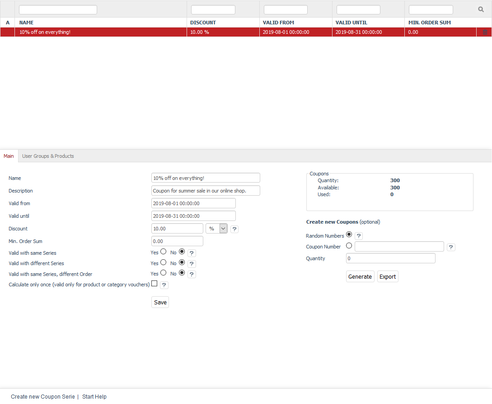
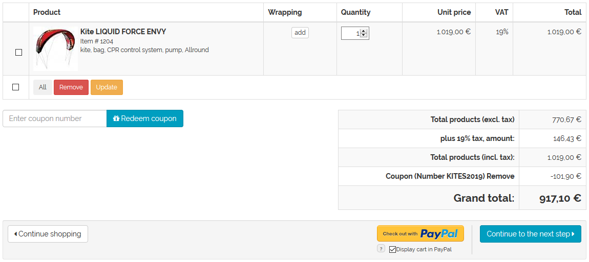

Coupon series
===============

Coupon series are a defined number of coupons with identical validity and the same redemption conditions. After creating a coupon series, coupons can be generated with the same coupon code or individual coupon numbers. After the coupons have found their way to the customer, for example, via a sent newsletter, the customer will be able to use the coupon code when shopping online. After entering the coupon code in the first step of the ordering process, the customer will receive a relative or absolute discount on certain products or the entire shopping cart. When a coupon is applied, its entire value will be used up. Unlike gift certificates, an existing coupon can’t be used partially.

Besides promotions, discounts and newsletters, coupons are another marketing tool in your OXID eShop. They can be used to create buying incentives and attract new customers.

After the customer has added products to the shopping cart, he/she can enter a coupon code or a coupon number in the appropriate field in the first ordering step. Depending on the coupon series settings, multiple coupons for one order or one coupon for multiple orders may be used. If multiple coupons can be used for an order, they will only be accepted if the total order amount is greater than €0.00. After the coupon has been submitted, the shop will check its validity and accept or reject it with a corresponding note.

If the coupon code has been accepted by the shop, the coupon will be marked as reserved in the database. Upon completion of the order, the coupon will be marked as used and will receive references to the order and the customer as well as a timestamp.

Coupons can also be removed from the cart overview.

Section \"Coupon series\" explains how to create and set up coupon series and how to generate and export the associated coupons.

Coupon series are created in the Admin panel under :menuselection:`Shop Settings --> Coupon Series`. Here, you will see a list of the available coupon series and the input area right below it.

A small green icon at the beginning of the line in the list of coupon series symbolises an active coupon series. If the validity period doesn’t apply for coupon series, this icon won’t be displayed. The coupon series thus is invalid and not active. The list displays the name of the coupon series, the discount granted, the validity period and a specified minimum purchase value. To search for coupon series, enter characters in the search field. The search starts as soon as Enter or the magnifying glass icon are clicked on. The column headers in the list are links. Clicking on them will sort the coupon series in ascending order by name, discount, validity, etc.

Coupon series can be permanently removed from the database by clicking on the trash icon at the end of the line. Enter an invalid period if you want the coupon series to be inactive.

When you select a coupon series from the list, its information will be displayed in the input area. To create a new coupon series, click on :guilabel:`Create new Coupon Series` at the bottom of the screen.

-----------------------------------------------------------------------------------------

Main tab
-------------------
**Contents**: valid coupon series, temporary valid, valid with the same series, valid with another series, coupon value, discount, absolute and percentage, generating and exporting coupons, random numbers, coupon number, coupon code |br|
:doc:`Read article <main-tab>` |link|

User Groups & Products tab
----------------------------------------
**Contents**: coupons for user groups, assigning user groups, coupons for categories, assigning categories, coupons for products, assigning products |br|
:doc:`Read article <user-groups-products-tab>` |link|

Mall tab
------------------
Available only in Enterprise Edition |br|
**Contents**: inheriting coupon series, assigning coupon series, parent shop, subshop, supershop, multishop, Mall |br|
:doc:`Read article <mall-tab>` |link|

.. Intern: oxbahr, Status: