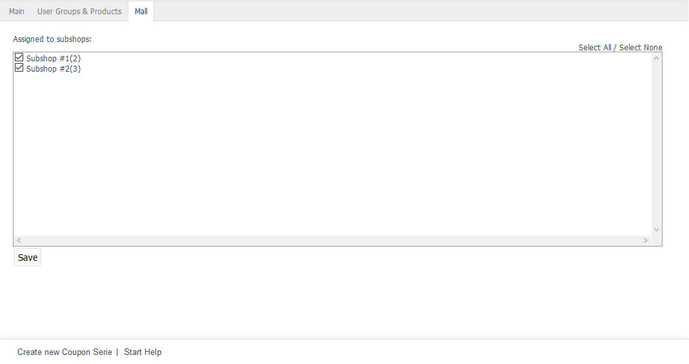

Mall tab
========

The :guilabel:`Mall` tab is only available for coupon series in Enterprise Edition.

Coupon series can be inherited when creating shops. If this option is selected, a new shop will contain all coupon series of the parent shop. The characteristics of these coupon series can’t be changed.

The :guilabel:`Mall` tab can be used to manage assignments of a coupon series to subshops and supershops. This tab will be empty for multishops since they can load and display coupon series from all shops without such an assignment.

The inheritance of all coupon series for a shop can be undone. To do this, uncheck the inheritance settings box in the :guilabel:`Mall` tab of the subshop or supershop under :menuselection:`Master Settings --> Core Settings`.

:guilabel:`Assigned to following subshops` |br|
Check or uncheck the appropriate box to assign/unassign a coupon series to/from subshops and supershops. If the box is not checked, the coupon series will be available in the parent shop but not in the respective subshop or supershop.

Use the :guilabel:`Select All` and :guilabel:`Select None` link on the right side of the window to assign/unassign the coupon series to/from all shops. Any changes made must be saved and will immediately be effective for subshops or supershops.

.. Intern: oxbahu, Status:, F1: voucherserie_mall.html