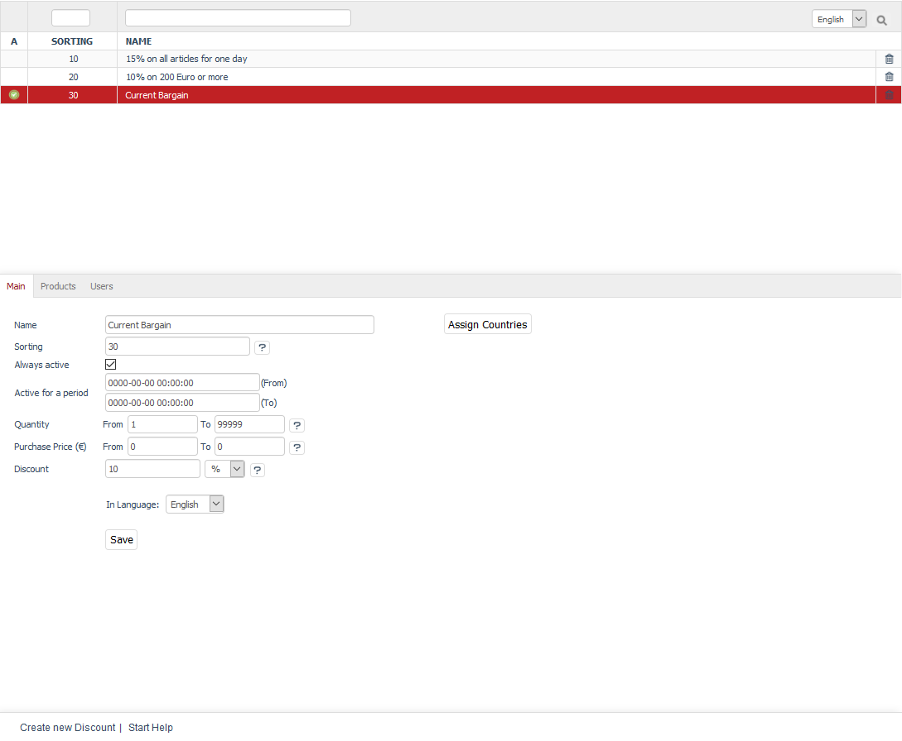
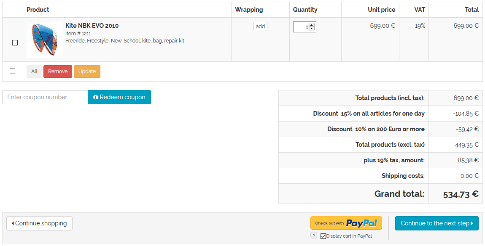

Discounts
=======

Apart from coupon series, newsletters or promotions, discounts are an important marketing tool in your OXID eShop. You can grant a discount on the regular price of a product if certain conditions are met. Cheaper product prices can be set for specific products, categories, users, user groups, and purchase values or quantities. The wide variety of discounts allows you to offer shopping benefits to your customers and promote customer loyalty.

Discounts can be defined for a specific time period or even for a specific country. They can be set to display the offer directly with the discounted prices. However, you can also specify that the discount is first calculated and shown in the shopping cart. Discounts can be given as a percentage or in absolute terms in relation to the product price. In addition to the reduction of the product price, there is also the option of adding a free products to the shopping cart for every purchase that meets the discount criteria.

Quantity or scale discounts can be implemented with scale prices for the products. This way, the product will be cheaper if the customer buys a certain quantity. See: :doc:`Products - Stock tab <../../setup/products/stock-tab>`

A discount granted at the time of purchase can be changed later in the order management section. Likewise, a discount on the shopping cart value can be given after the order has been placed. See: :doc:`Orders - Main tab <../orders/main-tab>`

Naturally, various discounts can be active in OXID eShop so that, under certain conditions, several discounts are taken into account when buying a product and displayed in the shopping cart. In this case, discounts that apply to specific products are indicated in the shopping cart by the now valid discounted price and the crossed-out, original product price. Discounts that apply to the entire product catalogue are displayed as one line when listing the total amount for the shopping cart.

The \"Discounts\" section tells you how to create discounts and what settings to use to customise and apply them to specific groups of customers. It also shows some typical examples of discounts.

Discounts can be edited in the Admin panel under :menuselection:`Shop Settings --> Discounts`. Here, you will see a list of the available discounts and the input area right below it.

A small green icon at the beginning of the line in the discounts list symbolises an active discount. It is not displayed for inactive discounts. The list shows only the name of the discount. To search for discounts, enter characters in the search field and then press Enter or click on the magnifying glass icon.

Discounts can be permanently removed from the database by clicking on the trash icon at the end of the line. To deactivate the discount, uncheck the :guilabel:`Always active` box and make sure that no time period is specified as otherwise the discount would be activated for the specified period.

When you select a discount from the list, its information will be displayed in the input area. To create a new discount, click on :guilabel:`Create new Discount` at the bottom of the screen.

-----------------------------------------------------------------------------------------

Main tab
-------------------
**Contents**: active discount, always active, active for a time period, purchase quantity, purchase value, absolute discount, percentage discount, gift, add-on, free product |br|
:doc:`Read article <main-tab>` |link|

Products tab
---------------------
**Contents**: Assigning products and categories |br|
:doc:`Read article <products-tab>` |link|

Users tab
----------------------
**Contents**: Assigning users and user groups |br|
:doc:`Read article <users-tab>` |link|

Mall tab
------------------
Available only in Enterprise Edition |br|
**Contents**: inheriting discounts, assigning discounts, parent shop, subshop, supershop, multishop, Mall |br|
:doc:`Read article <mall-tab>` |link|

.. Intern: oxbahh, Status: