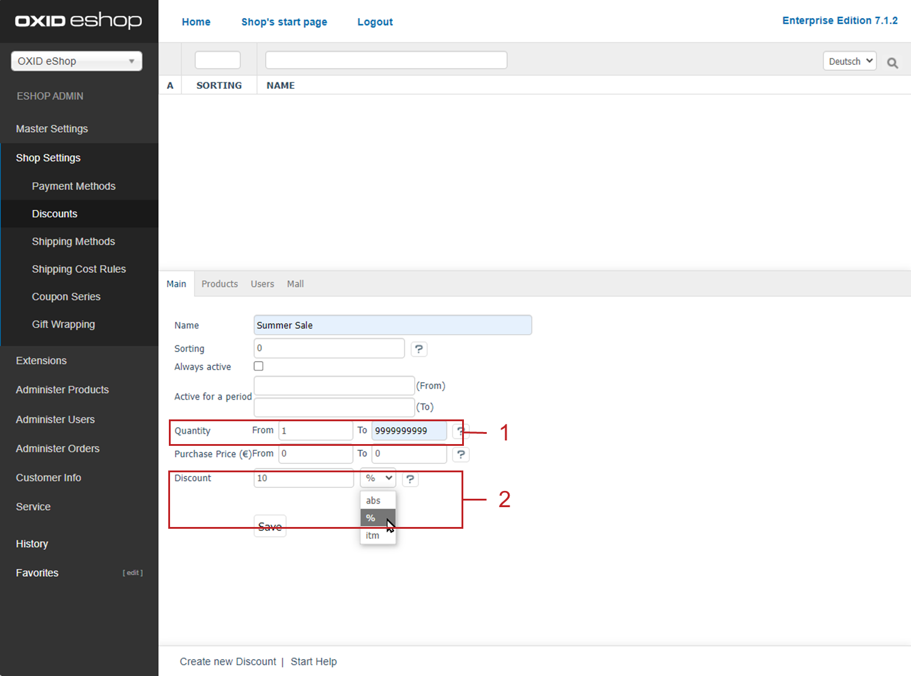

Creating, managing, and placing discounts
=========================================

Discounts are among the central marketing tools in your OXID eShop, alongside voucher series, newsletters, and promotions.

The discount reduces the price of an item if certain conditions are met.

You can offer lower item prices for certain items, categories, users, user groups, purchase values or quantities.

Discounts help attract customers and increase loyalty.

Types of discounts
------------------

* You can define the value of the discount as follows:

  * as a percentage of the item price (:ref:`oxbahh01`, item 2)
  * absolutely
  * as a free item that is automatically added to the shopping cart

* Restrict the discount’s validity

  * by category or item
  * by user or user group
  * for a specific period
  * country-specific

* You can apply quantity or tiered discounts using the graduated pricing feature.

  This allows you to define that an item becomes cheaper as soon as a certain quantity of this item is purchased.

  For more information, see :doc:`Article - Stock tab <../../setup/products/stock-tab>`.

.. _oxbahh01:

   Fig.: Example: Creating a limited-time discount of 10%

Displaying discounts
--------------------

* Determine how and where the discount is shown:

  * Display the offer directly with the discounted prices.
  * Show the discount only in the shopping cart.

    Example: You want to display the discount type ‘free item’ in the shopping cart and not in the item overview or on the details page (see :ref:`operation/discounts/product-as-add-on:Creating free items as a discount`).

    For more information, see step :ref:`Determine placement <Discount-placement-determination>` (under :ref:`operation/discounts/discounts:Creating and managing discounts`).

* Activate multiple discounts simultaneously in your OXID eShop if required. If the conditions are met, they will be applied in the shopping cart.

  Discounts that apply to specific items are indicated in the shopping cart by the current discounted price and the crossed-out original item price (:ref:`oxbahh02`, item 1).

  Discounts that apply to the entire product catalog are displayed as a single line when listing the total amount for the shopping cart (:ref:`oxbahh02`, item 2).

  .. _oxbahh02:

  .. figure:: ../../media/screenshots/oxbahh02.png
     :alt: Example: Discounted item in the shopping cart
     :width: 650
     :class: with-shadow

     Fig.: Example: Discounted item in the shopping cart

  For you as the shop owner, the discount is displayed in the order management (see :doc:`Orders - Main tab <../orders/main-tab>`).

Creating and managing discounts
-------------------------------

Create and edit discounts.

|procedure|

1. Choose :menuselection:`Shop Settings --> Discounts`.

#. If you have the Oxid eShop Enterprise Edition: Maintain discounts centrally and inherit them all or individually to subshops.

   For more information, see :ref:`operation/discounts/mall-tab:Inheriting Discounts to Subshops`.

#. Create the discount.

   You have the following options:

   * Optional: Set a time limit for discounts.

     For more information, see :doc:`Creating time-limited discounts <temporary-discounts>`.
   * Optional: Create a free item as a discount instead of an absolute or relative discount.

     For more information, see :doc:`Creating free items as a discount <product-as-add-on>`.
   * Determine the placement.

     .. _Discount-placement-determination:

     In the input field :guilabel:`Purchase value` or :guilabel:`Purchase quantity`, specify when the discount should be deducted from the price:

     * To display the item in the online store with the discounted price, enter the value in the :guilabel:`From` field as ``0`` (:ref:`oxbahh03`, item 1).

       The value in the :guilabel:`To` field can also be ``0``.

       .. _oxbahh03:

       .. figure:: ../../media/screenshots/oxbahh03.png
          :alt: Displaying the discounted price in the online store
          :width: 650
          :class: with-shadow

          Fig.: Displaying the discounted price in the online store

       In our example, the 10% discounted price of € 108,000 is displayed instead of the list price of € 120,000 (:ref:`oxbahh03`, item 2).

     * To display the discount only in the :emphasis:`shopping cart` (:ref:`oxbahh04`, Pos. 4, 5), enter the value in the :guilabel:`From` field as ``1`` (:ref:`oxbahh04`, Pos. 1).

       .. attention::

          The value in the :guilabel:`To` field must not be ``0`` in this case. (:ref:`oxbahh04`, pos. 2).

       .. _oxbahh04:

       .. figure:: ../../media/screenshots/oxbahh04.png
          :alt: Displaying the discounted price in the shopping cart
          :width: 650
          :class: with-shadow

          Fig.: Displaying the discounted price in the shopping cart

#. Assign the relevant categories or items.

   For more information, see :doc:`Restricting Discounts to Categories or Items <products-tab>`.
#. Optional: Restrict the discount to certain user groups.

   For more information, see :doc:`Restricting Discounts to Users or Groups <users-tab>`.

|result|

In the list of discounts, a small green circle with a tick at the beginning of the line symbolizes a discount that is always active.

.. note::

   :emphasis:`Time-controlled` discounts are :emphasis:`not` marked separately in the list.

.. todo: #SB: May be feature request: https://oxid-esales.atlassian.net/browse/OXDEV-8435?focusedCommentId=168679

Deactivating discounts
----------------------

To deactivate a discount, do the following:

* Remove the :guilabel:`Always active` check mark.
* Make sure that no time period is entered. An entry would otherwise activate the discount for the specified period.

.. Intern: oxbahh, Status: transL