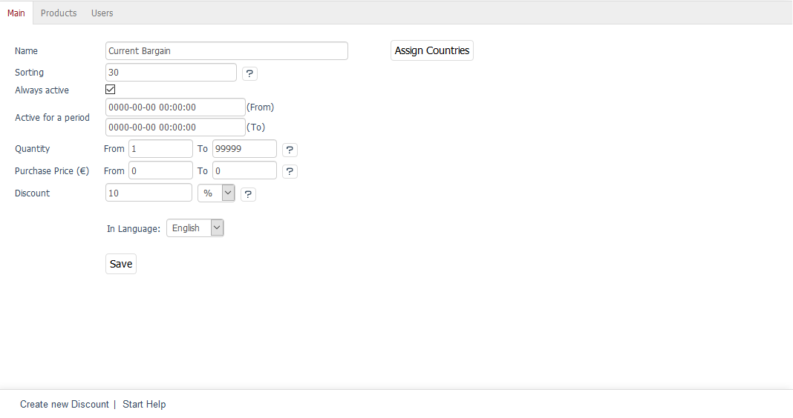
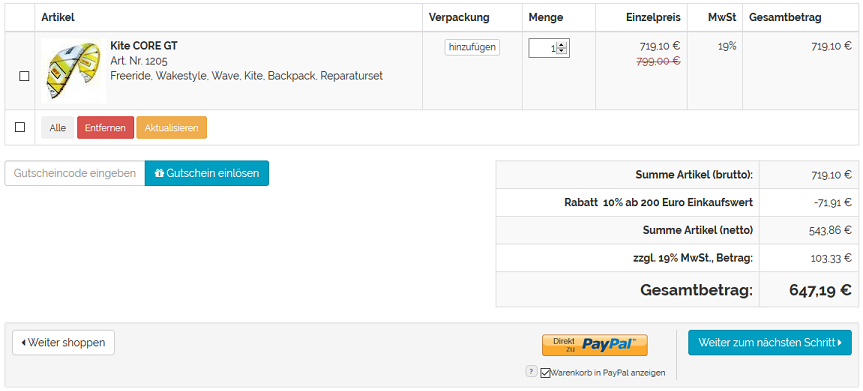
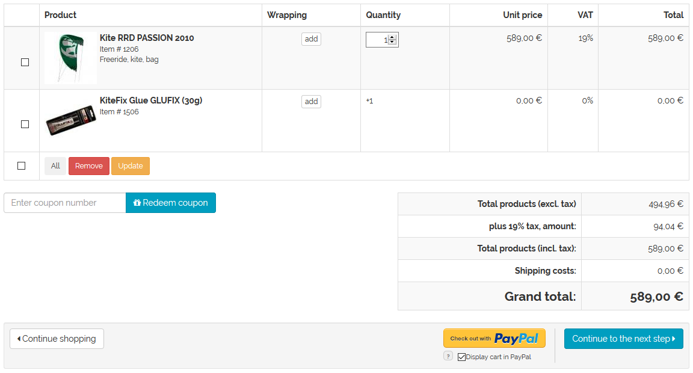

Main tab
===================

The :guilabel:`Main` tab contains some important settings that can be configured for the discounts. This is where you can create or edit a discount. The assignment to products, categories, users and user groups takes place in the two following tabs.

The language selection list at the bottom left of the input area allows you to edit the name of the discount in another language directly. Please note that you can only change the language after the selection list has been saved.

:guilabel:`Name` |br|
Name of the discount. This is displayed in the shopping cart as a line in the listing of the total amount if the discount applies globally to the complete product catalogue of the shop.

:guilabel:`Sorting` |br|
You can enter a value to specify the order in which the discounts are applied to the product or the shopping cart. The discount with the smallest number will be applied first and the discount with the largest number will be applied last.

:guilabel:`Always active` |br|
Check this box to have the discount granted permanently. Otherwise, the discount will only be granted for the specified time period.

:guilabel:`Active for a period` ... :guilabel:`(From)` ... :guilabel:`(To)` |br|
In order to prepare and schedule discounts, you can define a time period when a discount will be active. The start and end must be specified in the YYYY-MM-DD HH:MM:SS format. Date and time of the end of activation are mandatory.

:guilabel:`Quantity From` ... :guilabel:`To` ... |br|
Use this field to specify the minimum and maximum purchase quantities if the discount should only be granted after adding a certain quantity of products to the shopping cart. If both values are 0, the discount will apply to all purchase quantities.

:guilabel:`Purchase Price (€) From` ... :guilabel:`To` ... |br|
Enter a range for the total price on which a discount should be granted. If both values are 0, the discount will apply to each purchase value.

.. hint:: The value in the :guilabel:`Quantity` and :guilabel:`Purchase Price (€) From` input fields has a special meaning when displaying the discounts. If there is a 0 in both fields, all products to which this discount applies will be displayed in the shop directly with the discounted price. If the quantity and/or the purchase price starts with 1, the discount will only be shown in the shopping cart. This is also important for the add-on product so that this type of discount is displayed in the shopping cart.

:guilabel:`Discount` |br|
Define the discount to be granted here. This can be expressed as a percentage, in absolute terms or as a quantity. Select the type of discount in the selection list following the input field. |br|
:guilabel:`abs`: absolute discount, e.g. €5. |br|
:guilabel:`%`: percentage-based discount, e.g. 10% of the purchase value. |br|
:guilabel:`itm`: the discount is granted in the form of a free product (gift/add-on).

:guilabel:`Choose product` |br|
This button is only displayed if the discount is a free product. Clicking on it opens a new window where you can select a product. All available products will be displayed in the left-hand list. Select a category from the drop-down list if you only want to display products from this category. You can also filter and sort products by product number, title and/or EAN. Drag and drop the product into the right-hand list to assign it to the discount. The product’s price will be automatically set to zero if the customer places it into the shopping cart as an add-on.

:guilabel:`Free Product` - :guilabel:`Amount` |br|
This input field is only displayed if the discount is a free product. Specify the quantity of the free product to be granted as a discount. If, for example, you enter 2 as the quantity, a total of two free products will be added to the shopping cart regardless of how many products were purchased.

:guilabel:`Free Product` - :guilabel:`Multiply` |br|
This box is only displayed if the discount is a free product. Check the box if the quantity of free products should depend on the number of products purchased.

The number of add-ons is calculated in the shopping cart. The number of discountable products is first divided by the value of the minimum purchase quantity and then multiplied by the value entered in the :guilabel:`Free Product - Amount` field.

Example: If the customer purchased 10 products on which the discount is granted, the minimum purchase quantity is 5 and the add-on quantity is 1, then the add-on will be added (10/5)*1 = 2 times to the shopping cart. If the add-on quantity is 2, the number of add-ons will increase to 4.

:guilabel:`In Language` |br|
The discount can also be edited in other active languages of the shop. To do this, select the desired language from the list.

:guilabel:`Copy to` |br|
The discount must be copied to another active language of the shop for it to be edited in this language. If the discount exists in all active languages of the shop, the button and the selection list for the language will be hidden.

:guilabel:`Assign Countries` |br|
Discounts can also apply to specific countries. Use this button to assign the countries from which customers receive this discount when placing an order. Otherwise, the discount will be valid for all countries.

Clicking on this button will open an assignment window where you can select countries from the :guilabel:`All Countries` list. Countries can be sorted and filtered by name and/or country abbreviation. Drag the desired countries into the right-hand list using the mouse. Hold down the Ctrl key to select multiple countries.

.. seealso:: :doc:`Temporary discounts <temporary-discounts>`

.. Intern: oxbahi, Status:, F1: discount_main.html