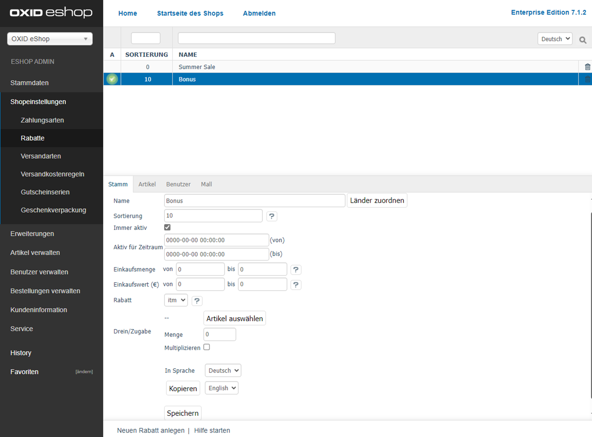

Defining the Basic Properties of a Discount
===========================================

On the :guilabel:`Main` tab, configure the fundamental settings for discounts.

   Fig.: Discounts - Main Tab

With the language selection option at the bottom left of the input area, edit the discount name directly in another language.

The settings and the language selection are only available after the discount has been created.

:guilabel:`Name`
   The name of the discount. It is displayed as a line item in the shopping cart's total amount listing if the discount applies globally to the entire product catalog.

:guilabel:`Sorting`
   Use numerical values to define the order in which discounts are applied to items or the shopping cart.
   The discount with the smallest number is applied first, while the one with the highest number is applied last.

:guilabel:`Always active`
   Enable this checkbox to make the discount permanently available.
   If the checkbox is unchecked, the discount will only be applied within a specified time period.

:guilabel:`Active for a period` ... :guilabel:`(From)` ... :guilabel:`(To)`
   To schedule and control discount campaigns, define a time period during which the discount is valid.

   Enter the start and end dates in the format ``YYYY-MM-DD HH:MM:SS``.
   The end date and time are mandatory fields.

:guilabel:`Quantity From` ... :guilabel:`To` ...
   If the discount should only apply when a certain quantity of items is in the shopping cart, specify the minimum and maximum purchase quantity.

   If both values are set to ``0``, the discount applies to all purchase quantities.

   Use the input field :guilabel:`Purchase value (€) from` or :guilabel:`Purchase quantity from` to define how the discount is deducted from the price.

   Consider the various use cases, for example:

   * :ref:`operation/discounts/discounts:Displaying discounts`
   * :ref:`operation/discounts/discounts:Creating and managing discounts`
   * :ref:`operation/discounts/product-as-add-on:Creating free items as a discount`

.. _purchase-price:

:guilabel:`Purchase Price (€) From` ... :guilabel:`To` ...
   Define a range for the total price on which a discount should be granted.

   If both values are set to ``0``, the discount applies to any purchase value.

   Use the input field :guilabel:`Purchase value (€) from` or :guilabel:`Purchase quantity from` to define how the discount is deducted from the price.

   For more information, see :ref:`operation/discounts/discounts:Displaying discounts`.

:guilabel:`Discount`
   Define the type of discount to be applied.

   You have the following options:

   * :guilabel:`abs`: The discount is an absolute value, e.g., €5.
   * :guilabel:`%`: The discount is a percentage, e.g., 10% of the purchase value.
   * :guilabel:`itm`: The discount is granted as a free item (bonus/gift).

:guilabel:`Select item`
   This button is only displayed if the discount is a free item.

   It opens a new window where you can select the item to be given as a free item.

   Only one item can be assigned. Its price is automatically set to zero when it is added to the shopping cart as part of the discount.

:guilabel:`Free Product` - :guilabel:`Amount`
   This input field is only displayed if the discount is a free item.

   Specify the quantity of the free item that should be granted.

   For example, if you set the quantity to 2, two free items will be added to the shopping cart, regardless of how many items are purchased.

   For more information, see :ref:`operation/discounts/product-as-add-on:Creating free items as a discount`.

   .. figure:: ../../media/screenshots/oxbahi03.png
      :alt: Item with a free item in the shopping cart
      :width: 650
      :class: with-shadow

      Fig.: Item with a free item in the shopping cart

:guilabel:`Free Product` - :guilabel:`Multiply`
   This checkbox is only displayed if the discount is a free item.
   Check this box if the number of free items should depend on the quantity of purchased items.

   The number of free items is calculated in the shopping cart.
   The calculation follows this formula:
   The number of discounted items is divided by the minimum purchase quantity (:guilabel:`Quantity from ... to` field) and then multiplied by the value entered in the :guilabel:`Free Product - Quantity` field.

   **Example:**
   A customer purchases **10 items** that qualify for the discount.
   - **Minimum purchase quantity:** 5
   - **Bonus quantity:** 1
   → Calculation: (10/5) × 1 = **2 free items**

   If the bonus quantity is **2**, the number of free items increases to **4**.

   For more information, see :ref:`operation/discounts/product-as-add-on:Creating free items as a discount`.

:guilabel:`Language`
   The discount can also be edited in additional active shop languages.
   Select a language from the list.

:guilabel:`Copy`
   The discount can be copied to an active shop language.
   This is required for editing the discount in that language.

   If the discount is already available in all active shop languages, the button and the selection list for languages are hidden.

:guilabel:`Assign countries`
   Discounts can also be applied based on country-specific restrictions.

   Use this button to assign the countries from which customers can receive this discount when placing an order.

   If no country is assigned, the discount applies to all countries.

.. seealso:: :doc:`Creating Time-Limited Discounts <temporary-discounts>`

.. Intern: oxbahi, Status:, F1: discount_main.html

.. Intern: oxbahi, Status:, F1: discount_main.html