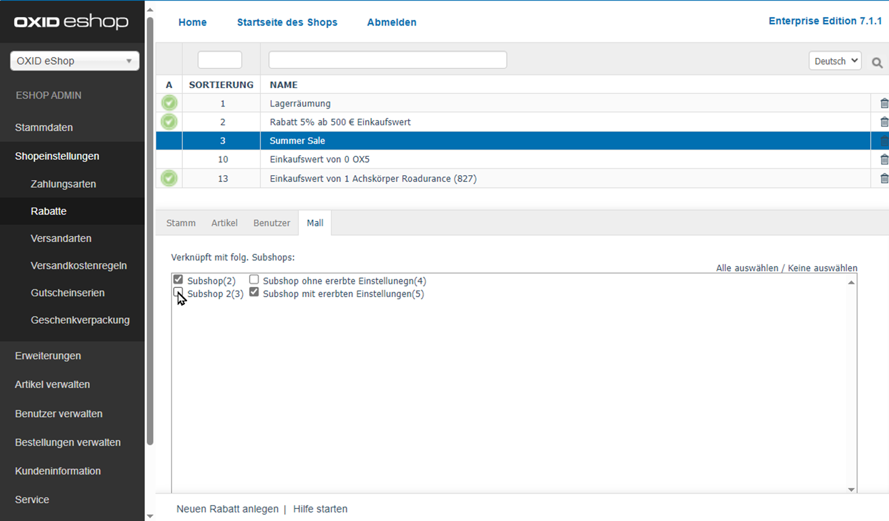

Mall tab
========

The :guilabel:`Mall` tab is only available for discounts in Enterprise Edition.

Discounts can be inherited when creating shops. If this option is selected, a new shop will contain all discounts of the parent shop. The characteristics of these discounts can’t be changed.

The :guilabel:`Mall` tab is used to manage the assignment of a discount to subshops and supershops. This tab will be empty for multishops since they can load and display discounts from all shops without such an assignment.

The inheritance of all discounts for a shop can be undone. To do this, uncheck the inheritance settings box in the :guilabel:`Mall` tab of the subshop or supershop under :menuselection:`Master Settings --> Core Settings`.

:guilabel:`Assigned to following subshops`
   Check or uncheck the appropriate box to assign/unassign the discount to/from subshops and supershops. If the box is not checked, the discount will be available in the parent shop but not in the respective subshop or supershop.

   Use the :guilabel:`Select All` and :guilabel:`Select None` links on the right side of the window to assign/unassign the discount to/from all shops. Any changes made must be saved and will immediately be effective for subshops or supershops.

.. Intern: oxbahl, Status:, F1: discount_mall.html