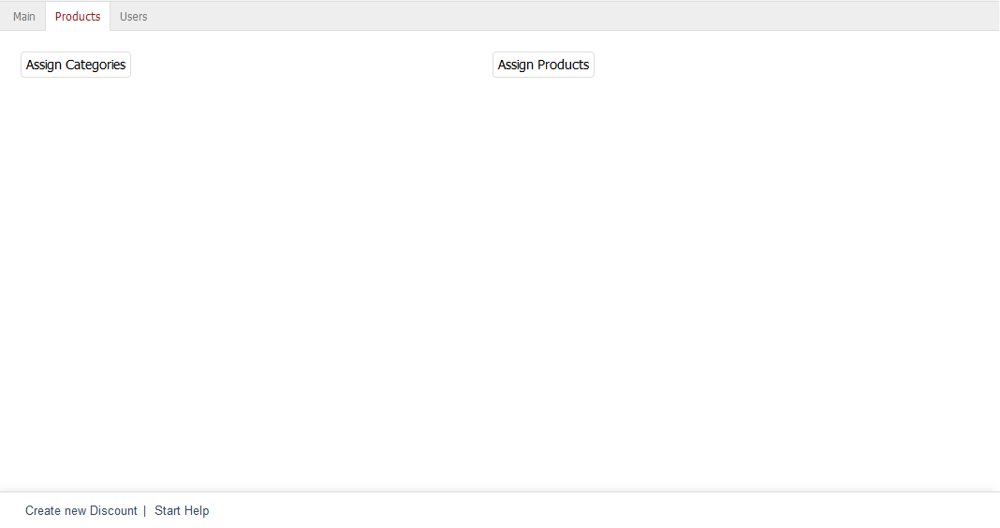

Products tab
=====================

Discounts can apply to categories and/or products. The :guilabel:`Products` tab allows you to configure the necessary assignments. The discount will only be granted when assigned products or products from assigned categories are added to the shopping cart. Without assignment of categories and/or products, the discount will apply globally to the entire product catalogue.

:guilabel:`Assign Categories` |br|
Clicking on this button will open the assignment window and display the two lists - :guilabel:`All Categories` and :guilabel:`Assigned Categories`. Categories can be filtered and sorted by title and short description. Drag the desired categories from the left-hand list into the right-hand list using the mouse. Hold down the Ctrl key to select multiple categories. The assignment is now completed.

:guilabel:`Assign Products` |br|
Click on :guilabel:`Assign Products` to define individual products for the discount. The assignment window opens and displays the two lists :guilabel:`All Products` and :guilabel:`Assigned Products`. Select a category from the drop-down list if you only want to display products from this category. You can also filter and sort products by product number, title and/or EAN. Drag and drop the products into the right-hand list to assign them to the discount. Hold down the Ctrl key to select multiple products.

.. seealso:: :doc:`Discounts on selected products <discounts-on-selected-products>`

.. Intern: oxbahj, Status:, F1: discount_articles.html