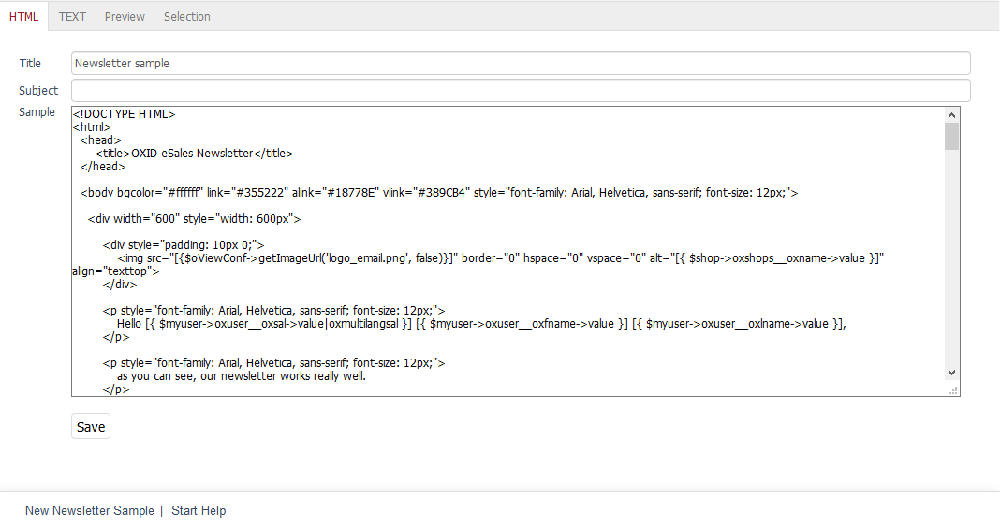

HTML tab
==================

OXID eShop always sends newsletters in two formats: as an HTML email and as a plain text email. This ensures that the newsletter is displayed correctly by all mail programs and webmails. The :guilabel:`HTML` tab allows you to create the newsletter in HTML format. Unlike plain text, the content here can be emphasised by heading hierarchies, different font colours and sizes, and other formatting options. You can also integrate the company logo, graphics, links and product photos.

:guilabel:`Title` |br|
The name of the newsletter displayed in the shop’s Admin panel. It can also be used to search for the newsletter. The title is not used in the newsletter that is sent out.

:guilabel:`Subject line` |br|
The subject line summarises the content of the newsletter. The subject should be brief and concise since it is the first thing the newsletter recipients see in their inbox. It determines whether they open the newsletter or move it directly to the trash. The subject line applies to both newsletter formats.

:guilabel:`Sample` |br|
The content of the newsletter can be easily entered in an editor. This works based on the WYSIWYG (What You See Is What You Get) principle, which means that the text is displayed the way it will be visible in the newsletter later. The editor lets you use different text formatting options and insert links and images.

When creating a newsletter in HTML format, it is important to know that most mail programs and webmails can render HTML, but there are no reliable standards. To be on the safe side, you should resort to the tried and tested techniques. We recommend that you work with tables, font tags, and inline CSS. However, CSS positioning via floats, videos, audios, forms and scripts should not be used in your newsletter. There are a lot of websites on the Internet that provide useful information on how to create and test HTML newsletters.

A special feature of creating the newsletter is that it can contain placeholders for dynamic content. Text passages provided for this purpose can display content from the online shop, such as the salutation, the first and last name of a user, the address of the shop or information about certain products.

The dynamic content is implemented with *Smarty*, a template engine for PHP. The provided default version has been enhanced with special functions required for the online shop. The corresponding files are located in the folder
:file:`/core/smarty/plugins`.

The way the Smarty prompts work is illustrated by an example from the sample newsletter. When the newsletter is sent, the Smarty prompts, which act as placeholders, are replaced by real data from the shop.

.. code:: html

   
oxuser__oxsal->value|oxmultilangsal }] [{ $myuser->oxuser__oxfname->value }] [{ $myuser->oxuser__oxlname->value }],
   

The recipient of the newsletter is addressed personally by reading and inserting the salutation and the first and last name from the database. The result can be viewed in the :guilabel:`Preview` tab.

.. seealso:: `Email Standards Project <http://www.email-standards.org>`_ | `Smarty Template Engine <https://www.smarty.net>`_ | :doc:`Preview tab <preview-tab>`

.. Intern: oxbaif, Status:, F1: newsletter_main