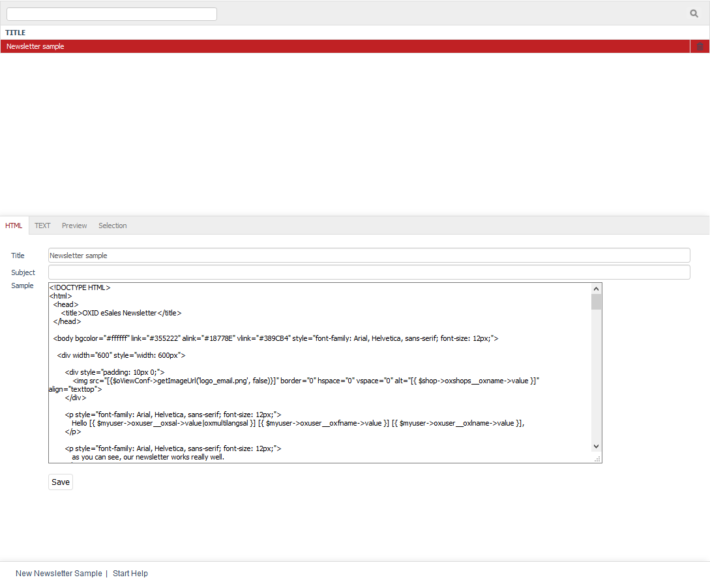

Newsletters
==========

Newsletters are a fast and easy way to notify online shop customers of current topics, give tips, announce campaigns and promote products. They serve to inform customers and at the same time create customer loyalty. Newsletters can be sent to customers by email at regular or irregular intervals. Customers must have subscribed to the newsletter, for example, by confirming this during registration or by filling out and sending the newsletter form. In addition, customers must explicitly agree to the sending of newsletters to their own email address. This procedure is called double opt-in. It ensures that no unauthorised person subscribes someone else to the newsletter.

Users who have subscribed to the newsletter will automatically be assigned to the "Newsletter Recipients" user group. They can be viewed in the Admin panel under :menuselection:`Administer Users --> User Groups`. Customers can unsubscribe by filling out the newsletter form and selecting :guilabel:`Unsubscribe`.

The “Newsletters" section tells you how to create and manage newsletters. Go to :menuselection:`Customer Info --> Newsletter` in the Admin panel to edit the newsletters. Here, you will see the list of the newsletters and the input area right below it. When you select a newsletter from the list, its information will be displayed in the input area. To create a new newsletter, click on :guilabel:`New Newsletter Sample` at the bottom of the screen.

You can search for newsletters by entering a few characters into the search field and clicking on the magnifying glass icon. As a result, you will only see the newsletters whose title contains these characters. Newsletters can be removed from the database by clicking on the trash icon at the end of the line. The sample newsletter can’t be deleted.

-----------------------------------------------------------------------------------------

HTML tab
------------------
**Contents**:  newsletter as HTML email, title, subject, template, HTML, tables, font tags, inline CSS, dynamic content, Smarty, Smarty example: user salutation |br|
:doc:`Read article <html-tab>` |link|

Text tab
------------------
**Contents**:  newsletter as plain text email, plain text template, dynamic content, Smarty, Smarty example: recommended products |br|
:doc:`Read article <text-tab>` |link|

Preview tab
----------------------
**Contents**: newsletter preview, text only, plain text, HTML, Smarty, Smarty example: full provider identification, CMS pages, oxemailfooter, oxemailfooterplain |br|
:doc:`Read article <preview-tab>` |link|

Selection tab
-----------------------
**Contents**: sending the newsletter, assigning user groups, number of recipients, number of emails sent, emails per tick, testing the newsletter, displaying in email programs, mobile and web clients |br|
:doc:`Read article <selection-tab>` |link|

.. seealso:: `Tips for sending newsletters on shopbetreiber-blog.de (in German) <http://shopbetreiber-blog.de/page/1/?s=Newsletter>`_

.. Intern: oxbaie, Status: