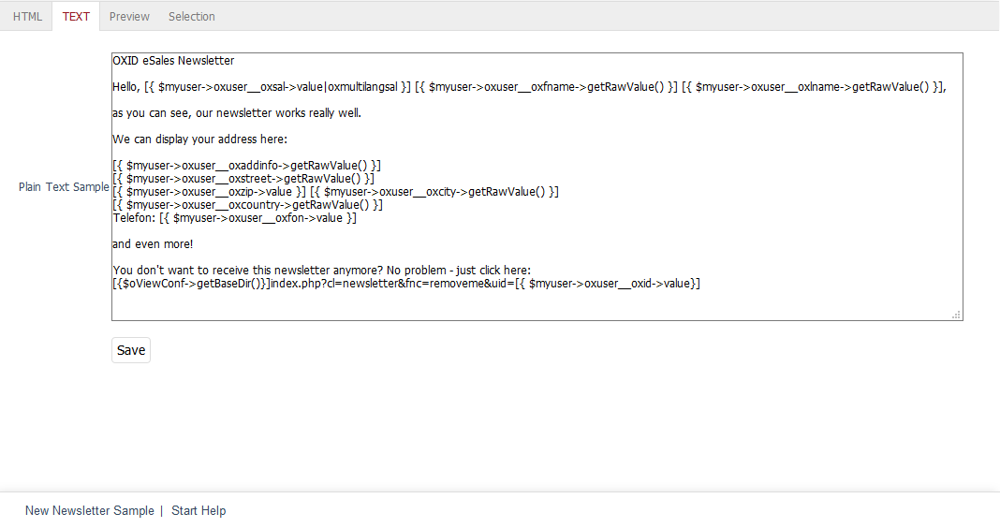

Text tab
==================

OXID eShop always sends newsletters in two formats: as a plain text email and as an HTML email. This ensures that the newsletter is displayed correctly by all mail programs and webmails. The :guilabel:`Text` tab allows you to create the newsletter in plain text format.

The text of the newsletter is entered in the large input field of this tab. As in HTML email, the text can contain dynamic content placeholders. Text passages provided for this purpose can display content from the online shop, such as the salutation, the first and last name of a user, the address of the shop or information about certain products.

The dynamic content is implemented with the *Smarty* template engine. The provided default version has been enhanced with special functions required for the online shop. The corresponding files are located in the :file:`/core/smarty/plugins` folder.

The following lines are taken from the sample newsletter that shows the way the Smarty prompts work. When the newsletter is sent, the Smarty prompts, which act as placeholders, are replaced by real data from the shop.

.. code:: html

   [{if isset($articlelist) }]
      Products from our shop selected specifically for this newsletter:
      [{foreach from=$articlelist item=product}]
         [{ $product->oxarticles__oxtitle->getRawValue() }]   Now only [{ $product->getFPrice() }] [{ $mycurrency->name}]
      [{/foreach}]
   [{/if}]

First, the system checks whether a list of products exists. If it exists, it will loop through to list all the products in that list with their price. The result can be viewed in the :guilabel:`Preview` tab. A list of products exists if products have been assigned to the \"Newsletter\" action.

.. seealso:: `Smarty Template Engine <https://www.smarty.net>`_ | :doc:`Preview tab <preview-tab>` | :doc:`Newsletter action <../promotions/newsletter-action>`

.. Intern: oxbaig, Status:, F1: newsletter_plain
