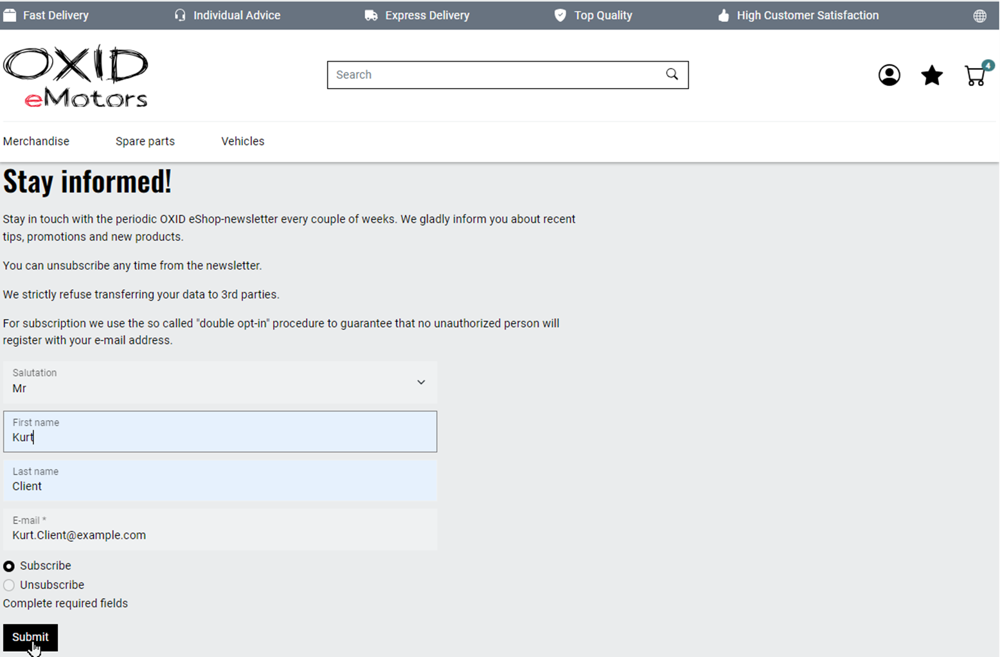

Newsletters
===========

Inform your OXID eShop customers about current topics with a newsletter. Give tips, announce promotions and advertise articles.

Newsletters inform customers and contribute to customer loyalty.

Newsletter from the customer's perspective
------------------------------------------

Customers subscribe to the newsletter either when they register or by filling out and sending the newsletter form.

Customers receive a confirmation e-mail and must explicitly agree to the sending of newsletters. This procedure is known as double opt-in and ensures that no unauthorized person can subscribe to the newsletter.

.. figure:: ../../media/screenshots/oxbaie01.png
   :alt: Subscribing to a newsletter
   :width: 650
   :class: with-shadow

   Fig.: Subscribing to a newsletter

Customers can unsubscribe from the newsletter by filling out the newsletter form and selecting :guilabel:`unsubscribe` (:ref:`oxbaie02`).

.. _oxbaie02:

   Fig.: Editing the newsletter form

Using the newsletter function
-----------------------------

Displaying newsletter subscribers
^^^^^^^^^^^^^^^^^^^^^^^^^^^^^^^^^

Users who have subscribed to the newsletter (and have the opt-in status `subscribed`, see :ref:`oxbaie03`) are automatically assigned to the user group “Newsletter subscribers”.

|procedure|

To display the newsletter subscribers, do the following:

1. In the administration area, chose :menuselection:`Manage users --> User groups`.
#. Choose :guilabel:`Assign users`.

   The members of the user group are displayed.

Sending newsletter
^^^^^^^^^^^^^^^^^^

Newsletters are sent to customers by email at regular or irregular intervals.

Use one of the many providers of newsletter services, cloud-based newsletter tools or newsletter software.

To do so, export a list of newsletter subscribers to the external provider.

|procedure|

1. In the administration area of the store, choose :menuselection:`Customer info --> Newsletter`.
#. Choose the :guilabel:`Export users` button.

   The data records :emphasis:`all` users are written to a CSV file whose file name consists of :file:`Export_user_recipient_status_`, an appended date in the format YYYY-MM-DD and the file extension :file:`.csv`.

   For each user, the file contains title, first name, last name, e-mail address, opt-in status, country and assigned user groups (:ref:`oxbaie03`).

   The opt-in status can be:

   * `not subscribed`: Registered customers who do not subscribe to a newsletter
   * `not confirmed`: Interested parties who have filled out the newsletter form but have not yet confirmed the confirmation email
   * `subscribed`: Newsletter subscribers

#. Open the CSV file in MS Excel with the text import tool, for example, and filter for users who have the opt-in status `subscribed`.

.. _oxbaie03:

   Fig.: Exporting users

.. Intern: oxbaie, Status:

