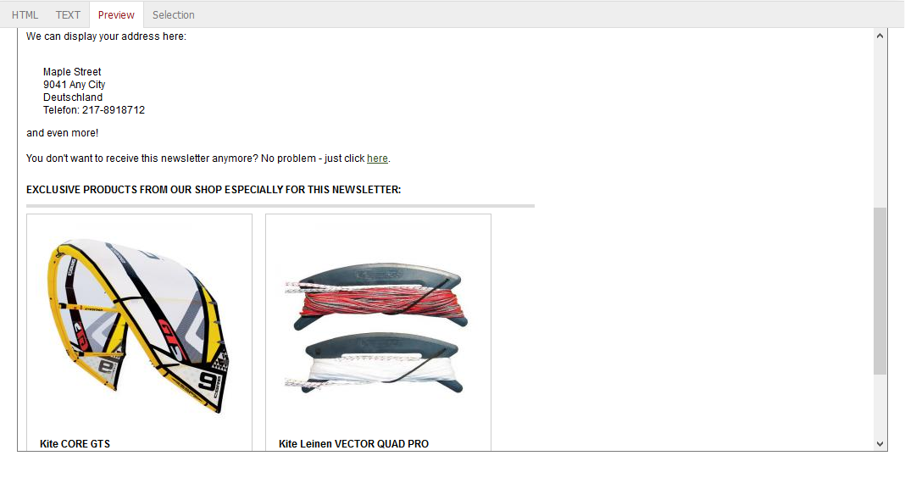

Preview tab
===========

The :guilabel:`Preview` tab displays the newsletter in both text and HTML formats.

You will see a request to provide full provider identification at the end of the HTML e-mail in the sample newsletter. The reason for this is a Smarty prompt that calls the CMS page with the "oxemailfooter" ident.

.. code:: html

   Please insert your full provider identification here.
   

      [{ oxcontent ident="oxemailfooter" }]
   

There is also such a CMS page for the plain text e-mail with the "oxemailfooterplain” ident. Both CMS pages should contain the About Us section so that the correct information about the online shop is sent to the recipients with newsletters and other e-mails.

.. Intern: oxbaih, Status:, F1: newsletter_preview
