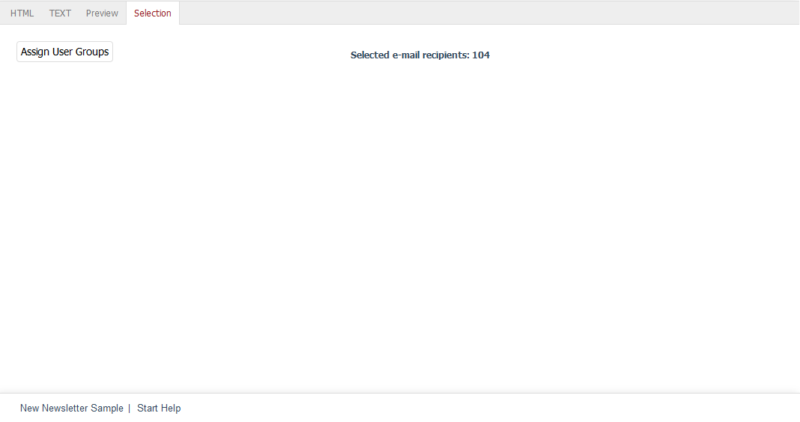

Selection tab
=======================

The :guilabel:`Selection` tab allows you to send newsletters to subscribers.

First of all, you will need to assign the user groups. For example, the newsletter can first be sent to a test group before it goes to the actual "Newsletter Recipients” user group later. After the assignment, you will see how many recipients were sent the newsletter. Click on :guilabel:`Send Newsletter` to start sending the newsletter.

The newsletter will not be sent to all recipients at once. A defined number of emails is sent in so-called ticks. The default setting is twenty emails per tick. This can be changed in the Admin panel under :menuselection:`Master Settings --> Core Settings` --> :menuselection:`Other settings`. The number of emails that can be sent without any issues also depends on the hosting provider.

Before sending the final newsletter, you should test how it displays in popular mail programs and browsers. It is important to remember about special features. Users often block the display of images or view the newsletter only in a preview. Smartphones that allow quickly viewing emails have also gained even more importance.

If you have installed accounts and email addresses with diverse webmail service providers and various mail programs, you can send the prepared newsletter to the specific users of a test group. There are also solutions on the Internet that make these tests easier. Newsletters can be displayed in many important mail clients, such as Microsoft Outlook, Apple Mail, Gmail or Thunderbird, and optimised for display in mobile and web clients.

.. Intern: oxbaii, Status:, F1: newsletter_selection
