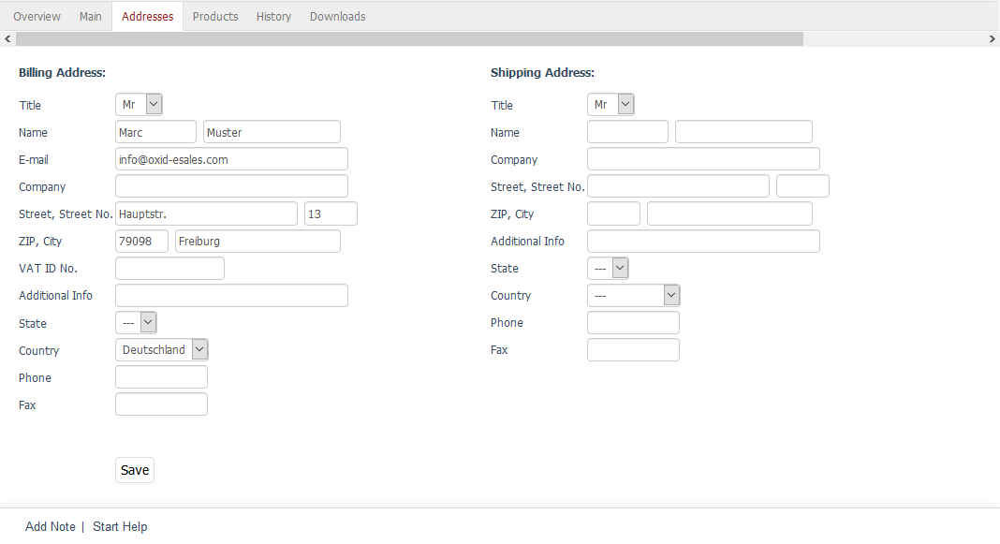

Addresses tab
======================

Customers can select the address to which the ordered products should be sent in the second step of the ordering process. They can check the box :guilabel:`Use Billing Address for Shipping` to have the invoice and the products sent to the billing address. However, customers can also specify a shipping address so that the products are shipped, for example, to the company where they work during the day.

The :guilabel:`Addresses` tab displays the billing address and, if specified, a different shipping address. The address data can be edited and any incorrect information specified when placing an order can be corrected afterwards. You can also add a shipping address if the customer wants to have the ordered products sent to a different address later.

A modified billing address or the shipping address entered at a later point will only apply to the respective order. The entries won’t be imported into the user administration section and will be saved permanently. For example, if the customer wants to use the shipping address for the next order, it must be entered in the :guilabel:`Addresses` section under :menuselection:`Administer Users --> Users`. Alternatively, customers can create one or more shipping addresses using the billing and shipping settings in their account.

The address information includes the customer’s name and address as well as some additional input fields for the company name, additional information, and phone and fax numbers. Depending on the country that can be selected from the drop-down list, you can add the respective state, e.g. for the United States of America, in the “State” field.

.. seealso:: :doc:`Addresses tab <../users/addresses-tab>`

.. Intern: oxbaee, Status:, F1: order_address.html