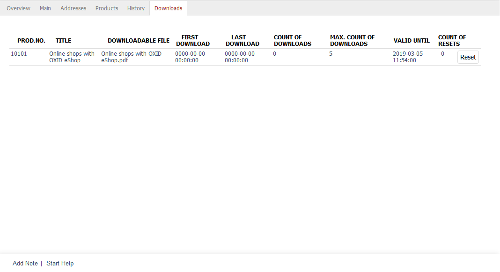

Downloads tab
=======================

This tab displays all downloads belonging to an order. For each download, there is a line that, in addition to the product number, the product title and the name of the downloadable file, also contains information that will be updated with the actual download.

After ordering, the download links can be found under :menuselection:`Account --> My downloads`. The files can be downloaded once the payment has been made. If the order hasn’t yet been marked as paid, a corresponding message will be displayed. If the customer used direct debit or credit card as a payment method, he/she will be able to download the files immediately. The order confirmation email will also contain the download links to the ordered files when the payment is complete.

All downloads belonging to the order will be displayed in a table.

:guilabel:`Prod.No.` |br|
Unique number of the downloadable product.

:guilabel:`Title` |br|
Title of the downloadable product.

:guilabel:`Downloadable file` |br|
File that belongs to the downloadable product and can be downloaded by the customer. Each downloadable file of a downloadable product will have a separate table line.

:guilabel:`First Download` |br|
Date and time of the first download.

:guilabel:`Last Download` |br|
Date and time of the last download.

:guilabel:`Count of Downloads` |br|
Number of downloads so far.

:guilabel:`Maximum count of downloads` |br|
The maximum number of downloads allowed. The number zero stands for an unlimited number of downloads. This value was set as the default in the :guilabel:`Settings` tab under :menuselection:`Master Settings --> Core Settings` or overwritten by definition for the respective downloadable product.

:guilabel:`Valid until` |br|
Deadline for downloading the files of the downloadable product. The default settings or the values defined for the downloadable product will also apply here.

:guilabel:`Count of Resets` |br|
Displays the number of times the information about the downloads has been reset.

:guilabel:`Reset` |br|
The shop owner can reset the already occurred downloads as long as they are valid. Clicking on this button resets the time of the first and last download and the number of downloads. The validity of the downloads will also be recalculated according to their definition.

.. seealso:: :doc:`Downloads tab <../../setup/products/downloads-tab>`

.. Intern: oxbaeh, Status:, F1: order_downloads.html