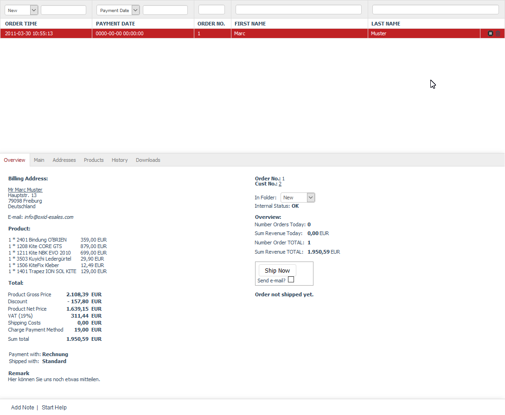

Orders
============

An order is created when the customer completes his/her purchase in the online shop by placing a payable order. The customer will see a thank you page and will immediately be informed about the order number. At the same time, the shop will send an order confirmation email, containing all important information, such as a list of ordered products, the total price with all individual items, the selected payment method, the billing address, and the shipping method. The shop owner will also be notified about the new order by email.

The \"Orders\" section contains all the details on processing orders. The order created during the purchase in the online shop can be changed at a later point, for example, to assign a different payment or shipping method. Payment receipt and product shipping information can also be documented. Invoice and delivery note can be created from the order. Go to :menuselection:`Administer Orders --> Orders` in the Admin panel to edit the orders. Here, you will see a list of the orders and the input area right below it.

Orders can be filtered and searched for. One filter option is the folders where the orders can be moved to. Folders \"New\", \"Finished\" or \"Problems\" can be selected from the drop-down list directly to the left above the list of orders. These folders are available by default and allow easy classification of orders. You can also specify a date in the YYYY-MM-DD format for the selected folder in the next field. Partial formats such as YYYY-MM are also allowed.

Another filter option allows the display of paid orders, orders with specific products or payment methods. Select \"Payment Date\" from the drop-down list to display orders with the specified payment date in the YYYY-MM-DD format. Partial formats are allowed here as well. Orders with specific products can be filtered by the product title or number. Entering a few characters will be enough. The search by order number or buyer’s first and last name can be used separately or to refine the set filters.

Orders can be cancelled and deleted by using the icons at the end of the line. Important: Please note that cancelled orders can’t be restored and that the deleted orders will be permanently removed from the database.

When you select an order from the list, its information will be displayed in the input area. The footer contains the following links: :guilabel:`Add Note` and :guilabel:`Start Help`.

-----------------------------------------------------------------------------------------

Overview tab
-----------------------
**Contents**: order overview, billing address, shipping address, ordered products, total price with individual items, payment method, shipping method, order notification, order number, customer number, folder for orders, new, processed, problems, today’s orders, total orders, shipping orders, shipping confirmation, XML export, invoice and delivery note as PDF |br|
:doc:`Read article <overview-tab>` |link|

Main tab
-------------------
**Contents**: IP address and order, Trusted Shops, order number, invoice number, discount, payment information, payment date, payment method, shipping information, shipping method, shipping costs, order shipping, shipping confirmation, links to downloadable products |br|
:doc:`Read article <main-tab>` |link|

Addresses tab
----------------------
**Contents**: billing address, shipping address, user, account, billing and shipping settings |br|
:doc:`Read article <addresses-tab>` |link|

Products tab
---------------------
**Contents**: products in an order, changing product quantity, cancelling ordered products, deleting products from the order, searching for products, adding products to the order, total price with individual items |br|
:doc:`Read article <products-tab>` |link|

History tab
----------------------
**Contents**: note, log, customer actions, customer information |br|
:doc:`Read article <history-tab>` |link|

Downloads tab
-----------------------
**Contents**: downloadable products of an order, downloadable files, first and last download, number of completed downloads, maximum possible downloads, validity of download links, reset, resetting downloads |br|
:doc:`Read article <downloads-tab>` |link|

.. Intern: oxbaeb, Status: