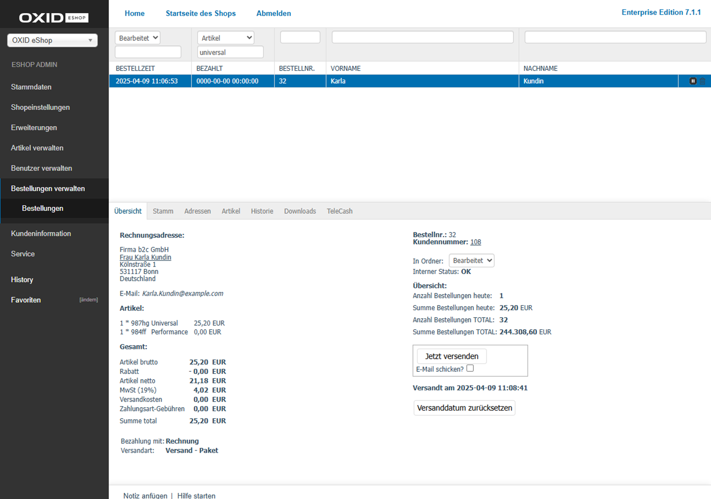

Managing Orders
===============

When a customer completes their purchase in the OXID eShop, an order is automatically created.

The customer receives an **order confirmation by email**, which includes the following information:

* List of ordered items
* Itemized and total prices
* Billing and shipping address
* Payment and shipping method
* Order number

At the same time, the shop owner is also notified of the new order via email.

   Fig.: Editing orders

Searching and filtering orders
------------------------------

* Use the filters above the list to select orders based on specific criteria:

  * Select a **folder** (“New”, “Processed”, “Issues”)
  * Restrict results by **date** in the format `YYYY-MM-DD` (partial formats like `YYYY-MM` are also supported)
  * Show only **paid orders** via dropdown and payment date
  * Search by **product** (title or article number)
  * Search by **customer** (order number, first name, last name)

* Orders can be sorted by:

  * Order time
  * Payment status
  * Order number
  * Customer name

Editing orders
--------------

|procedure|

1. Open the menu item :menuselection:`Administer Orders --> Orders`.
2. Select an order from the list.

   The order data is loaded into the input area.

3. Edit the desired information.
4. Optional: To document individual agreements with the customer, click :guilabel:`Add note` in the footer of the input area.

   For more information, see :ref:`operation/orders/history-tab:History tab`.

|result|

* Changes take effect immediately and are visible in the respective tab.
* Use the corresponding tab to record payment and shipping status.

Cancelling or deleting orders
-----------------------------

* Use the icons at the end of a row in the order list to:

  * **Delete** – permanently removes the order from the database.
  * **Cancel** – marks the order as canceled.

.. warning::

   A cancellation **cannot be undone**.

   Deleting an order **permanently removes** it from the system.

Tabs at a glance
----------------

Overview tab
^^^^^^^^^^^^
**Contents**: order overview, billing address, shipping address, ordered products, total price with individual items, payment method, shipping method, order notification, order number, customer number, folder for orders, new, processed, problems, today’s orders, total orders, shipping orders, shipping confirmation |br|
:doc:`Read article <overview-tab>` |link|

Main tab
^^^^^^^^
**Contents**: IP address and order, Trusted Shops, order number, invoice number, discount, payment information, payment date, payment method, shipping information, shipping method, shipping costs, order shipping, shipping confirmation, links to downloadable products |br|
:doc:`Read article <main-tab>` |link|

Addresses tab
^^^^^^^^^^^^^
**Contents**: billing address, shipping address, user, account, billing and shipping settings |br|
:doc:`Read article <addresses-tab>` |link|

Products tab
^^^^^^^^^^^^
**Contents**: products in an order, changing product quantity, cancelling ordered products, deleting products from the order, searching for products, adding products to the order, total price with individual items |br|
:doc:`Read article <products-tab>` |link|

History tab
^^^^^^^^^^^
**Contents**: note, log, customer actions, customer information |br|
:doc:`Read article <history-tab>` |link|

Downloads tab
^^^^^^^^^^^^^
**Contents**: downloadable products of an order, downloadable files, first and last download, number of completed downloads, maximum possible downloads, validity of download links, reset, resetting downloads |br|
:doc:`Read article <downloads-tab>` |link|

.. Intern: oxbaeb, Status: transL