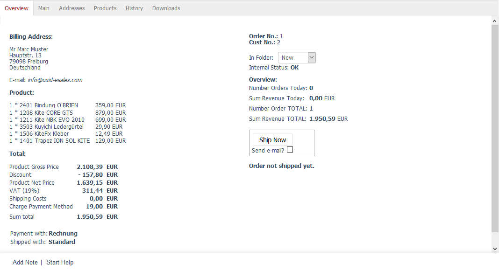

Overview tab
=======================

The :guilabel:`Overview` tab displays all important order-related information, including, for example, the billing address, a different shipping address, the ordered products, the total price with its individual items, as well as the payment and the shipping method. The order will receive an order number and the customer will receive a customer number provided that this is the first order.

In addition, you will see a brief summary of the orders placed on this day and all orders placed in the shop. You can generate an invoice or a delivery note for the order in PDF format and export orders in XML format for further processing in other systems.

:guilabel:`Billing Address` |br|
Displays the address to which the invoice for the order should be sent. The customer provides this address during registration in the shop or when buying something without registration. In addition, the customer's email address will be displayed as a link. Clicking on it opens a new email that you can use to send an invoice to the customer, for example.

:guilabel:`Shipping Address` |br|
Customers can specify or select a shipping address when placing an order if the products needs to be sent to an address other than the billing address. In this case, the shipping address will be displayed next to the billing address.

:guilabel:`Products` |br|
Displays all products included in this order with their quantity, number, title and price. The :guilabel:`Products` tab allows you to change the quantity of the ordered products at a later point. You can also cancel and delete products included with the order.

:guilabel:`Total` |br|
:guilabel:`Total` displays the total price of the order with its individual items. You will see the product’s gross and net price, a discount granted, VAT, as well as the shipping costs and a fee associated with this payment method, if any.

:guilabel:`Payment with` |br|
Payment method selected by the customer when placing the order. If needed, the payment method can be changed by the shop owner in the :guilabel:`Main` tab.

:guilabel:`Shipped with` |br|
Shipping method selected by the customer when placing the order. The shipping method can also be changed in the :guilabel:`Main` tab if necessary.

:guilabel:`Remark` |br|
The customer can enter a message for the shop owner in a designated input field in the second step of the ordering process. This message will be displayed here. If the customer doesn’t use this option, the default text \"Here you can enter an optional message.\" will be displayed here instead.

:guilabel:`Order No.` |br|
Orders get assigned consecutive order numbers. The first order placed in the shop has the number 1. However, sometimes a shop should start the numbering with a higher order number as shop owners often find this to be more professional. The merchandise management system used may also require higher numbering. All you have to do is increase the number of the last order, and the shop will count from this order number on.

:guilabel:`Cust No.` |br|
When a customer buys something in the online shop for the first time, he/she will be saved as a user and receive a customer number. The customer number is assigned on a consecutive basis but can also be changed by changing the customer number of the last created user. To do this, go to :menuselection:`Administer Users --> User`, change the customer number in the :guilabel:`Main` tab and save your changes. The shop will then continue counting from the new customer number on.

:guilabel:`In Folder` |br|
When products are ordered in the shop, the system creates an order and stores it in the \"New\" folder. By default, there are three folders for the orders: \"New\", \"Finished\" and \"Problems\". You can move the orders to a different folder, such as, e.g., \"Finished\", to make it easier to find orders via filtering and searching.

You can also create additional folders to refine the classification of orders and adapt it to your specific requirements. New folders can be defined in the :guilabel:`Settings` tab under :menuselection:`Master Settings --> Core Settings`. Click on :guilabel:`Administration` to view the settings. Each folder in the order management section has an entry with the following syntax: ``language constant folder name\=\>hexadecimal colour definition``. A language constant is used to display the folders depending on the language. The translation for the default folders can be found in the respective language file :file:`/application/views/admin/{locale}/lang.php`. The user-defined language file :file:`cust_lang.php` should be used for new folders. The font colour in which the folder should be displayed is defined according to the #RRGGBB scheme. Example: folder\"Cancellation\"in dark blue lettering - ORDERFOLDER_CANCELLATION =\>#000088

:guilabel:`Internal Status` |br|
Displays any errors that occurred while processing an order.

:guilabel:`Overview` |br|
Displays the number of orders and the order amount of the current day. This information is supplemented by the number of all orders placed in the shop and the total order amount.

:guilabel:`Ship Now` |br|
When products are sent to the buyer, the shop owner can document the shipment in the order details. Clicking on :guilabel:`Ship Now` changes the order status and the :guilabel:`Order not shipped yet` note. You will see a message confirming the shipment and stating the shipment’s date and time instead. In addition, the :guilabel:`Reset Shipping Date` button will be displayed. You can use it to reset the previous shipping date and resent the products with the current date.

:guilabel:`Send e-mail?` |br|
If the :guilabel:`Send e-mail?` box is checked, the customer will be informed about the shipment by email. The email will contain the shipping address, the order number and a list of the products shipped with the link to review them. If a tracking code has been entered in the shipping information in the :guilabel:`Main` tab, a tracking link will take the customer directly to the DPD Germany website.

:guilabel:`XML Export` |br|
Orders can be exported in XML (Extensible Markup Language) format, which enables exchange with other systems, such as merchandise management or a shipping service provider. If you don’t specify the order number, all orders will be processed for export. Depending on the browser used, the export file will be downloaded and the customer will be prompted to open or save it. By entering order numbers in the input fields :guilabel:`start Order No.` and :guilabel:`to Order No.`, you can limit the number of orders for export.

.. hint:: This function hasn’t been implemented in Enterprise Edition.

:guilabel:`PDF` |br|
The order invoice and delivery note can be created in PDF (Portable Document Format) format. The invoice and the delivery note can be selected from a drop-down list. Clicking on :guilabel:`Create PDF` creates the .pdf file and offers the customer to open or save it, depending on the browser used. If the shop has been set up for multiple languages, you will be able to select the desired language for the invoice and the delivery note.

The invoice and the delivery note are generated using the :guilabel:`myorder.php` file from the :file:`/modules/invoicepdf` directory. If you have the necessary programming skills, you will be able to customise the content and structure of the documents in accordance with your individual requirements.

.. hint:: This function hasn’t been implemented in Enterprise Edition.

In addition, Community and Professional Editions allow you to export orders with the \"direct debit\" payment method for processing at banks and financial institutions. With OXID eShop 4.9.0, the option of creating direct debit records for electronic processing in the data carrier exchange system (DTAUS) has been removed. Since August 2014, this method is no longer supported by the banks.

.. seealso:: :doc:`Main tab <../users/main-tab>` | `Hexadecimal colour definition (Wikipedia) <http://de.wikipedia.org/wiki/Hexadezimale_Farbdefinition>`_ | `Defining colours in HTML (SELFHTML) <http://de.selfhtml.org/html/allgemein/farben.htm>`_ | `Extensible Markup Language, XML (Wikipedia) <https://en.wikipedia.org/wiki/XML>`_ | `Portable Document Format, PDF (Wikipedia) <https://en.wikipedia.org/wiki/PDF>`_

.. Intern: oxbaec, Status:, F1: order_overwiew.html