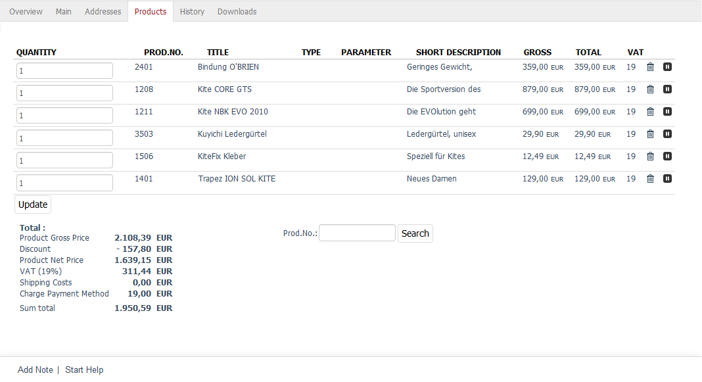

Products tab
============

All products belonging to an order are listed in detail in the :guilabel:`Products` tab.

The quantity of the ordered products can be changed and updated at a later point. As a result, the product’s total price will be recalculated, and the shipping costs or the discount granted will also be updated.

Products included with an order can be cancelled or deleted completely by using the two icons at the end of each line. Clicking on the icon on the far right removes the respective products from the order. After you confirm your decision in a confirmation prompt, the line will be greyed out and the order total will be recalculated. Click on the icon one more time to undo the cancellation. The cancellation will be irrevocable if you have deleted the products from the order by clicking on the cross icon.

There is also a function that allows you to include new products in the order. Enter the product number to search for a specific product. Enter the quantity for the product found and click on :guilabel:`Add Product`. The product will be added to the order in the quantity entered.

All products belonging to the order will be displayed in a table.

:guilabel:`Quantity`
   Quantity of the products ordered. This value can be changed in the input field. Click on :guilabel:`Update` to recalculate the price of the product and the total price of the order.

:guilabel:`Prod.No.`
   Unique product number.

:guilabel:`Title`
   Displays the product title shortened to approx. twenty characters.

:guilabel:`Type`
   The selected variant. If the ordered product is a variant, the selected variant will be displayed here. An example of size and colour for a pair of jeans: W 32/L 34 | Blue.

:guilabel:`Parameter`
   Product’s label. A label can be entered in a text box displayed during the order for customisable products.

:guilabel:`Short Description`
   Product’s short description.

:guilabel:`Gross`
   Product’s unit price.

:guilabel:`Total`
   Product’s total price.

:guilabel:`VAT`
   Value-added tax included in the price as a percentage.

   Small buttons for deleting and cancelling products are located at the end of each table line. The :guilabel:`Update` button under the table is used to recalculate the prices and the order amount after any changes.

:guilabel:`Total` |br|
:guilabel:`Total` displays the total price of the order with its individual items. You will see the product’s gross and net price, a discount granted, VAT, as well as the shipping costs and a fee associated with this payment method, if any.

:guilabel:`Prod.No.`
   Product number to search for.

   Click on :guilabel:`Search` to search for a product using the entered product number. If the product is found, its short description will be displayed in a drop-down list and the quantity in the corresponding input field. Click on :guilabel:`Add Product` to add the product to the order.

.. Intern: oxbaef, Status:, F1: order_article.html