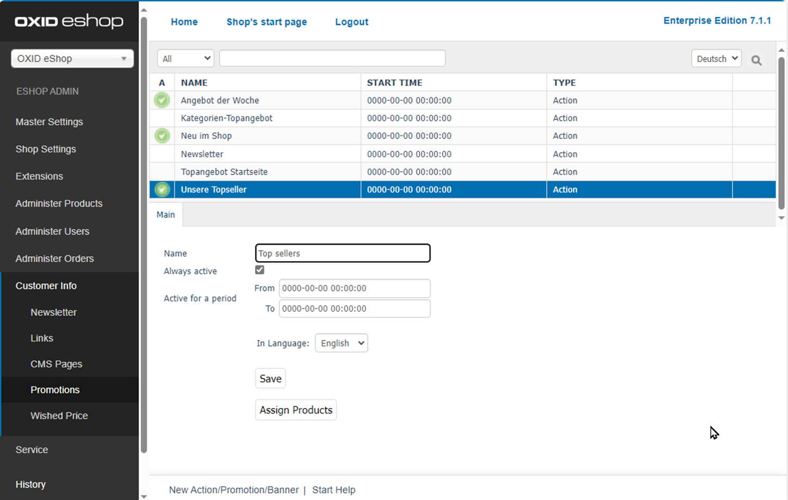
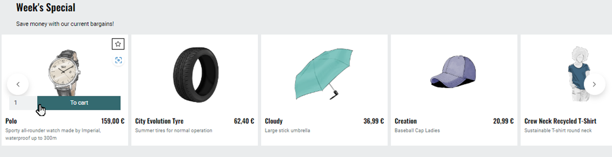
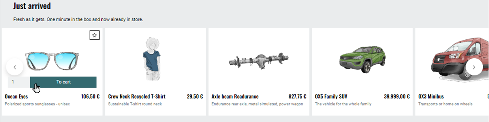
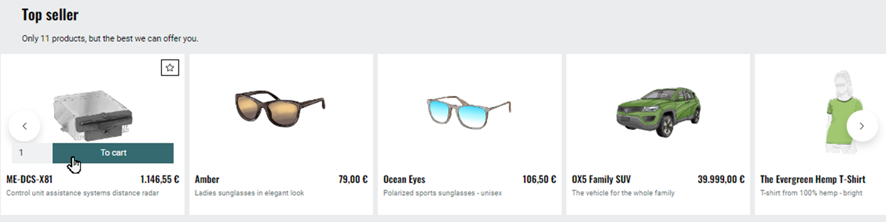

Configuring promotions
======================

.. todo: this topic combines actions-and-startpage and tab root as well as /actions.rst and replaces them.

Display promotions on the start page of the store.

Promotions are an important marketing tool in your OXID eShop alongside discounts, vouchers and newsletters.

The \“APEX\” theme only supports the \“Promotion\” promotion type.

The “Promotion” and “Banner” promotion types as well as the “Category top offer” and “Top offer start page” promotions are not used by the “APEX” theme.

However, the promotions \“Category top offer\” and \“Top offer homepage\” are available in the administration area (:ref:`oxbagw00`) because the theme \“Azure\” uses them. If required, you can integrate them into a theme based on \“Flow\”.

.. _oxbagw00:

   Fig.: Managing promotions

General procedure
-----------------

1. To ensure that promotions are displayed on the start page, make sure that under :menuselection:`Master Settings --> Core Settings`, on the :guilabel:`Perform.` tab, the :guilabel:`Load Promotions` checkbox is activated.
2. Under :menuselection:`Customer info --> Promotions --> <Promotions> --> Main`, configure the relevant promotions:

   * Assign the relevant items.
   * Specify how long the promotion should appear on the start page.
   * Specify the language.

   Banners and promotions are not supported by the APEX theme. Configure promotions as follows (:ref:`oxbagw00`):

   :guilabel:`Name`
       Name of the promotion as it is displayed in the administration area and on the start page of the store.

   :guilabel:`Always active`
       Activate this checkbox so that the promotion is always displayed in the store.

   :guilabel:`Active for period From` ... :guilabel:`To` ...
       Specify the period in which the promotion is active. This is only taken into account if the :guilabel:`Always active` checkbox is not ticked.

   :guilabel:`In language`
       Edit the promotion in other active languages of your OXID eShop. Choose the language from the list.

   :guilabel:`Assign products`
       Assign one or more articles to the promotion.

#. Save your settings.

Configuring promotions of a standard installation
-------------------------------------------------

In the following, we describe what the promotions on the start page of a standard installation of the OXID eShop with the \“APEX\” theme look like and how to configure them in detail.

For example, our demo store implements the following typical promotions

* Offer of the week (Angebot der Woche)
* New in the store (Neu im Shop)
* Our top sellers (Unsere Topseller)

Week's Special
^^^^^^^^^^^^^^

The Week's Special offers are presented on the start page with the title and image that you have assigned to the promotion (:ref:`oxbagw02`).

From the offer, the customer can call up the detail page of an advertised item. They can also add the item directly to the shopping cart using the :guilabel:`Add to cart` button.

.. _oxbagw02:

   Figure: Promotion type Offers of the week

|procedure|

Under :menuselection:`Customer Info --> Promotions --> Offer of the week --> Main`, control whether the offers of the week should always be active or only for a defined period.

Use the time period to control weekly changing offers, for example.

Freshly arrived
^^^^^^^^^^^^^^^

The start page presents articles as new arrivals in the store with a slider overview (:ref:`oxbagw04`).

The customer can call up the detail page of the item or add the item directly to the shopping cart.

.. _oxbagw04:

   Fig.: Promotion type Freshly arrived

|procedure|

1. Specify which items are displayed in the category.

   Under :menuselection:`Master Settings --> Core Settings`, choose the :guilabel:`Perform.` tab.

   Under :guilabel:`List of newest products (Just arrived!)` you have the following options:

    * Have the store provide articles automatically

    * Assign articles manually

      To specify which items are to be displayed in the list, under :menuselection:`Customer info --> Promotions`, choose the :guilabel:`New in shop` pronotion and choose :guilabel:`Assign Products`.

    * To prevent the eShop from wasting computing power on determining the latest products, deactivate the promotion.

#. Under :menuselection:`Master Settings --> Core Settings`, on the :guilabel:`Perform.` tab, use the :guilabel:`Display prices at \“Top of the Shop\” and \“Just arrived!\“` checkbox to specify whether the prices should be displayed.
#. Save your settings.

Top seller
^^^^^^^^^^

Further down on the start page is the store's best-selling items (top sellers) (:ref:`oxbagw05`).

The image, title and optionally the price of the item are displayed.

The customer can call up the detail page of the item or add the item directly to the shopping cart.

.. _oxbagw05:

   Fig.: Displaying the promotion type Top seller

|procedure|

1. Determine which articles are to be displayed in the category.

   Under :menuselection:`Master Settings --> Core settings`, choose the :guilabel:`Perform.` tab.

   Under :guilabel:`List of best-selling articles (Top of the Shop)` you have the following options:

   * Automatic

     Have the store provide the items automatically.

   * Manual

     Under :menuselection:`Customer info --> Promotions`, choose :guilabel:`Our top sellers`. Specify which items are to be displayed in the list.

   * To prevent the eShop from wasting computing power on determining the top selling products, deactivate the promotion.

#. Under :menuselection:`Master Settings --> Core Settings`, on the :guilabel:`Perform.` tab, use the :guilabel:`Display prices at \“Top of the Shop\” and \“Just arrived!\“` checkbox to specify whether the prices should be displayed.
#. Save your settings.

.. Intern: oxbagw, Status: