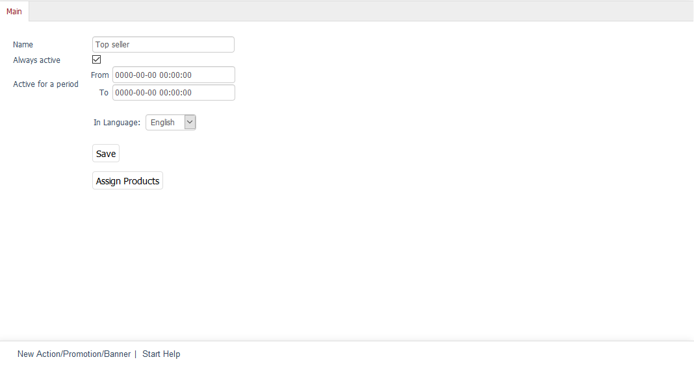
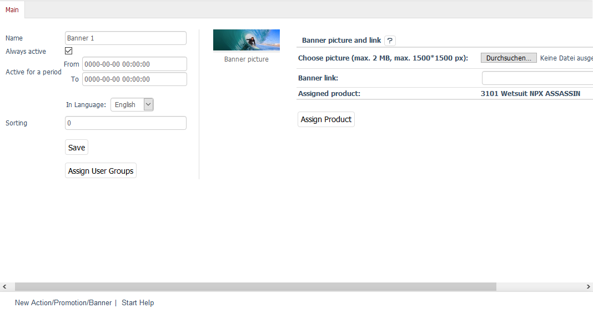
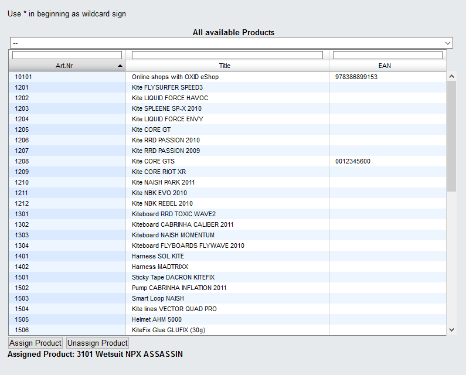

Main tab
===================

The :guilabel:`Main` tab contains a few settings that can be configured for the promotion. This is where you can create or edit a promotion. When creating a promotion, you will need to specify its type. Depending on whether you have selected Action, Promotion, or Banner, the settings in the tab will be more or less different from each other.

Please note that the Promotion type and some of the Action types will not be displayed on the start page for the \"Flow\" theme. See: :doc:`Promotions and start page <promotions-and-start-page>`

Action type
----------

:guilabel:`Name` |br|
Name of the Action type promotion as displayed in the Admin panel and on the shop’s start page.

:guilabel:`Always active` |br|
Check this box to have the promotion always displayed in the shop. Make sure that the :guilabel:`Load Promotions` box in the :guilabel:`Perform.` tab under :menuselection:`Master Settings --> Core Settings` is checked and pay attention to the setting concerning the \"Top seller\" and \"Just arrived\" actions.

:guilabel:`Active for a period From` ... :guilabel:`To` ... |br|
You can define a time period when a promotion will be active. This will only be considered if the :guilabel:`Always active` box is unchecked.

:guilabel:`In Language` |br|
The promotion can also be edited in other active languages of the shop. To do this, select the desired language from the list.

:guilabel:`Assign Products` |br|
The promotion can have one product (e.g. \"Week's Specials\" action) or several products (e.g. \"Just arrived\" and \"Top seller\" actions) assigned to it. Clicking on :guilabel:`Assign Products` opens a new window. All available products will be displayed in the left-hand list. Select a category from the drop-down list if you only want to display products from this category. You can also filter and sort products by product number, title and/or EAN. Drag and drop the products into the right-hand list to assign them to the promotion. Hold down the Ctrl key to select multiple products.

Banner type
----------

:guilabel:`Name` |br|
Name of the Banner type promotion as displayed in the Admin panel. Banners are displayed as a slideshow without a headline on the shop’s start page.

:guilabel:`Always active` |br|
Check this box to have the banner displayed in the shop. Make sure that the :guilabel:`Load Promotions` box in the:guilabel:` Perform.` tab under :menuselection:`Master Settings --> Core Settings` is checked.

:guilabel:`Active for a period From` ... :guilabel:`To` ... |br|
Define a time period when the banner will be active. This will only be considered if the :guilabel:`Always active` box is unchecked. Assigned user groups also affect the display of the banner on the start page.

:guilabel:`In Language` |br|
The banner can also be edited in other active languages of the shop. To do this, select the desired language from the list.

:guilabel:`Sorting` |br|
Determines the order in which banner images are displayed on the start page. Enter a number between 0 and 9999 in the input field. The banner with the smallest number represents the first image of the slideshow, and the banner with the largest number the last one. Without sorting preferences, banner names will be used in their alphabetical order.

:guilabel:`Assign User Groups` |br|
Banners can be assigned to different user groups. This allows different products and categories to be promoted on the start page, depending on which user group a customer belongs to. For example, if the banner is assigned to the \"Retailer\" user group, a regular customer won’t see its image in the slideshow.

:guilabel:`Choose picture (max. 2 MB, max. 1500*1500 px)` |br|
Upload the image for the banner. By default, it will be displayed with a size of 940 px × 220 px on the start page. The size of larger images will be adjusted. However, the images should be no more than 2 MB in size or have a maximum resolution of 1500*1500 pixels.

Clicking on :guilabel:`Browse...` opens a file dialog where you can select the relevant file on your computer. Click on :guilabel:`Open` to have the file name loaded directly. Click on “Save” to start uploading the image. This will replace an existing image. An assigned photo can also be deleted.

:guilabel:`Banner link` |br|
You can add a link to the image to ensure targeted advertisement is on the start page. This can be a URL in the form ``http://www.myurl.com`` or a relative path based on the structure of the categories.

:guilabel:`Assigned product` |br|
Displays the number and title of the product assigned to the banner. The price and the title will be displayed above the banner on the start page. Clicking on it opens the details page of the promoted product.

:guilabel:`Assign Product` |br|
You can assign a product to the promotion. Clicking on :guilabel:`Assign Product` opens a new window. All available products will be displayed in a list. Select a category from the drop-down list if you only want to display products from this category. You can also filter and sort products by product number, title and/or EAN.

Click on :guilabel:`Assign Product` to link the banner to the product selected in the list. Click on :guilabel:`Unassign Product` to unlink the banner and the product.

.. seealso:: :doc:`Promotions <promotions>` | :doc:`Promotions and start page <promotions-and-start-page>` | :doc:`Newsletter action <newsletter-action>`

.. Intern: oxbagy, Status:, F1: actions_main.html