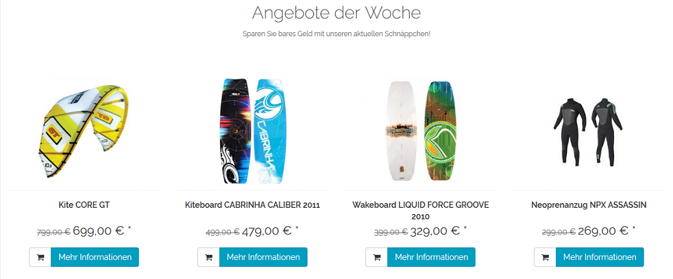
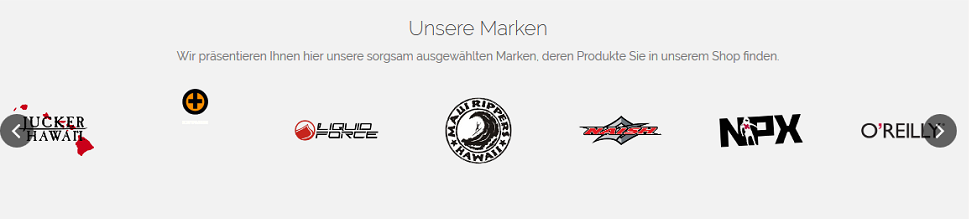
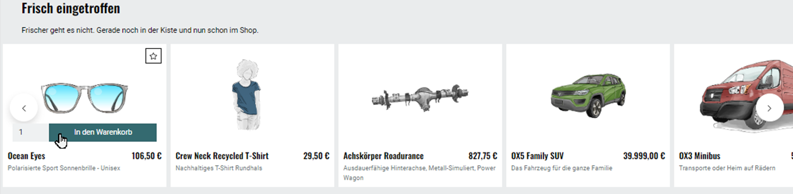
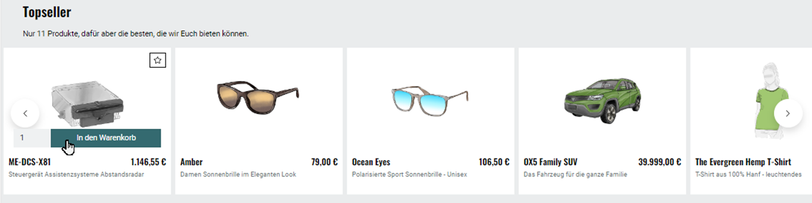

Promotions and start page
=======================

To display promotions on the shop’s start page, you will need to check the :guilabel:`Load Promotions` box in the :guilabel:`Perform.` tab under :menuselection:`Master Settings --> Core Settings`. This tab also contains other settings that are important for promotions and are discussed here.

This document describes the promotions on the start page of OXID eShop default installation with the \"Flow\" theme.

Banner
------
The banner is a large area that stretches horizontally across the start page. It can display one or more images highlighting products and categories.

.. image:: ../../media/screenshots/oxbagw01.png
   :alt: Banner
   :class: with-shadow
   :height: 208
   :width: 650

If several images have been defined as banners, they will be changed into in a sequence of images which are displayed as a slideshow. An image can be linked to the product’s details page so that it opens when the customer clicks on the image. The product’s title and a short description can also be displayed at the bottom of the screen. This must be enabled in the image settings of the \"Flow\" theme. To do this, check the box :guilabel:`Activate captions for slider on home page` in the :guilabel:`Settings` tab under :menuselection:`Extensions --> Themes`.

Week's Specials
------------------
Week’s Specials are displayed on the start page below the banner. It present products with title and image assigned to the promotion.

From here, the customer can click on the link and the :guilabel:`More information` button to access the details page of an advertised product. The product can also be added directly to the shopping cart by clicking on a different button. Week's Specials can be active always or only for a defined period of time, e.g. specials that change every week.

Our brands
-------------

Under Week’s Specials, you will see a different slider. It presents all manufacturers with their logos in alphabetical order. The display under \"Our brands\" must be activated in the display settings of the \"Flow\" theme. To do this, check the box :guilabel:`Show manufacturer slider on Start page` in the :guilabel:`Settings` tab under :menuselection:`Extensions --> Themes`.

Just arrived
-------------------

A large part of the start page is taken by products that are presented as new additions to the shop. The display is arranged as a four-column product overview, showing the product’s image, title and price. From here, you can access the product’s details page or add the product directly to the shopping cart.

The display of products in the category is determined by a setting in the :guilabel:`Perform.` tab under :menuselection:`Master Settings --> Core Settings`. Use the :guilabel:`List of newest Products (Just arrived!)` to select whether the products are assigned manually during the promotion or whether they are provided by the shop automatically. You can also switch off the promotion here completely so that the shop doesn’t spend any time to process it.

The additional setting :guilabel:`Show Prices in \"Top of the Shop\" and \"Just arrived!\"` in the :guilabel:`Perform.` tab affects the display of product prices for this and a further promotion.

Top seller
---------
If customers scroll down the start page, they will see the best-selling products in the shop. The display is similar to the two-column gallery of a product overview. From here, you can access the product’s details page or add the product directly to the shopping cart.

The selection of products that are presented as \"Top seller\" is determined by a setting in the :guilabel:`Perform.` tab under :menuselection:`Master Settings --> Core Settings`. Use the :guilabel:`List of most sold Products (Top of the Shop)` to select :guilabel:`manual`, :guilabel:`automatic` or :guilabel:`inactive`. Products can be assigned to the \"Top seller\" promotion or determined by the shop. You can also deactivate the promotion here so that it won’t be processed or displayed on the start page.

The additional setting :guilabel:`Show Prices in \"Top of the Shop\" and \"Just arrived!\"` determines the display of product prices for this and a further promotion.

.. seealso:: :doc:`Promotions <promotions>` | :doc:`Newsletter action <newsletter-action>` | :doc:`Main tab <main-tab>`

.. Intern: oxbagw, Status: