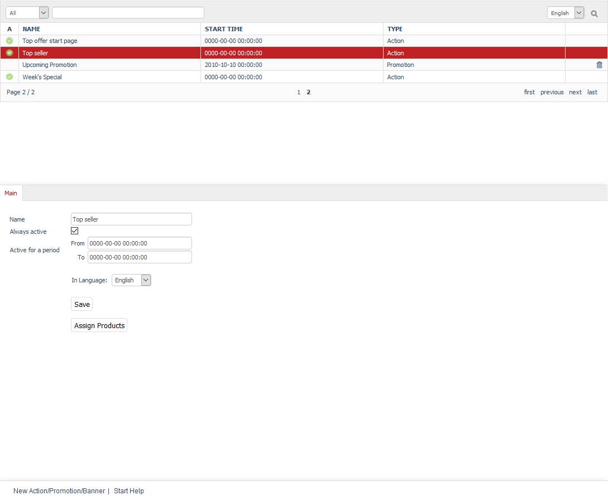

Promotions
========

Apart from discounts, coupons or newsletters, promotions are an important marketing tool in your OXID eShop. There are three types of promotions that can be used to design and update the appearance of the shop’s start page: Action, Banner, and Promotion. The \"Flow\" theme supports Action and Banner. Promotion and some Action types are not used by the new default theme. However, the actions \"Top offer in categories\" and \"Top offer start page\" are available in the Admin panel since they are used by the \"Azure\" theme. They could be integrated into a \"Flow\"-based theme as needed.

Promotions can be edited under :menuselection:`Customer Info --> Promotions`. You will see a list of promotions and the respective input area below. Promotions differ by the type: Banner, Action, and Promotion, and you can also upload and link a photo for the banner.

All promotions are displayed in alphabetical order. You can search for promotions by using the search field and the magnifying glass icon. For example, if you type \"ba\" in the search box, you will see all four banners of the start page.

In addition, you can use the selection list to search for promotions that are active, upcoming, or expired. This is based on the activity period defined for the promotions.

Promotions can be permanently removed from the database by clicking on the trash icon at the end of the line. Action type records that came with the shop can’t be deleted as they are required for the stable operation of OXID eShop. You can disable such a record to see how it affects the start page display.

When you select a promotion, its information will be displayed in the input area. To create a new promotion, click on :guilabel:`New Action/Promotion/Banner` at the bottom of the screen.

-----------------------------------------------------------------------------------------

Promotions and start page
-----------------------
**Contents**: start page \"Flow\" theme, Action type, Banner type, banner, Week's Specials, Our brands, Just arrived, Top seller, performance settings, loading promotions, displaying prices for \"Top of the Shop\" and \"Just arrived!\" |br|
:doc:`Read article <promotions-and-start-page>` |link|

Newsletter action
---------------------
**Contents**: newsletter, displaying selected products, \"Newsletter\" action |br|
:doc:`Read article <newsletter-action>` |link|

Main tab
-------------------
**Contents**: active promotion, Action type, Banner type, Promotion type, name, assigning products, banner images, sorting, slideshow, link for banner image, assigning user groups |br|
:doc:`Read article <main-tab>` |link|

.. Intern: oxbagv, Status: