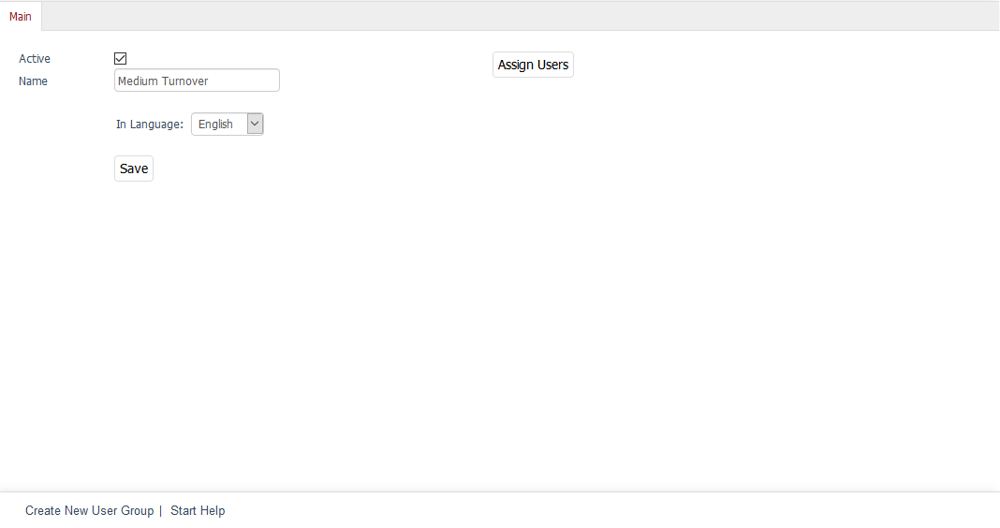

Main tab
========

The :guilabel:`Main` tab can be used to specify or change the name of a user group and to activate or deactivate it. An additional :guilabel:`Copy to` button will be displayed for all newly created user groups after you save them for the first time. Select a language from the drop-down list to copy the user group into this shop’s language and edit it.

:guilabel:`Active`
   Check this box to be able to use the user group in the shop. If the user group hasn’t been activated, it will be saved in the database but won’t be displayed in the assignment windows for the user groups. When you activate or deactivate a user group, this setting will apply to all languages.

:guilabel:`Name`
   The name of the user group displayed in the shop’s Admin panel. For example, this name will be listed under :guilabel:`Administer Users` --> :guilabel:`User Groups` or in the respective assignment windows for the payment and shipping methods, shipping cost rules, discounts or coupon series.

:guilabel:`In Language`
   Use the drop-down list to select a language in which you want to edit the name of the user group. The user group must have been previously copied into this language.

:guilabel:`Copy to`
   Clicking on this button will make the user group available for another language selected in the drop-down list. If the user group has been copied to all of the shop’s languages, the button and the corresponding drop-down list will no longer be displayed.

:guilabel:`Assign Users`
   Clicking on this button will open the assignment window with the two lists - :guilabel:`All Users` and :guilabel:`User Group Members` - displayed. User groups can be filtered and sorted by e-mail/login. Drag the desired user groups from the left-hand list into the right-hand list using the mouse. Hold down the Ctrl key to select multiple user groups. The assignment is now completed.

.. Intern: oxbaea, Status:, F1: usergroup_main.html