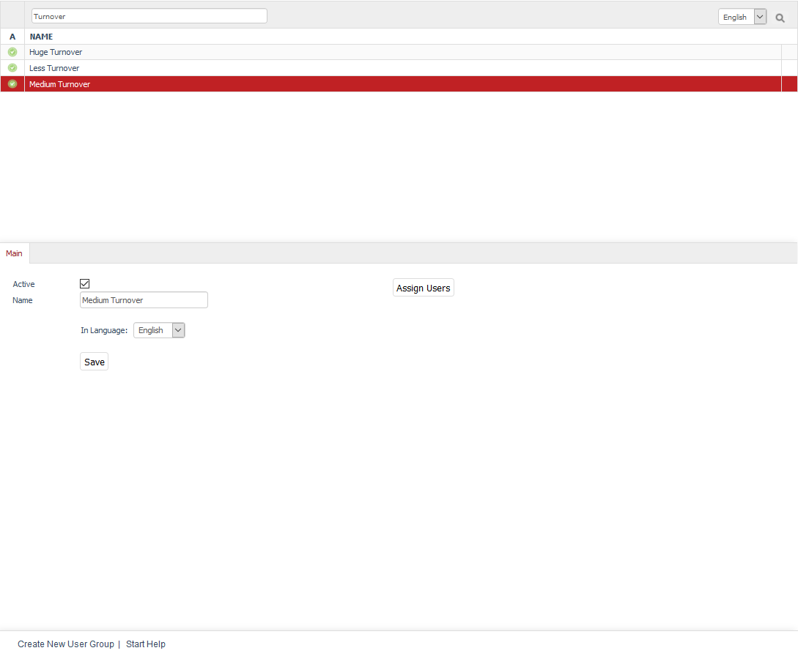

User groups
===============

User groups are used to group users with specific characteristics. Such characteristics may include the user status, previous sales in the shop, signing up for the newsletter or special prices for specific products. Users belonging to a user group can be conveniently assigned elsewhere. You can also assign payment and shipping methods, shipping costs, discounts, coupon series, etc. to them with just a few mouse clicks.

User groups can be edited in the Admin panel under :menuselection:`Administer Users --> User Groups`. Here, you will see a list of the user groups and the input area right below it. You can search for the name of the user group by using the available search field. For example, typing \"a\" will display all user groups that have this letter in their name.

User groups can be permanently removed from the database by clicking on the trash icon at the end of the line. The only exception are the 16 predefined user groups that come with OXID eShop.

When you select a user group from the list, its information will be displayed in the input area. To create a new user group, click on :guilabel:`Create New User Group` at the bottom of the screen.

Predefined user groups and automatic assignment
--------------------------------------------------------
OXID eShop comes with 16 user groups. When customers register and buy something in the shop, they are automatically assigned to specific user groups.

Domestic/Foreign Customer
^^^^^^^^^^^^^^^^^^^^^^^^^^
Users are automatically assigned to one of these user groups when placing an order in the shop. The assignment is based on the specified billing address. For example, the two user groups can be used for assigning different shipping costs.

Which of the shop’s active countries should be considered domestic can be specified in section :guilabel:`Global` under :menuselection:`Master Settings --> Core Settings`, in the :guilabel:`Settings` tab.

Customer
^^^^^
This user group contains all users who have bought something in the shop. They are automatically assigned by the system.

Retailer
^^^^^^^
You can use this user group for your commercial customers. They are not assigned automatically.

Less Turnover/Medium Turnover/Huge Turnover
^^^^^^^^^^^^^^^^^^^^^^^^^^^^^^^^^^^^^^^^^^^^^^^
Users are assigned to one of these turnover-based user groups when placing an order in the shop. The automatic assignment is based on the order’s purchase value. Every new order can place the registered users into a different user group, even a user group with less turnover.

Purchase values relevant for the medium and huge turnover can be specified under :menuselection:`Master Settings --> Core Settings --> Settings` in the :guilabel:`Orders` section.

Powershopper
^^^^^^^^^^^^
You can use this group for users with a particularly high turnover. They are not assigned automatically.

Not Yet Purchased
^^^^^^^^^^^^^^^^^^
Users who register in your shop without having placed an order will be displayed in this user group. After the first order, the affiliation to this user group will be removed. They are automatically assigned by the system.

Newsletter Recipients
^^^^^^^^^^^^^^^^^^^^^
If the user checks the box :guilabel:`Subscribe to the newsletter` when placing an order or registering in the shop, he/she will be flagged as a newsletter subscriber. If the user clicks on a special confirmation link received by email, he/she will be activated for receiving the newsletter and included in this user group. Such explicit confirmation is also called double opt-in. If the user unsubscribes from the newsletter later, he/she will still remain in this user group. The actual delivery of the newsletter to the user can be disabled in the :doc:`Extended tab <../users/extended-tab>`.

Price A/Price B/Price C
^^^^^^^^^^^^^^^^^^^^^^^
These user groups allow you to display special product prices to the users. Users must be manually assigned to the respective group. Go to the products’ :doc:`Main tab <../../setup/products/main-tab>` to specify alternative prices (A, B and/or C) that the users of the respective user group (Price A/Price B or Price C) will see instead of the regular price after they register in the shop.

.. hint::You may experience issues with products for which no alternative prices have been specified. For example, €0.00 would be displayed for users from one of the user groups with alternative prices. To avoid this, check the box :guilabel:`Use standard Product Price if no A/B/C Price is set` in section :guilabel:`Products` under :menuselection:`Master Settings --> Core Settings`, the :guilabel:`Settings` tab.

Store Administrator
^^^^^^^^^^
This user group includes the users who are allowed to administer the shop. The first administrator is created during the shop installation and goes directly to this user group. Additional administrators can only be created in the Admin panel under :menuselection:`Administer Users --> Users`. They don’t automatically become users of this user group and must be added manually.

Blacklist
^^^^^^^^^
This user group is for users who have caused you any problems. You can assign the so-called \"black sheep\" to this user group and only allow them to use certain payment and shipping methods. The users in question will never know about such categorisation.

BLOCKED
^^^^^^^
Users who have been assigned to this user group will be denied access to the shop. After logging in, such a user will be notified of his/her status with a stop sign and the \"Permission denied!\" message.

-----------------------------------------------------------------------------------------

Main tab
-------------------
**Contents**: active user group, user group name, language, assigning users |br|
:doc:`Read article <main-tab>` |link|

.. seealso:: :doc:`Users <../users/users>` | :doc:`Payment methods <../../setup/payment-methods/payment-methods>` | :doc:`Shipping methods <../../setup/shipping-methods/shipping-methods>` | :doc:`Shipping cost rules <../../setup/shipping-cost-rules/shipping-cost-rules>`

.. Intern: oxbadz, Status: