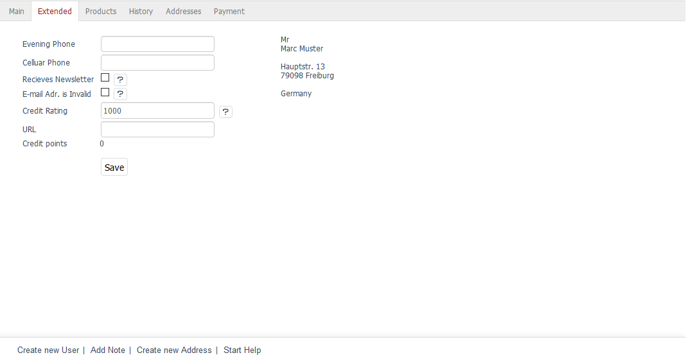

Extended tab
=======================
The :guilabel:`Extended` tab allows you to store additional information about the user. In addition, the user’s billing address is displayed. The billing address can only be changed in the Main tab.

:guilabel:`Evening Phone` |br|
Phone number to reach the customer privately.

:guilabel:`Cellular Phone` |br|
Customer’s cell phone number.

:guilabel:`Newsletter` |br|
If customers want to receive newsletters from the shop, they can choose this option when buying a product or registering in the shop. This box will be checked after the customer clicks on a confirmation link received by email and activates the newsletter via the so-called double opt-in. The newsletter will be sent to the email address stored in the Main tab. Shop owners can use this checkbox to change newsletter subscription settings if needed. This function will also be disabled if the customer cancels the subscription.

:guilabel:`Email adr. is invalid` |br|
The newsletter can’t be sent if the customer has entered an incorrect email address when buying a product or registering in the shop. The shop owner will receive a corresponding error message from the mail system and will be able to use this checkbox to deactivate the sending of the newsletter. The indicated email address will still be used for other emails, such as shipping confirmation.

:guilabel:`Credit Rating` |br|
This value represents the customer’s creditworthiness and determines what payment methods he/she can use in the shop. This allows the shop owner to specify that only certain customers can use payment methods, such as invoice or direct debit. By default, users are created with a credit rating of 1000.

:guilabel:`URL` |br|
This field can be used to store a web address, such as a business customer's web page, a private web page or a blog.

:guilabel:`Credit points` |br|
Users can earn bonus points for bringing customers to the shop. Newly recruited customers can also receive bonus points when they register in the shop. You will need to first activate this function in :menuselection:`Master Settings --> Core Settings`, the :guilabel:`Settings` tab, under :guilabel:`Invitations`. This is where you can also specify the number of bonus points for inviting new customers and for registering in the shop. The shop owner determines how to use the users’ bonus points in the context of his/her business model.

:guilabel:`No automatic assignment of user groups` |br|
Users are automatically assigned to specific user groups based on certain conditions. For example, if a user subscribes to the newsletter, he/she will be added to the \"Newsletter Recipients\" user group. When the user buys a product, the order volume will determine whether he/she will belong to the \"Less Turnover\", \"Medium Turnover\" or \"Huge Turnover\" user group in the future. More information can be found in the User Groups section.

Deactivate this function if you don’t want to assign the user to user groups automatically.

.. seealso:: :doc:`User groups <../user-groups/user-groups>`

.. Intern: oxbads, Status:, F1: user_extend.html