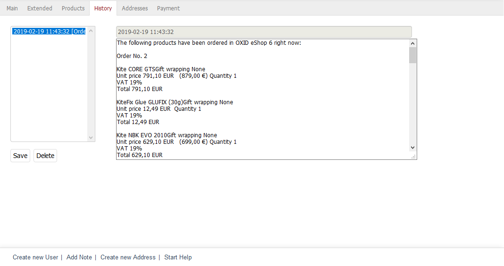

History tab
===========

Customer’s actions in OXID eShop and the related information are logged in the :guilabel:`History` tab. For example, you will see entries for successful registration, orders, as well as orders and e-mails sent. Each entry is saved with a timestamp and a note in square brackets, such as \"Remark\" and \"Order\". If you highlight an entry in the left-hand column by clicking on it with the mouse, its content will be displayed in the bigger input field on the right-hand side.

In addition to the entries automatically generated by the shop, you can also create your own entries, e.g. to document individual arrangements with the customer. To do this, click on the :guilabel:`Add Note` link at the bottom of the input area. Enter the required information in the input field and click on :guilabel:`Save`. The entry will be saved together with the date and the exact time, including seconds. You can always change, update and delete the existing entries later. Be careful when using the delete function to make sure that the customer’s history remains as complete as possible.

.. Intern: oxbadu, Status:, F1: user_remark.html