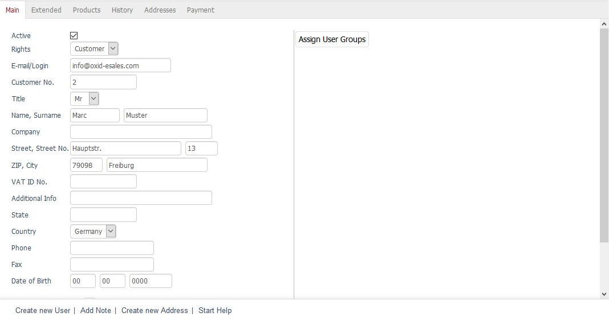

Main tab
===================
The :guilabel:`Main` tab contains important information about the user. This information is saved as soon as the user buys something in the shop for the first time, registers in the shop or subscribes to the newsletter. You don’t have to fill out all fields as only the email address, the first and last name, the address and the country are required by default when registering in the shop. When subscribing to the newsletter, only the email address is mandatory.

Users can also be created by clicking on :guilabel:`Create new User`. All relevant user data will need to be entered in the :guilabel:`Main` tab. You won’t be able to save the user data without entering an email address.

:guilabel:`Active` |br|
A checked box means that the user can log in to the shop depending on his/her rights. An automatically generated user will be active immediately.

:guilabel:`Rights` |br|
There are two types of rights: \"Customer\" and \"Admin\". Use the drop-down list to select the desired right. All users who shop, register or subscribe to the newsletter are granted the \"Customer\" right. The administrator created during the installation has the \"Admin\" right. Additional users with this right can only be created in the Amin panel under :menuselection:`Administer Users --> Users`.

Enterprise Edition also allows you to define administrators who only have access to a specific shop. The drop-down list will contain corresponding entries when there are more shops than just the main shop. However, users with the \"Admin\" right can work with all shops.

:guilabel:`Email/Login` |br|
This field contains the user’s email address. Manually created users can have any login assigned to them.

:guilabel:`Customer No.` |br|
When a user is created, he/she gets assigned a consecutive customer number, starting with 1 by default. If you change the customer number of the last created user, the counting will continue from this customer number. The :guilabel:`Customer No.` field may only contain numerical values. Any other entries will cause the customer number to be set to zero.

:guilabel:`Title` |br|
User title selected during the purchase or registration. When manually creating or changing the user, you will be able to select \"Mr\" or \"Mrs\" from the drop-down list.

:guilabel:`Name, Surname` |br|
The two fields contain the user’s first and last name.

:guilabel:`Company`
Business customers can specify the name of their company when buying a product or registering in the shop. You can also enter the user’s company name when creating the user manually.

:guilabel:`Street, Street No.` |br|
These fields contain the street and house number of the user's address. The address data is part of the billing and shipping address unless a different shipping address is used during the purchase.

:guilabel:`ZIP, City` |br|
Fields for the postcode and the city name of the user's address.

:guilabel:`VAT ID No.` |br|
Business customers can specify their VAT identification number (VAT ID) when buying a product or registering in the shop. You can also enter the VAT ID when creating the user manually.

:guilabel:`Additional Info` |br|
Field for saving additional information.

:guilabel:`State` |br|
Enter the state where the user lives.

:guilabel:`Country` |br|
Select the country where the user lives from the drop-down list. This information determines what payment and shipping methods the user can use in the ordering process.

:guilabel:`Phone` |br|
User’s phone number.

:guilabel:`Fax` |br|
User’s fax number.

:guilabel:`Date of Birth` |br|
User’s date of birth.

:guilabel:`Has password?` |br|
This question will be displayed only for existing users. The answer \"Yes\" or \"No\" determines whether a password has been assigned or not. A user without a password has bought something in the shop without registering and without opening a customer account.

:guilabel:`New Password` |br|
When you create or edit a user, you will need to assign a password that he/she can use to log in to the shop. The user won’t be able to log in without a password. This is not explicitly indicated when you save a user without a password.

:guilabel:`Assign User Groups` |br|
Users can belong to different user groups. Grouping users into user groups makes it easy to assign conditions, such as payment and shipping methods, and promotions, such as discounts and coupons.

Clicking on :guilabel:`Assign User Groups` opens a new window. All available user groups will be displayed in the left-hand list. Drag and drop them into the right-hand list. Hold down the Ctrl key to select multiple user groups. The assignment is now completed.

.. seealso:: :doc:`User groups <../user-groups/user-groups>`

.. Intern: oxbadr, Status:, F1: user_main.html