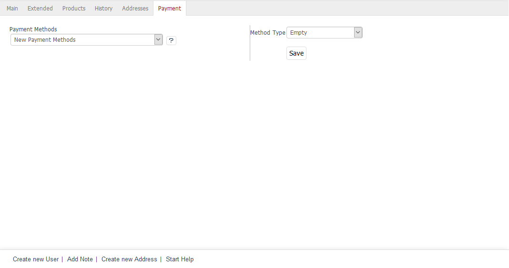

Payment tab
=====================
All payment methods used by the customer in the previous orders are displayed in the :guilabel:`Payment` tab and can be selected from a drop-down list. For the \"Direct Debit\" payment method, you can enter or change the bank details that are displayed to the customer in the ordering process.

You can also create new payment methods for the customer or delete the existing ones. However, payment methods that are displayed in this tab don’t determine which one the customer can use to pay for the order. This can only be specified in the :doc:`Payment methods <../../setup/payment-methods/payment-methods>`.

.. Intern: oxbadw, Status:, F1: user_payment.html