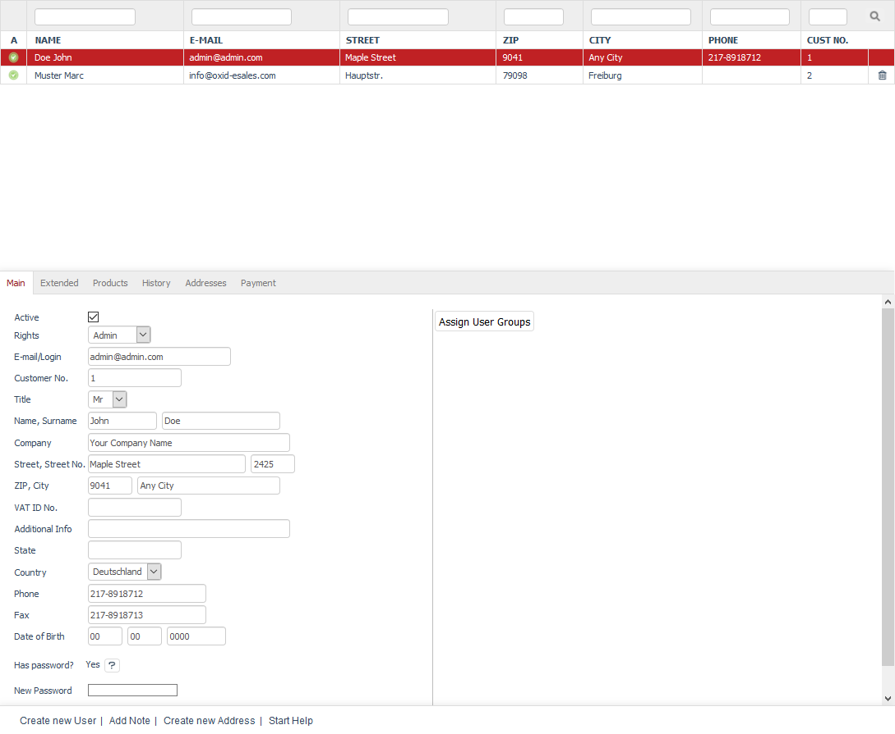
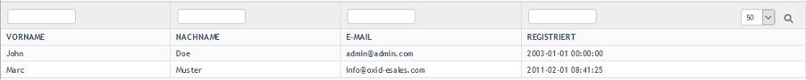

Users
========

Every customer who buys something in the shop for the first time with or without registration will be registered as a user. The shop also creates a new user or updates an existing one when a customer signs up to create a customer account or subscribe to the newsletter.

A special form of the user is the one with administrator rights. Unlike users who only interact with the shop’s front end, the administrator is also able to customise the configuration of the shop and edit products and categories, i.e. to use the shop’s Admin panel. The first administrator is created during the shop installation. In step 5, :doc:`Running setup <../../installation/new-installation/running-setup>`, you had to enter the email address and password for this administrator and were able to log in directly to the Admin panel after completing the setup.

In Enterprise Edition, there are administrators who can work with all shops and those who only have access to a specific shop. The user with the administrator rights created during the installation can access all shops and switch between the individual shops in the Admin panel.

Users can be edited in the Admin panel under :menuselection:`Administer Users --> Users`. Here, you will see the list of the users and the input area right below it. The user list displays the name of the user, the email address, the address, the telephone number and the customer number. You can search for users by using the available search fields.

Users can be permanently removed from the database by clicking on the trash icon at the end of the line. The only exception is the administrator created during the installation. This is the master that can’t be deleted in this way. Set a user to inactive if you only want to prevent him/her from accessing the shop temporarily.

When you select a user from the list, his/her information will be displayed in the input area. To create a new user, click on :guilabel:`Create new User` at the bottom of the screen. Other functions allow you to create a note for the user, enter another shipping address or start context-sensitive help.

An overview of all users can also be found under :menuselection:`Administer Users --> List All Users`. You can use the drop-down list to select whether you want to display 50, 100 or 200 users in the user list. Users can be searched by first name, last name, email address and date of registration. The search will narrow down the users displayed in the list. Click on any field of the user in the list to edit him/her.

-----------------------------------------------------------------------------------------

Main tab
-------------------
**Contents**: active user, user rights, customer, admin, administrator, user data, name, address, billing address, email, phone, customer number, password, assigning user groups |br|
:doc:`Read article <main-tab>` |link|

Extended tab
-----------------------
**Contents**: additional user information, phone number, cell phone number, mobile phone number, newsletter, double opt-in, invalid email address, credit rating, creditworthiness, approved payment methods, URL, bonus points, inviting friends, referring customers, assignment to user groups, no automatic assignment |br|
:doc:`Read article <extended-tab>` |link|

Products tab
---------------------
**Contents**: products purchased by the user, overview, quantity, product number, title, type, variant selection, brief description |br|
:doc:`Read article <products-tab>` |link|

History tab
----------------------
**Contents**: note, log, customer actions, customer information |br|
:doc:`Read article <history-tab>` |link|

Addresses tab
----------------------
**Contents**: new address, shipping address, billing address, order, account, billing and shipping settings |br|
:doc:`Read article <addresses-tab>` |link|

Payment tab
---------------------
**Contents**: previously used payment methods, cash on delivery, credit card, direct debit, cash in advance, invoice, empty, stored bank details |br|
:doc:`Read article <payment-tab>` |link|

.. seealso:: :doc:`User groups <../user-groups/user-groups>` | :doc:`Payment methods <../../setup/payment-methods/payment-methods>` | :doc:`Shipping methods <../../setup/shipping-methods/shipping-methods>` | :doc:`Shipping cost rules <../../setup/shipping-cost-rules/shipping-cost-rules>`

.. Intern: oxbadq, Status: