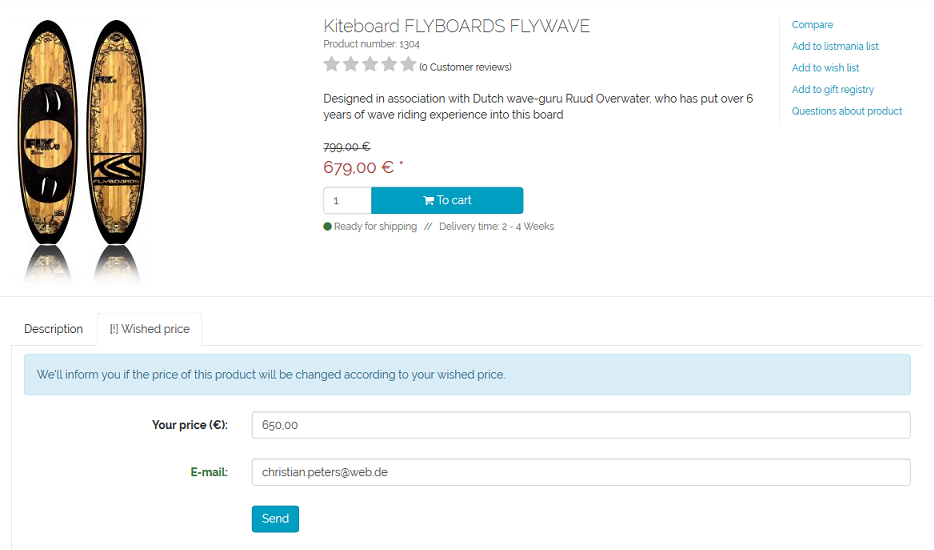
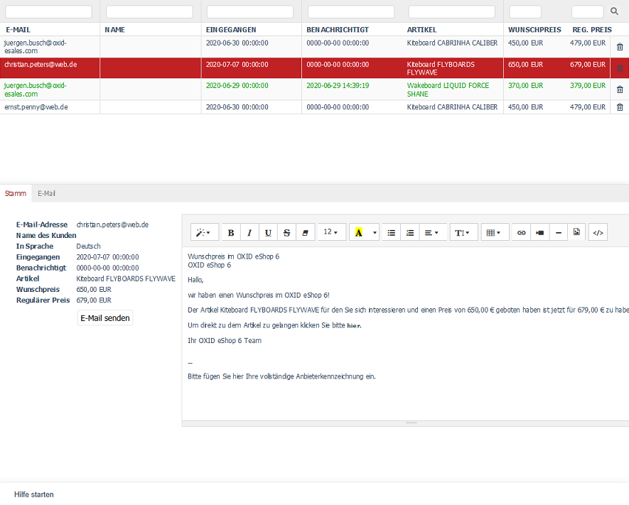

Wished price
============

Customers can specify a price for products from the shop at which they would like to buy them. The shop owner can inform customers by e-mail as soon as this wished price is reached or undercut. The function is globally enabled or disabled for the shop in the :guilabel:`Functions` section of the theme's settings. But it can also be applied to individual products. Select the :guilabel:`Deactivate Wished Price` checkbox on the :guilabel:`Extended` tab of a product to disable the function for that product. Until OXID eShop 6.2.1, wished price was called price alert.

If the wished price function is active, the :guilabel:`[!] Wished price` tab is displayed in the details page of the product, which contains a small form. Here the customer can enter the wished price and his e-mail address. After sending the information, he will receive a confirmation that he will be notified when the wished price is achieved. The shop owner is informed by e-mail that the customer wishes to purchase a product at a certain price. The template for the e-mail is the CMS page "wished price" (Ident: oxpricealarmemail).

The wished prices requested by customers are collected in the administration panel under :menuselection:`Customer Info --> Wished Price`. There all enquiries for a wished price are listed.

The list of wished price enquiries shows the e-mail address, the name of the customer, the date of receipt, the date of e-mail notification, the name of the product, its regular price and the customer's wished price. You can search for wished price enquiries by using the search fields above the list.

The wished price enquiries can be sorted in the list by clicking on the respective column header. They are thus displayed in ascending order. Wished price enquiries can be permanently removed from the database by clicking on the trash icon at the end of the line.

When you select an entry from the list, the detailed information will be displayed in the input area. On the :guilabel:`Main` tab, you can edit the text of the e-mail that should inform the customer about the wished price. The :guilabel:`Mail` tab allows you to send the e-mails to the customers.

Main tab
--------
**Contents**: e-mail address, name of customer, in language, date of receipt, date of e-mail notification, product, wished price, regular price, text of the e-mail, Price alert up to OXID eShop 6.2.1 |br|
:doc:`Read article <main-tab>` |link|

Mail tab
--------
**Contents**: Wished price achieved, send notification mail(s)  |br|
:doc:`Read article <mail-tab>` |link|

.. seealso:: :doc:`Products, Extended tab <../../setup/products/extended-tab>`

.. Intern: oxbajm, Status: transL, Latitute-images